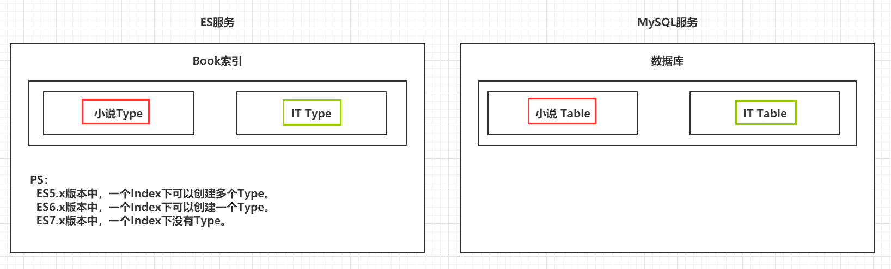

> Author：zhaojian
>
> Version：9.0.0


[TOC]


### 一、引言

---

#### 1.1 海量数据

> 在海量数据中执行搜索功能时，如果使用MySQL，效率太低。


#### 1.2 全文检索

> 在海量数据中执行搜索功能时，如果使用MySQL，效率太低。


#### 1.3 高亮显示

> 将搜索关键字，以红色的字体展示。


### 二、ES概述

-----

#### 2.1 ES的介绍

> - ES是一个使用Java语言并且基于Lucene编写的搜索引擎框架，他提供了分布式的全文搜索功能，提供了一个统一的基于RESTful风格的WEB接口，官方客户端也对多种语言都提供了相应的API。
>
> - Lucene：Lucene本身就是一个搜索引擎的底层。
>
> - 分布式：ES主要是为了突出他的横向扩展能力。
>
> - 全文检索：将一段词语进行分词，并且将分出的单个词语统一的放到一个分词库中，在搜索时，根据关键字去分词库中检索，找到匹配的内容。（倒排索引）
>
> - RESTful风格的WEB接口：操作ES很简单，只需要发送一个HTTP请求，并且根据请求方式的不同，携带参数的同，执行相应的功能。
>
> - 应用广泛：Github.com，WIKI，Gold Man用ES每天维护将近10TB的数据。


#### 2.2 ES的由来

|                  ES回忆时光                  |
| :------------------------------------------: |
|  |


#### 2.3 ES和Solr

> - Solr在查询死数据时，速度相对ES更快一些。但是数据如果是实时改变的，Solr的查询速度会降低很多，ES的查询的效率基本没有变化。
> - Solr搭建基于需要依赖Zookeeper来帮助管理。ES本身就支持集群的搭建，不需要第三方的介入。
> - 最开始Solr的社区可以说是非常火爆，针对国内的文档并不是很多。在ES出现之后，ES的社区火爆程度直线上升，ES的文档非常健全。
> - ES对现在云计算和大数据支持的特别好。


#### 2.4 倒排索引

> 将存放的数据，以一定的方式进行分词，并且将分词的内容存放到一个单独的分词库中。
>
> 当用户去查询数据时，会将用户的查询关键字进行分词。
>
> 然后去分词库中匹配内容，最终得到数据的id标识。
>
> 根据id标识去存放数据的位置拉取到指定的数据。

|                    倒排索引                    |
| :--------------------------------------------: |
|  |


### 三、 ElasticSearch安装

----

#### 3.1 安装ES&Kibana

> docker-compose.yml文件

```yaml
version: "3.1"
services:
  es:
    image: daocloud.io/library/elasticsearch:7.6.2
    restart: always
    container_name: es
    ports:
      - 9200:9200
    environment:
      - discovery.type=single-node
  kibana:
    image: daocloud.io/library/kibana:7.6.2
    restart: always
    container_name: kibana
    environment:
      - elasticsearch_url=http://192.168.200.129:9200
    ports:
      - 5601:5601
    depends_on:
      - es
```

> 安装出现的问题：
>
> - 启动es最大虚拟内存不足：
>
>   ```sh
>   #修改文件
>   vi /etc/sysctl.conf
>   
>   #设置ES最大虚拟内存大小
>   vm.max_map_count=655360
>   
>   #让设置生效
>   sysctl -p
>   ```
>
> - 启动es时，持久化数据的数据卷没有权限修改：
>
>   ```sh
>   # 修改数据卷目录的权限
>   chmod 777 data
>   ```
>
> - 启动kibana报错pid： "6"：
>
>   ```sh
>   # 进去kibana容器
>   docker exec -it kibana bash
>   
>   # 修改config目录下的kibana.yml
>   vi config/kibana.yml
>   
>   # 将elasticsearch:9200替换为es容器的id地址:9200
>   # 将最后的true，改为false                                                                                 
>   ```

```yaml
# ** THIS IS AN AUTO-GENERATED FILE **
# Default Kibana configuration for docker target
server.name: kibana
server.host: "0"
elasticsearch.hosts: [ "http://192.168.200.129:9200" ]
xpack.monitoring.ui.container.elasticsearch.enabled: false
```


#### 3.2 安装IK分词器

> - **进去到ES容器内部，跳转到 bin 目录下，执行 bin 目录下的脚本文件：**
> - ./elasticsearch-plugin install https://github.com/medcl/elasticsearch-analysis-ik/releases/download/v7.6.2/elasticsearch-analysis-ik-7.6.2.zip
> - **重启ES的容器，让IK分词器生效。**


**浏览器访问Kabana:**

​					http://192.168.200.129:5601

- 使用Kabana测试Ik分词器效果:


```json
POST _analyze
{
  "analyzer": "ik_max_word",
  "text": "中华人民共和国"
}
```


### 四、 ElasticSearch基本操作

-------------

#### 4.1 ES的结构

ElasticSearch整体结构图:


##### 4.1.1 索引Index，分片和备份

> - ES的服务中，可以创建多个索引。
>
> - 每一个索引默认被分成5片存储。
>
> - 每一个分片都会存在至少一个备份分片。
>
> - 备份分片默认不会帮助检索数据，当ES检索压力特别大的时候，备份分片才会帮助检索数据。
>
> - 备份的分片必须放在不同的服务器中。

|                 索引分片备份                 |
| :------------------------------------------: |
|  |


##### 4.1.2 类型 Type

> 一个索引下，可以创建多个类型。
>
> [Ps：根据版本不同，类型的创建也不同。]()

|                     类型                     |
| :------------------------------------------: |
|  |


##### 4.1.3 文档 Doc

> 一个类型下，可以有多个文档。这个文档就类似于MySQL表中的多行数据。

|                     文档                     |
| :------------------------------------------: |
|  |


##### 4.1.4 属性 Field

> 一个文档中，可以包含多个属性。类似于MySQL表中的一行数据存在多个列。

|                     属性                     |
| :------------------------------------------: |
|  |


#### 4.2 操作ES的RESTful语法

**注意 : 我们是基于7.x版本的ElasticSearch, 所以没有type**

> - GET请求：
>      - http://ip:port/index：查询索引信息
>     - http://ip:port/index/type/doc_id：查询指定的文档信息
>- POST请求：
>     - http://ip:port/index/type/_search：查询文档，可以在请求体中添加json字符串来代表查询条件
>      - http://ip:port/index/type/doc_id/_update：修改文档，在请求体中指定json字符串代表修改的具体信息
> - PUT请求：
>      - http://ip:port/index：创建一个索引，需要在请求体中指定索引的信息，类型，结构
>     - http://ip:port/index/type/_mappings：代表创建索引时，指定索引文档存储的属性的信息
>- DELETE请求：
>     - http://ip:port/index：删除索引
>      - http://ip:port/index/type/doc_id：删除指定的文档


#### 4.3 索引的操作

##### 4.3.1 创建一个索引

> 语法如下

```json
# 创建一个索引, person是索引名字, shards主分片是5片, replicas是备份分片1片
PUT /person
{
  "settings": {
    "number_of_shards": 5,
    "number_of_replicas": 1
  }
}
```

- 执行完上面语法, 在下面这里可以查询到已经创建好的person索引结构:


##### 4.3.2 查看索引信息

> 语法如下

```sh
# 查看索引信息
GET /person
```


##### 4.3.3 删除索引

> 语法如下

```json
# 删除索引
DELETE /person
```


#### 4.4 ES中Field可以指定的类型

> - 字符串类型：
>   - text：一般被用于全文检索。 将当前Field进行分词。 
>   - keyword：当前Field不会被分词。        
>
> - 数值类型：
>   - long：取值范围为-9223372036854774808~922337203685477480(-2的63次方到2的63次方-1)，占用8个字节
>   - integer：取值范围为-2147483648~2147483647(-2的31次方到2的31次方-1)，占用4个字节
>   - short：取值范围为-32768~32767(-2的15次方到2的15次方-1)，占用2个字节
>   - byte：取值范围为-128~127(-2的7次方到2的7次方-1)，占用1个字节
>   - double：1.797693e+308~ 4.9000000e-324 (e+308表示是乘以10的308次方，e-324表示乘以10的负324次方)占用8个字节
>   - float：3.402823e+38 ~ 1.401298e-45(e+38表示是乘以10的38次方，e-45表示乘以10的负45次方)，占用4个字节
>   - half_float：精度比float小一半。
>   - scaled_float：根据一个long和scaled来表达一个浮点型，long-345，scaled-100 -> 3.45
>
> - 时间类型：
>   - date类型，针对时间类型指定具体的格式
>
> - 布尔类型：
>
>   - boolean类型，表达true和false
>
> - 二进制类型：
>   - binary类型暂时支持Base64 encode string
>
> - 范围类型：
>   - long_range：赋值时，无需指定具体的内容，只需要存储一个范围即可，指定gt，lt，gte，lte
>   - integer_range：同上
>   - double_range：同上
>   - float_range：同上
>   - date_range：同上
>   - ip_range：同上
>
> - 经纬度类型：
>   - geo_point：用来存储经纬度的
>
> - ip类型：
>   - ip：可以存储IPV4或者IPV6
>


**小结 ：常用需要记住的内容如下 ：** 

- 字符串类型：
  - keyword：不能被分词
  - text：可以被分词
- 数值类型：
  - 整形：byte，short，integer，long
  - 浮点型：float，double
- 时间类型：
  - date：可以给date类型指定format格式化，支持时间戳以及年月日等格式
- IP类型：
  - 存储ip
- GEO_POINT类型：
  - 存储经纬度

Ps官网文档：https://www.elastic.co/guide/en/elasticsearch/reference/7.6/mapping-types.html

#### 4.5 创建索引并指定数据结构

> 语法如下

```json
# 创建索引，指定数据结构
PUT /book
{
  "settings": {
    # 分片数
    "number_of_shards": 5,
    # 备份数
    "number_of_replicas": 1
  },
  # 指定数据结构
  "mappings": {
    # 类型 Type, 我们是7.x版本, 所以没有这个novel, 直接写下面properties数据就可以。
    "novel": {
      # 文档存储的Field
      "properties": {
        # Field属性名
        "name": {
    		# 类型
          "type": "text",
    		# 指定分词器
          "analyzer": "ik_max_word",
    		# 指定当前Field可以被作为查询的条件
          "index": true ,
    		# 是否需要额外存储
          "store": false 
        },
        "auth": {
          "type": "keyword"
        },
        "count": {
          "type": "long"
        },
        "createtime": {
          "type": "date",
           # 时间类型的格式化方式 
          "format": "yyyy-MM-dd HH:mm:ss||yyyy-MM-dd||epoch_millis"
        },
        "desc": {
          "type": "text",
          "analyzer": "ik_max_word"
        }
      }
    }
  }
}
```

- 下面是正确的存放书籍信息数据索引结构 ：

```json
PUT /book
{
  "settings": {
    "number_of_shards": 5,
    "number_of_replicas": 1
  },
  "mappings": {
    "properties": {
      "name": {
        "type": "text",
        "analyzer": "ik_max_word",
        "index": true,
        "store": false
      },
      "auth":{
        "type": "keyword"
      },
      "count":{
        "type": "integer"
      },
      "createtime":{
        "type": "date",
        "format": "epoch_millis||yyyy-MM-dd||yyyy-MM-dd HH:mm:ss"
      },
      "desc":{
        "type": "text",
        "analyzer": "ik_max_word"
      }
    }
  }
}
```


#### 4.6 文档的操作

> 文档在ES服务中的唯一标识，`_index`，`_type`，`_id`三个内容为组合，锁定一个文档，操作是添加还是修改。

##### 4.6.1 新建文档

> 自动生成_id
>

```json
# 添加文档，自动生成id
POST /book/_doc
{
  "name": "盘龙",
  "auth": "我吃西红柿",
  "count": 100000,
  "createtime": "2000-01-01",
  "desc": "山重水复疑无路，柳暗花明又一村"
}
```

> 手动指定_id
>

```json
# 添加文档，手动指定id
PUT /book/_doc/1
{
  "name": "红楼梦",
  "auth": "曹雪芹",
  "count": 4353453,
  "createtime": "1985-01-01",
  "desc": "一个是阆苑仙葩，一个是美玉无瑕"
}
```


##### 4.6.2 修改文档

> 覆盖式修改
>

```json
# 添加文档，手动指定id
PUT /book/_doc/1
{
  "name": "金瓶梅",
  "auth": "古人",
  "count": 4353453,
  "createtime": "1985-01-01",
  "desc": "讲述潘金莲,李瓶,春梅的爱情故事!"
}
```

> doc修改方式
>

```json
# 修改文档，基于doc方式
POST /book/_update/1
{
  "doc": {
    "name":"斗破苍穹"
  }
}
```


##### 4.6.3 删除文档

> 根据id删除

```json
# 根据id删除文档
DELETE /book/_doc/2
```


### 五、Java操作ElasticSearch【`重点`】

#### 5.0 导入数据

方便代码查询操作 : 

```json
PUT /book/_doc/1
{
  "name": "红楼梦",
  "auth": "曹雪芹",
  "count": 4353453,
  "createtime": "1985-01-01",
  "desc": "一个是阆苑仙葩，一个是美玉无瑕"
}

PUT /book/_doc/2
{
  "name": "金瓶梅",
  "auth": "古人",
  "count": 1353453,
  "createtime": "1650-01-01",
  "desc": "讲述潘金莲, 李瓶, 春梅三人的爱情故事!"
}

PUT /book/_doc/3
{
  "name": "佛本是道",
  "auth": "天蚕土豆",
  "count": 153453,
  "createtime": "2016-01-01",
  "desc": "讲述佛教起源...."
}

PUT /book/_doc/4
{
  "name": "凡人修仙传",
  "auth": "我吃西红柿",
  "count": 14353453,
  "createtime": "2018-01-01",
  "desc": "讲述一个凡人, 一步一步努力修炼成仙的故事!"
}

PUT /book/_doc/5
{
  "name": "java编程思想",
  "auth": "高斯林",
  "count": 534530,
  "createtime": "1995-01-01",
  "desc": "学习java的圣经, 一书在手, 代码我有!"
}

PUT /book/_doc/6
{
  "name": "盘龙",
  "auth": "我吃西红柿",
  "count": 14353453,
  "createtime": "2021-01-01",
  "desc": "讲述龙如何盘它的故事!"
}

PUT /book/_doc/7
{
  "name": "诛仙",
  "auth": "萧鼎",
  "count": 353453,
  "createtime": "2005-01-01",
  "desc": "讲述如何弑神逆仙!"
}

PUT /book/_doc/8
{
  "name": "鬼吹灯之精绝古城",
  "auth": "天下霸唱",
  "count": 853453,
  "createtime": "2010-01-01",
  "desc": "惊觉古城在哪里呢!"
}

PUT /book/_doc/9
{
  "name": "鬼吹灯之龙岭迷窟",
  "auth": "天下霸唱",
  "count": 353453,
  "createtime": "2003-01-01",
  "desc": "讲述在黑龙江深山龙岭中的盗墓故事"
}

PUT /book/_doc/10
{
  "name": "鬼吹灯之云南虫谷",
  "auth": "天下霸唱",
  "count": 153453,
  "createtime": "2000-01-01",
  "desc": "讲述在云南虫谷的盗墓故事"
}

PUT /book/_doc/11
{
  "name": "鬼吹灯之混轮神宫",
  "auth": "天下霸唱",
  "count": 1153453,
  "createtime": "1998-01-01",
  "desc": "讲述在昆仑山下有古墓, 盗墓故事!"
}

PUT /book/_doc/12
{
  "name": "鬼吹灯之南海归墟",
  "auth": "天下霸唱",
  "count": 853453,
  "createtime": "2019-01-01",
  "desc": "南海下面有个坟, 坟中有个海王, 挖海王坟的故事!"
}
```


----

#### 5.1 Java连接ES

> 创建Maven工程

> 导入依赖

```xml
<properties>
    <project.build.sourceEncoding>UTF-8</project.build.sourceEncoding>
    <maven.compiler.source>1.8</maven.compiler.source>
    <maven.compiler.target>1.8</maven.compiler.target>
</properties>
<dependencies>
    <dependency>
        <groupId>org.elasticsearch</groupId>
        <artifactId>elasticsearch</artifactId>
        <version>7.6.2</version>
    </dependency>
    <dependency>
        <groupId>org.elasticsearch.client</groupId>
        <artifactId>elasticsearch-rest-high-level-client</artifactId>
        <version>7.6.2</version>
    </dependency>
    <dependency>
        <groupId>junit</groupId>
        <artifactId>junit</artifactId>
        <version>4.12</version>
    </dependency>
    <dependency>
        <groupId>com.fasterxml.jackson.core</groupId>
        <artifactId>jackson-databind</artifactId>
        <version>2.10.3</version>
    </dependency>
    <!-- 导入fastJSON -->
    <dependency>
        <groupId>com.alibaba</groupId>
        <artifactId>fastjson</artifactId>
        <version>1.2.47</version>
    </dependency>
    <dependency>
        <groupId>org.projectlombok</groupId>
        <artifactId>lombok</artifactId>
        <version>1.18.12</version>
    </dependency>
    <dependency>
        <groupId>org.apache.logging.log4j</groupId>
        <artifactId>log4j-core</artifactId>
        <version>2.14.1</version>
    </dependency>
    <dependency>
        <groupId>org.apache.logging.log4j</groupId>
        <artifactId>log4j-api</artifactId>
        <version>2.14.1</version>
    </dependency>
</dependencies>
```

> 创建工具类，连接ES

```java
package com.qf.utils;

import org.apache.http.HttpHost;
import org.elasticsearch.client.RestClient;
import org.elasticsearch.client.RestClientBuilder;
import org.elasticsearch.client.RestHighLevelClient;

/**
 * @author zhaojian
 */
public class EsClient {

    /**
     * 获取和ES服务器的连接
     * @return
     */
    public static RestHighLevelClient getClient() {
        //1. 创建和服务器的连接
        HttpHost httpHost = new HttpHost("192.168.200.129", 9200);
        //2. 创建RestClient对象
        RestClientBuilder builder = RestClient.builder(httpHost);
        //3. 创建返回可以使用的连接对象
        RestHighLevelClient restHighLevelClient = new RestHighLevelClient(builder);
        return restHighLevelClient;
    }
}
```

- 针对索引结构创建实体类

```java
package pojo;

import com.fasterxml.jackson.annotation.JsonFormat;
import com.fasterxml.jackson.annotation.JsonIgnore;
import lombok.AllArgsConstructor;
import lombok.Data;
import lombok.NoArgsConstructor;

import java.util.Date;

/**
 * @author zhaojian
 */
@Data
@AllArgsConstructor
@NoArgsConstructor
public class Person {

    //json转换的时候忽略这个id
    @JsonIgnore
    private String id;
    
    //姓名
    private String name;
    
    //年龄
    private Integer age;

    //出生日期, 日期格式必须和ES中这个索引字段的日期格式保持一致
    @JsonFormat(pattern = "yyyy-MM-dd")
    private Date birthday;

}
```


#### 5.2 Java操作索引

##### 5.2.1 创建索引

> 代码如下

```java
package com.qf.test;

import com.qf.utils.EsClient;
import org.elasticsearch.client.RequestOptions;
import org.elasticsearch.client.RestHighLevelClient;
import org.elasticsearch.client.indices.CreateIndexRequest;
import org.elasticsearch.client.indices.CreateIndexResponse;
import org.elasticsearch.common.settings.Settings;
import org.elasticsearch.common.xcontent.XContentBuilder;
import org.elasticsearch.common.xcontent.json.JsonXContent;
import org.junit.Test;

/**
 * @author zhaojian
 */
public class TestIndexManage {

    private RestHighLevelClient client = EsClient.getClient();
    
    //索引库名字
    private String index = "person";

    /**
     * 创建分片, 索引以及索引结构
     * @throws Exception
     */
    @Test
    public void testCreateIndex() throws Exception {
        //1. 创建主分片和备份分片
        Settings.Builder settings = Settings.builder()
                .put("number_of_shards", 5)
                .put("number_of_replicas", 1);

        //2. 创建索引结构
        XContentBuilder mapping = JsonXContent.contentBuilder()
                .startObject()
                    .startObject("properties")
                        .startObject("name")
                            .field("type", "text")
                        .endObject()
                        .startObject("age")
                            .field("type", "integer")
                        .endObject()
                        .startObject("birthday")
                            .field("type", "date")
                            .field("format", "yyyy-MM-dd")
                        .endObject()
                    .endObject()
                .endObject();

        //3. 将分片和索引结构封装成一个Request对象
        CreateIndexRequest request = new CreateIndexRequest(index)
                .settings(settings)
                .mapping(mapping);

        //4. 发送请求执行创建并返回响应
        CreateIndexResponse response = client.indices().create(request, RequestOptions.DEFAULT);
        System.out.println("========" + response);
    }

}
```


##### 5.2.2 检查索引是否存在

> 代码如下

```java
package com.qf.test;

import com.qf.utils.EsClient;
import org.elasticsearch.action.admin.indices.alias.get.GetAliasesRequest;
import org.elasticsearch.action.admin.indices.delete.DeleteIndexRequest;
import org.elasticsearch.action.support.master.AcknowledgedResponse;
import org.elasticsearch.client.RequestOptions;
import org.elasticsearch.client.RestHighLevelClient;
import org.elasticsearch.client.indices.CreateIndexRequest;
import org.elasticsearch.client.indices.CreateIndexResponse;
import org.elasticsearch.common.settings.Settings;
import org.elasticsearch.common.xcontent.XContentBuilder;
import org.elasticsearch.common.xcontent.json.JsonXContent;
import org.junit.Test;

import java.io.IOException;

/**
 * @author zhaojian
 */
public class TestIndexManage {

    private RestHighLevelClient client = EsClient.getClient();
    //索引库名字
    private String index = "person";

    /**
     * 查看索引是否存在
     * @throws IOException
     */
    @Test
    public void testIndexExists() throws IOException {
        //1. 准备Get请求对象
        GetAliasesRequest request = new GetAliasesRequest();
        //将索引名字加入到请求对象中
        request.indices(index);

        //2. 通过client去操作
        boolean exists = client.indices().existsAlias(request, RequestOptions.DEFAULT);

        //3. 输出
        System.out.println(exists);
    }

}
```


##### 5.2.3 删除索引

> 代码如下

```java
package com.qf.test;

import com.qf.utils.EsClient;
import org.elasticsearch.action.admin.indices.delete.DeleteIndexRequest;
import org.elasticsearch.action.support.master.AcknowledgedResponse;
import org.elasticsearch.client.RequestOptions;
import org.elasticsearch.client.RestHighLevelClient;
import org.elasticsearch.client.indices.CreateIndexRequest;
import org.elasticsearch.client.indices.CreateIndexResponse;
import org.elasticsearch.common.settings.Settings;
import org.elasticsearch.common.xcontent.XContentBuilder;
import org.elasticsearch.common.xcontent.json.JsonXContent;
import org.junit.Test;

/**
 * @author zhaojian
 */
public class TestIndexManage {

    private RestHighLevelClient client = EsClient.getClient();
    //索引库名字
    private String index = "person";

    /**
     * 删除索引
     * @throws Exception
     */
    @Test
    public void testDeleteIndex() throws Exception{
        //1. 准备删除索引请求对象
        DeleteIndexRequest request = new DeleteIndexRequest();
        //将需要删除的索引名字加入到请求对象中
        request.indices(index);

        //2. 通过client对象执行
        AcknowledgedResponse delete = client.indices().delete(request, RequestOptions.DEFAULT);

        //3. 获取返回结果
        System.out.println(delete.isAcknowledged());
    }

}
```


#### 5.3 Java操作文档

##### 5.3.1 添加文档操作

> 代码如下

```java
package com.qf.test;

import com.fasterxml.jackson.databind.ObjectMapper;
import com.qf.utils.EsClient;
import org.elasticsearch.action.index.IndexRequest;
import org.elasticsearch.action.index.IndexResponse;
import org.elasticsearch.client.RequestOptions;
import org.elasticsearch.client.RestHighLevelClient;
import org.elasticsearch.common.xcontent.XContentType;
import org.junit.Test;
import pojo.Person;

import java.io.IOException;
import java.util.Date;

/**
 * @author zhaojian
 */
public class TestSimple {

    //json转换工具对象
    private ObjectMapper mapper = new ObjectMapper();

    //es连接
    private RestHighLevelClient client = EsClient.getClient();

    //索引名字
    private String index = "person";

    /**
     * 添加文档, 存入数据
     * @throws IOException
     */
    @Test
    public void testCreateDoc() throws IOException {
        //1. 准备一个person数据
        Person person = new Person("1", "张三", 23, new Date());
        //2. 将person实体转换成json格式
        String json = mapper.writeValueAsString(person);

        //3. 准备一个request对象, 指定索引名字（手动指定id）
        IndexRequest request = new IndexRequest(index);

        //4. 手动指定id, 将json数据存入请求对象中, XContentType.JSON为存入数据类型
        request.id(person.getId()).source(json, XContentType.JSON);

        //5. 通过client对象执行添加
        IndexResponse resp = client.index(request, RequestOptions.DEFAULT);

        //6. 输出返回结果
        System.out.println(resp.getResult().toString());
    }
    
}
```


##### 5.3.2 修改文档

> 代码如下

```java
package com.qf.test;

import com.fasterxml.jackson.databind.ObjectMapper;
import com.qf.utils.EsClient;
import org.elasticsearch.action.index.IndexRequest;
import org.elasticsearch.action.index.IndexResponse;
import org.elasticsearch.action.update.UpdateRequest;
import org.elasticsearch.action.update.UpdateResponse;
import org.elasticsearch.client.RequestOptions;
import org.elasticsearch.client.RestHighLevelClient;
import org.elasticsearch.common.xcontent.XContentType;
import org.junit.Test;
import pojo.Person;

import java.io.IOException;
import java.util.Date;

/**
 * @author zhaojian
 */
public class TestSimple {

    //json转换工具对象
    private ObjectMapper mapper = new ObjectMapper();

    //es连接
    private RestHighLevelClient client = EsClient.getClient();

    //索引名字
    private String index = "person";

    /**
     * 修改文档数据
     */
    @Test
    public void testUpdateDoc() throws Exception {
        //1. 准备一个person数据
        Person person = new Person("1", "青龙", 23, new Date());
        //2. 将person实体转换成json格式
        String json = mapper.writeValueAsString(person);

        //2. 创建修改请求对象, 第一个参数: 索引名字, 第二个参数:修改的文档id
        UpdateRequest request = new UpdateRequest(index, person.getId());
        //设置修改后的内容, 第二个参数: 文档数据类型
        request.doc(json, XContentType.JSON);

        //3. 通过client对象执行
        UpdateResponse update = client.update(request, RequestOptions.DEFAULT);

        //4. 输出返回结果
        System.out.println(update.getResult().toString());

    }
}
```


##### 5.3.3 删除文档

> 代码如下

```java
package com.qf.test;

import com.fasterxml.jackson.databind.ObjectMapper;
import com.qf.utils.EsClient;
import org.elasticsearch.action.delete.DeleteRequest;
import org.elasticsearch.action.delete.DeleteResponse;
import org.elasticsearch.action.index.IndexRequest;
import org.elasticsearch.action.index.IndexResponse;
import org.elasticsearch.action.update.UpdateRequest;
import org.elasticsearch.action.update.UpdateResponse;
import org.elasticsearch.client.RequestOptions;
import org.elasticsearch.client.RestHighLevelClient;
import org.elasticsearch.common.xcontent.XContentType;
import org.junit.Test;
import pojo.Person;

import java.io.IOException;
import java.util.Date;

/**
 * @author zhaojian
 */
public class TestSimple {

    //json转换工具对象
    private ObjectMapper mapper = new ObjectMapper();

    //es连接
    private RestHighLevelClient client = EsClient.getClient();

    //索引名字
    private String index = "person";

    /**
     * 根据id删除文档
     * @throws IOException
     */
    @Test
    public void testDeleteDoc() throws Exception {
        //1. 封装用于删除的请求对象, 第一参数:索引名字, 第二参数:文档id
        DeleteRequest request = new DeleteRequest(index, "1");

        //2. client执行
        DeleteResponse resp = client.delete(request, RequestOptions.DEFAULT);

        //3. 输出结果
        System.out.println(resp.getResult().toString());
    }
}
```


#### 5.4 Java批量操作文档

##### 5.4.1 批量添加

> 代码如下

```java
package com.qf.test;

import com.fasterxml.jackson.databind.ObjectMapper;
import com.qf.utils.EsClient;
import org.elasticsearch.action.bulk.BulkRequest;
import org.elasticsearch.action.bulk.BulkResponse;
import org.elasticsearch.action.delete.DeleteRequest;
import org.elasticsearch.action.delete.DeleteResponse;
import org.elasticsearch.action.index.IndexRequest;
import org.elasticsearch.action.index.IndexResponse;
import org.elasticsearch.action.update.UpdateRequest;
import org.elasticsearch.action.update.UpdateResponse;
import org.elasticsearch.client.RequestOptions;
import org.elasticsearch.client.RestHighLevelClient;
import org.elasticsearch.common.xcontent.XContentType;
import org.junit.Test;
import pojo.Person;

import java.io.IOException;
import java.util.Date;

/**
 * @author zhaojian
 */
public class TestSimple {

    //json转换工具对象
    private ObjectMapper mapper = new ObjectMapper();

    //es连接
    private RestHighLevelClient client = EsClient.getClient();

    //索引名字
    private String index = "person";

    /**
     * 批量添加数据
     * @throws IOException
     */
    @Test
    public void testBulkCreateDoc() throws IOException {
        //1. 准备多个person实体数据
        Person p1 = new Person("1", "张三", 23, new Date());
        Person p2 = new Person("2", "李四", 24, new Date());
        Person p3 = new Person("3", "王五", 25, new Date());

        //2. 将实体数据转换成json格式
        String json1 = mapper.writeValueAsString(p1);
        String json2 = mapper.writeValueAsString(p2);
        String json3 = mapper.writeValueAsString(p3);

        //3. 创建批量执行请求对象，将准备好的数据封装进去
        BulkRequest request = new BulkRequest();
        request.add(new IndexRequest(index).id(p1.getId()).source(json1, XContentType.JSON));
        request.add(new IndexRequest(index).id(p2.getId()).source(json2, XContentType.JSON));
        request.add(new IndexRequest(index).id(p3.getId()).source(json3, XContentType.JSON));

        //4. 用client执行
        BulkResponse resp = client.bulk(request, RequestOptions.DEFAULT);

        //5. 输出结果
        System.out.println(resp.toString());
    }
}
```


##### 5.4.2 批量删除

> 代码如下

```java
package com.qf.test;

import com.fasterxml.jackson.databind.ObjectMapper;
import com.qf.utils.EsClient;
import org.elasticsearch.action.bulk.BulkRequest;
import org.elasticsearch.action.bulk.BulkResponse;
import org.elasticsearch.action.delete.DeleteRequest;
import org.elasticsearch.action.delete.DeleteResponse;
import org.elasticsearch.action.index.IndexRequest;
import org.elasticsearch.action.index.IndexResponse;
import org.elasticsearch.action.update.UpdateRequest;
import org.elasticsearch.action.update.UpdateResponse;
import org.elasticsearch.client.RequestOptions;
import org.elasticsearch.client.RestHighLevelClient;
import org.elasticsearch.common.xcontent.XContentType;
import org.junit.Test;
import pojo.Person;

import java.io.IOException;
import java.util.Date;

/**
 * @author zhaojian
 */
public class TestSimple {

    //json转换工具对象
    private ObjectMapper mapper = new ObjectMapper();

    //es连接
    private RestHighLevelClient client = EsClient.getClient();

    //索引名字
    private String index = "person";

    /**
     * 批量删除文档数据
     * @throws IOException
     */
    @Test
    public void bulkDeleteDoc() throws IOException {
        //1. 封装Request对象
        BulkRequest request = new BulkRequest();
        request.add(new DeleteRequest(index,"1"));
        request.add(new DeleteRequest(index,"2"));
        request.add(new DeleteRequest(index,"3"));

        //2. client执行
        BulkResponse resp = client.bulk(request, RequestOptions.DEFAULT);

        //3. 输出
        System.out.println(resp);
    }
}
```


#### 5.5 ElasticSearch练习 (作业)

> 创建索引，指定数据结构
>
> 索引名：sms-logs-index
>
> 结构如下：

|                  索引结构图                  |
| :------------------------------------------: |
|  |


### 六、 ElasticSearch的各种查询

-----------


- **在查询前添加实体类 : 然后为了演示查询, 自己往书这个索引中多添加些数据.**

```java
package pojo;

import com.fasterxml.jackson.annotation.JsonFormat;
import com.fasterxml.jackson.annotation.JsonIgnore;
import lombok.AllArgsConstructor;
import lombok.Data;
import lombok.NoArgsConstructor;

import java.util.Date;

/**
 * @author zhaojian
 */
@Data
@AllArgsConstructor
@NoArgsConstructor
public class Book {

    @JsonIgnore
    private String id;

    //书名
    private String name;

    //作者
    private String auth;

    //总字数
    private Long count;

    //出版日期
    @JsonFormat(pattern = "yyyy-MM-dd")
    private Date createtime;

    //简介
    private String desc;
}
```


#### 6.1 term&terms查询【`重点`】

##### 6.1.1 term查询

> term的查询是代表完全匹配，搜索之前不会对你搜索的关键字进行分词，对你的关键字去文档分词库中去匹配内容。

```json
# term查询
POST /book/_search
{
  "from": 0,    
  "size": 5,	  
  "query": {
    "term": {
      "name": {
        "value": "java"
      }
    }
  }
}
```

> 代码实现方式

```java
package com.qf.test;

import com.fasterxml.jackson.databind.ObjectMapper;
import com.qf.utils.EsClient;
import org.elasticsearch.action.search.SearchRequest;
import org.elasticsearch.action.search.SearchResponse;
import org.elasticsearch.client.RequestOptions;
import org.elasticsearch.client.RestHighLevelClient;
import org.elasticsearch.index.query.QueryBuilders;
import org.elasticsearch.search.SearchHit;
import org.elasticsearch.search.builder.SearchSourceBuilder;
import org.junit.Test;

import java.io.IOException;
import java.util.Map;

/**
 * @author zhaojian
 */
public class TestTermQuery {

    //json转换工具对象
    private ObjectMapper mapper = new ObjectMapper();

    //es连接
    private RestHighLevelClient client = EsClient.getClient();

    //索引名字
    private String index = "book";

    /**
     * 根据词元查询
     * @throws IOException
     */
    @Test
    public void testTermQuery() throws IOException {
        //1. 创建Request对象
        SearchRequest request = new SearchRequest(index);

        //2. 指定查询条件
        SearchSourceBuilder builder = new SearchSourceBuilder();
        //从第几条开始查询
        builder.from(0);
        //每页显示条数
        builder.size(5);
        builder.query(QueryBuilders.termQuery("name","金瓶梅"));
		
        //3. 将查询条件对象放入查询请求对象中
        request.source(builder);

        //4. 执行查询
        SearchResponse resp = client.search(request, RequestOptions.DEFAULT);

        //5. 获取到_source中的数据，并展示
        for (SearchHit hit : resp.getHits().getHits()) {
            Map<String, Object> result = hit.getSourceAsMap();
            System.out.println(result);
        }
    }
}
```


##### 6.1.2 terms查询

> terms和term的查询机制是一样，都不会将指定的查询关键字进行分词，直接去分词库中匹配，找到相应文档内容。
>
> terms是在针对一个字段包含多个值的时候使用。
>
> term：where province = 北京；
>
> terms：where province = 北京 or province = ？or province = ？

```json
# terms查询
POST /book/_search
{
  "from": 0,    
  "size": 5,	  
  "query": {
    "terms": {
      "name": [
        "java", "金瓶梅"
      ]
    }
  }
}
```

> 代码实现方式

```java
package com.qf.test;

import com.fasterxml.jackson.databind.ObjectMapper;
import com.qf.utils.EsClient;
import org.elasticsearch.action.search.SearchRequest;
import org.elasticsearch.action.search.SearchResponse;
import org.elasticsearch.client.RequestOptions;
import org.elasticsearch.client.RestHighLevelClient;
import org.elasticsearch.index.query.QueryBuilders;
import org.elasticsearch.search.SearchHit;
import org.elasticsearch.search.builder.SearchSourceBuilder;
import org.junit.Test;

import java.io.IOException;
import java.util.Map;

/**
 * @author zhaojian
 */
public class TestTermQuery {

    //json转换工具对象
    private ObjectMapper mapper = new ObjectMapper();

    //es连接
    private RestHighLevelClient client = EsClient.getClient();

    //索引名字
    private String index = "book";

    /**
     * 根据多个词元查询
     * @throws IOException
     */
    @Test
    public void termsQuery() throws IOException {
        //1. 创建request
        SearchRequest request = new SearchRequest(index);

        //2. 封装查询条件
        SearchSourceBuilder builder = new SearchSourceBuilder();
        builder.query(QueryBuilders.termsQuery("name","java","金瓶梅"));

        //3. 将查询条件放入查询请求对象中
        request.source(builder);

        //4. 执行查询
        SearchResponse resp = client.search(request, RequestOptions.DEFAULT);

        //5. 输出_source
        for (SearchHit hit : resp.getHits().getHits()) {
            System.out.println(hit.getSourceAsMap());
        }
    }
}

```


#### 6.2 match查询【`重点`】

> match查询属于高层查询，他会根据你查询的字段类型不一样，采用不同的查询方式。
>
> - 查询的是日期或者是数值的话，他会将你基于的字符串查询内容转换为日期或者数值对待。
> - 如果查询的内容是一个不能被分词的内容（keyword），match查询不会对你指定的查询关键字进行分词。
> - 如果查询的内容时一个可以被分词的内容（text），match会将你指定的查询内容根据一定的方式去分词，去分词库中匹配指定的内容。
>
> match查询，实际底层就是多个term查询，将多个term查询的结果给你封装到了一起。

##### 6.2.1 match_all查询

> 查询全部内容，不指定任何查询条件。

```json
# match_all查询
GET book/_search
{
  "query": {
    "match_all": {}
  }
}
```

> 代码实现方式

```java
package com.qf.test;

import com.qf.utils.EsClient;
import org.elasticsearch.action.search.SearchRequest;
import org.elasticsearch.action.search.SearchResponse;
import org.elasticsearch.client.RequestOptions;
import org.elasticsearch.client.RestHighLevelClient;
import org.elasticsearch.index.query.BoolQueryBuilder;
import org.elasticsearch.index.query.QueryBuilders;
import org.elasticsearch.search.SearchHit;
import org.elasticsearch.search.builder.SearchSourceBuilder;
import org.junit.Test;

import java.io.IOException;

/**
 * @author zhaojian
 */
public class TestMathQuery {

    private RestHighLevelClient client = EsClient.getClient();
    //索引库名字
    private String index = "book";

    /**
     * 查询所有
     * @throws IOException
     */
    @Test
    public void testMatchAllQuery() throws IOException {
        //1. 创建Request
        SearchRequest request = new SearchRequest(index);

        //2. 指定查询条件
        SearchSourceBuilder builder = new SearchSourceBuilder();
        //设置查询所有
        builder.query(QueryBuilders.matchAllQuery());
        //ES默认每页查询10条, 这里设置每页查询20条数据
        builder.size(20);
        //将查询对象放入请求对象中
        request.source(builder);

        //3. 执行查询
        SearchResponse resp = client.search(request, RequestOptions.DEFAULT);

        //4. 输出结果
        for (SearchHit hit : resp.getHits().getHits()) {
            System.out.println(hit.getSourceAsMap());
        }
        System.out.println(resp.getHits().getHits().length);
    }
}
```


##### 6.2.2 match查询

> 指定一个Field作为筛选的条件

```json
# match查询
GET book/_search
{
  "query": {
    "match": {
      "name": "金瓶梅"
    }
  }
}
```

> 代码实现方式

```java
/**
  * 根据指定字段内容查询
  * @throws IOException
  */
@Test
public void testMatchQuery() throws IOException {
    //1. 创建Request
    SearchRequest request = new SearchRequest(index);

    //2. 指定查询条件
    SearchSourceBuilder builder = new SearchSourceBuilder();
    // 设置查询条件: 查询的字段和内容
    builder.query(QueryBuilders.matchQuery("name","金瓶梅"));
    //将查询条件放入请求对象
    request.source(builder);

    //3. 执行查询
    SearchResponse resp = client.search(request, RequestOptions.DEFAULT);

    //4. 输出结果
    for (SearchHit hit : resp.getHits().getHits()) {
        System.out.println(hit.getSourceAsMap());
    }
}
```


##### 6.2.3 布尔match查询

> 基于一个Field匹配的内容，采用and或者or的方式连接

```json
# 布尔match查询, 名字中包含金瓶梅 或者 描述中包含李瓶
POST book/_search
{
  "query": {
    "match": {
      "desc": "java 李瓶"
    }
  }
}
```

> 代码实现方式

```java
/**
  * 多条件查询
  * @throws IOException
  */
@Test
public void testBooleanMatchQuery() throws IOException {
    //1. 创建Request
    SearchRequest request = new SearchRequest(index);

    //2. 创建查询条件对象
    SearchSourceBuilder builder = new SearchSourceBuilder();

    //将多条件查询对象放入查询对象中
    builder.query(QueryBuilders.matchQuery("desc","java 李瓶").operator(Operator.OR));
    //将查询对象放入请求对象中
    request.source(builder);

    //3. 执行查询
    SearchResponse resp = client.search(request, RequestOptions.DEFAULT);

    //4. 输出结果
    for (SearchHit hit : resp.getHits().getHits()) {
        System.out.println(hit.getSourceAsMap());
    }
}
```


##### 6.2.4 multi_match查询

> match针对一个field做检索，multi_match针对多个field进行检索，多个field对应一个text。

```json
# multi_match 查询
POST book/_search
{
  "query": {
    "multi_match": {
      "query": "李瓶",
      "fields": ["name", "desc"]
    }
  }
}
```

> 代码实现方式

```java
/**
  * 多字段查询
  * @throws IOException
  */
@Test
public void testMultiMatchQuery() throws IOException {
    //1. 创建Request
    SearchRequest request = new SearchRequest(index);

    //2. 指定查询条件
    SearchSourceBuilder builder = new SearchSourceBuilder();
    //设置条件: 从名字字段和描述字段中查询含有java关键字的
    builder.query(QueryBuilders.multiMatchQuery("java","name","desc"));
    //将条件放入请求对象中
    request.source(builder);

    //3. 执行查询
    SearchResponse resp = client.search(request, RequestOptions.DEFAULT);

    //4. 输出结果
    for (SearchHit hit : resp.getHits().getHits()) {
        System.out.println(hit.getSourceAsMap());
    }
}
```


#### 6.3 其他查询

##### 6.3.1 id查询

> 根据id查询 where id = ?

```json
# id查询
GET book/_doc/1
```

> 代码实现方式

```java
package com.qf.test;

import com.qf.utils.EsClient;
import org.elasticsearch.action.get.GetRequest;
import org.elasticsearch.action.get.GetResponse;
import org.elasticsearch.client.RequestOptions;
import org.elasticsearch.client.RestHighLevelClient;
import org.junit.Test;

import java.io.IOException;

/**
 * @author zhaojian
 */
public class TestOtherQuery {

    private RestHighLevelClient client = EsClient.getClient();
    //索引库名字
    private String index = "book";

    /**
     * 根据id查询
     * @throws IOException
     */
    @Test
    public void testFindById() throws IOException {
        //1. 创建GetRequest
        GetRequest request = new GetRequest(index,"1");

        //2. 执行查询
        GetResponse resp = client.get(request, RequestOptions.DEFAULT);

        //3. 输出结果
        System.out.println(resp.getSourceAsMap());
    }
}
```


##### 6.3.2 ids查询

> 根据多个id查询，类似MySQL中的where id in（id1，id2，id2...）

```json
# ids查询
POST book/_search
{
  "query": {
    "ids": {
      "values": ["1", "2"]
    }
  }
}
```

> 代码实现方式

```java
/**
  * 根据多个id查询
  * 相当于sql语句中的 where 字段名 in(值1, 值2, 值3)
  * @throws IOException
  */
@Test
public void testFindByIds() throws IOException {
    //1. 创建SearchRequest
    SearchRequest request = new SearchRequest(index);

    //2. 指定查询条件
    SearchSourceBuilder builder = new SearchSourceBuilder();
    //设置查询条件 : 根据多个id查询
    builder.query(QueryBuilders.idsQuery().addIds("1","2","3"));
    //将查询条件放入请求对象中
    request.source(builder);

    //3. 执行
    SearchResponse resp = client.search(request, RequestOptions.DEFAULT);

    //4. 输出结果
    for (SearchHit hit : resp.getHits().getHits()) {
        System.out.println(hit.getSourceAsMap());
    }
}
```


##### 6.3.3 prefix查询

> 前缀查询，可以通过一个关键字去指定一个Field的前缀，从而查询到指定的文档。

```json
#prefix 查询
POST book/_search
{
  "query": {
    "prefix": {
      "name": {
        "value": "金"
      }
    }
  }
}
```

> 代码实现方式

```java
/**
  * 前缀查询
  * @throws IOException
  */
@Test
public void testFindByPrefix() throws IOException {
    //1. 创建SearchRequest
    SearchRequest request = new SearchRequest(index);

    //2. 指定查询条件
    SearchSourceBuilder builder = new SearchSourceBuilder();
    //----------------------------------------------------------
    builder.query(QueryBuilders.prefixQuery("desc","java"));
    //----------------------------------------------------------
    request.source(builder);

    //3. 执行
    SearchResponse resp = client.search(request, RequestOptions.DEFAULT);

    //4. 输出结果
    for (SearchHit hit : resp.getHits().getHits()) {
        System.out.println(hit.getSourceAsMap());
    }
}
```


##### 6.3.4 fuzzy查询

> 模糊查询，我们输入字符的大概，ES就可以去根据输入的内容大概去匹配一下结果。

```json
# fuzzy查询, 
POST book/_search
{
  "query": {
    "fuzzy": {
      "desc": {
        "value": "讲述潘",
        "prefix_length": 2     # 指定前面几个字符是不允许出现错误的
      }
    }
  }
}
```

> 代码实现方式

```java
/**
  * 模糊查询
  * @throws IOException
  */
@Test
public void testFindByFuzzy() throws IOException {
    //1. 创建SearchRequest
    SearchRequest request = new SearchRequest(index);

    //2. 指定查询条件
    SearchSourceBuilder builder = new SearchSourceBuilder();
    //----------------------------------------------------------
    builder.query(QueryBuilders.fuzzyQuery("name","java").prefixLength(2));
    //----------------------------------------------------------
    request.source(builder);

    //3. 执行
    SearchResponse resp = client.search(request, RequestOptions.DEFAULT);

    //4. 输出结果
    for (SearchHit hit : resp.getHits().getHits()) {
        System.out.println(hit.getSourceAsMap());
    }
}
```


##### 6.3.5 wildcard查询

> 通配查询，和MySQL中的like是一个套路，可以在查询时，在字符串中指定通配符*和占位符？

```json
# wildcard 查询
POST book/_search
{
  "query": {
    "wildcard": {
      "desc": {
        "value": "李*"      # 可以使用*和？指定通配符和占位符
      }
    }
  }
} 
```

> 代码实现方式

```java
/**
  * 通配符匹配查询
  * 相当于sql语句中的like 后面加通配符*或者?
  * @throws IOException
  */
@Test
public void testFindByWildCard() throws IOException {
    //1. 创建SearchRequest
    SearchRequest request = new SearchRequest(index);

    //2. 指定查询条件
    SearchSourceBuilder builder = new SearchSourceBuilder();
    //----------------------------------------------------------
    builder.query(QueryBuilders.wildcardQuery("name","金*"));
    //----------------------------------------------------------
    request.source(builder);

    //3. 执行
    SearchResponse resp = client.search(request, RequestOptions.DEFAULT);

    //4. 输出结果
    for (SearchHit hit : resp.getHits().getHits()) {
        System.out.println(hit.getSourceAsMap());
    }
}
```


##### 6.3.6 range查询

> 范围查询，只针对数值类型，对某一个Field进行大于或者小于的范围指定

```json
# range 查询, 可以使用 gt：>      gte：>=     lt：<     lte：<=
POST book/_search
{
  "query": {
    "range": {
      "count": {
        "gte": 1000000,
        "lte": 2000000
      }
    }
  }
}
```

> 代码实现方式

```java
/**
  * 数值范围查询
  * @throws IOException
  */
@Test
public void testFindByRange() throws IOException {
    //1. 创建SearchRequest
    SearchRequest request = new SearchRequest(index);

    //2. 指定查询条件
    SearchSourceBuilder builder = new SearchSourceBuilder();
    //----------------------------------------------------------
    builder.query(QueryBuilders.rangeQuery("count").lte(2000000).gte(1000000));
    //----------------------------------------------------------
    request.source(builder);

    //3. 执行
    SearchResponse resp = client.search(request, RequestOptions.DEFAULT);

    //4. 输出结果
    for (SearchHit hit : resp.getHits().getHits()) {
        System.out.println(hit.getSourceAsMap());
    }
}
```


##### 6.3.7 regexp查询

> 正则查询，通过你编写的正则表达式去匹配内容。
>
> [Ps：prefix，fuzzy，wildcard和regexp查询效率相对比较低，要求效率比较高时，避免去使用]()

```json
# regexp 查询, 编写正则
 POST book/_search
 {
   "query": {
     "regexp": {
       "desc": "[a-z]{4}"
     }
   }
 }
```

> 代码实现方式

```java
/**
  * 正则表达式匹配查询
  * @throws IOException
  */
@Test
public void testFindByRegexp() throws IOException {
    //1. 创建SearchRequest
    SearchRequest request = new SearchRequest(index);

    //2. 指定查询条件
    SearchSourceBuilder builder = new SearchSourceBuilder();
    //----------------------------------------------------------
    builder.query(QueryBuilders.regexpQuery("name","[a-z]{4}"));
    //----------------------------------------------------------
    request.source(builder);

    //3. 执行
    SearchResponse resp = client.search(request, RequestOptions.DEFAULT);

    //4. 输出结果
    for (SearchHit hit : resp.getHits().getHits()) {
        System.out.println(hit.getSourceAsMap());
    }
}
```


#### 6.4 深分页Scroll

> ES对from + size是有限制的，from和size二者之和不能超过1W
>
> 原理：
>
> - from+size在ES查询数据的方式：
>   - 第一步现将用户指定的关键进行分词。
>   - 第二步将词汇去分词库中进行检索，得到多个文档的id。
>   - 第三步去各个分片中去拉取指定的数据。耗时较长。
>   - 第四步将数据根据score进行排序。耗时较长。
>   - 第五步根据from的值，将查询到的数据舍弃一部分。
>   - 第六步返回结果。
>
> - scroll+size在ES查询数据的方式：
>   - 第一步现将用户指定的关键进行分词。
>   - 第二步将词汇去分词库中进行检索，得到多个文档的id。
>   - 第三步将文档的id存放在一个ES的上下文中。
>   - 第四步根据你指定的size的个数去ES中检索指定个数的数据，拿完数据的文档id，会从上下文中移除。
>   - 第五步如果需要下一页数据，直接去ES的上下文中，找后续内容。
>   - 第六步循环第四步和第五步
>
> [Scroll查询方式，不适合做实时的查询]()

```json
# 执行scroll查询，返回第一页数据，并且将文档id信息存放在ES上下文中，指定生存时间1m
POST book/_search?scroll=1m
{
  "query": {
    "match_all": {}
  },
  "size": 2, 
  "sort": [
    {
      "count": {
        "order": "desc"
      }
    }
  ]
}


# 根据scroll查询下一页数据
POST /_search/scroll
{
  "scroll_id": "<根据第一步得到的scorll_id去指定>",
  "scroll": "<scorll信息的生存时间>"
}
#例如: 分页滚动显示查询结果
POST _search/scroll
{
  "scroll":"1m",
  "scroll_id":"DnF1ZXJ5VGhlbkZldGNoBQAAAAAAAC0bFnp0ZDV0V1J3UWN1NHI1dnhHSjladkEAAAAAAAAtHhZ6dGQ1dFdSd1FjdTRyNXZ4R0o5WnZBAAAAAAAALR0WenRkNXRXUndRY3U0cjV2eEdKOVp2QQAAAAAAAC0aFnp0ZDV0V1J3UWN1NHI1dnhHSjladkEAAAAAAAAtHBZ6dGQ1dFdSd1FjdTRyNXZ4R0o5WnZB"
}


# 删除scroll在ES上下文中的数据
DELETE _search/scroll/<根据第一步得到的scorll_id去指定>
```

> 代码实现方式

```java
/**
  * 查询所有, 深分页
  * @throws IOException
  */
@Test
public void testScrollQuery() throws IOException {
    //1. 创建SearchRequest
    SearchRequest request = new SearchRequest(index);

    //2. 指定scroll信息, scrollId的生存时间一分钟
    request.scroll(TimeValue.timeValueMinutes(1L));

    //3. 指定查询条件
    SearchSourceBuilder builder = new SearchSourceBuilder();
    //每页显示2条数据
    builder.size(2);
    //按照count字段排序
    builder.sort("count", SortOrder.DESC);
    //查询条件: 查询所有内容
    builder.query(QueryBuilders.matchAllQuery());

    request.source(builder);

    //4. 获取返回结果scrollId，source
    SearchResponse resp = client.search(request, RequestOptions.DEFAULT);

    String scrollId = resp.getScrollId();
    System.out.println("----------首页---------");
    for (SearchHit hit : resp.getHits().getHits()) {
        System.out.println(hit.getSourceAsMap());
    }


    while(true) {
        //5. 循环 - 创建SearchScrollRequest
        SearchScrollRequest scrollRequest = new SearchScrollRequest(scrollId);

        //6. 指定scrollId的生存时间
        scrollRequest.scroll(TimeValue.timeValueMinutes(1L));

        //7. 执行查询获取返回结果
        SearchResponse scrollResp = client.scroll(scrollRequest, RequestOptions.DEFAULT);

        //8. 判断是否查询到了数据，输出
        SearchHit[] hits = scrollResp.getHits().getHits();
        if(hits != null && hits.length > 0) {
            System.out.println("----------下一页---------");
            for (SearchHit hit : hits) {
                System.out.println(hit.getSourceAsMap());
            }
        }else{
            //9. 判断没有查询到数据-退出循环
            System.out.println("----------结束---------");
            break;
        }
    }


    //10. 创建CLearScrollRequest
    ClearScrollRequest clearScrollRequest = new ClearScrollRequest();

    //11. 指定ScrollId
    clearScrollRequest.addScrollId(scrollId);

    //12. 删除ScrollId
    ClearScrollResponse clearScrollResponse = client.clearScroll(clearScrollRequest, RequestOptions.DEFAULT);

    //13. 输出结果
    System.out.println("删除scroll：" + clearScrollResponse.isSucceeded());

}
```


#### 6.5 复合查询

##### 6.5.1 bool查询

> 复合过滤器，将你的多个查询条件，以一定的逻辑组合在一起。
>
> - must： 所有的条件，用must组合在一起，表示And的意思
> - must_not：将must_not中的条件，全部都不能匹配，标识Not的意思
> - should：所有的条件，用should组合在一起，表示Or的意思

```json
# 布尔match查询, 名字中包含金瓶梅 并且 描述中包含李瓶
POST book/_search
{
  "query": {
    "bool": {
      "must": [
        {
          "match": {
            "name": "金瓶梅"
          }
        },{
          "match": {
            "desc": "李瓶"
          }
        }
      ]
    }
  }
}


# 布尔match查询 名字中包含java   或者   描述中包含李瓶
POST book/_search
{
  "query": {
    "bool": {
      "should": [
        {
          "match": {
            "name": "java"
          }
        },{
          "match": {
            "desc": "李瓶"
          }
        }
      ]
    }
  }
}
```

> 代码实现方式

```java
package com.qf.test;

import com.qf.utils.EsClient;
import org.elasticsearch.action.search.SearchRequest;
import org.elasticsearch.action.search.SearchResponse;
import org.elasticsearch.client.RequestOptions;
import org.elasticsearch.client.RestHighLevelClient;
import org.elasticsearch.index.query.BoolQueryBuilder;
import org.elasticsearch.index.query.QueryBuilders;
import org.elasticsearch.search.SearchHit;
import org.elasticsearch.search.builder.SearchSourceBuilder;
import org.junit.Test;

import java.io.IOException;

/**
 * @author zhaojian
 */
public class TestBooleanQuery {

    private RestHighLevelClient client = EsClient.getClient();
    //索引库名字
    private String index = "book";

    /**
     * 多条件查询
     * @throws IOException
     */
    @Test
    public void testBooleanMatchQuery() throws IOException {
        //1. 创建Request
        SearchRequest request = new SearchRequest(index);

        //2. 创建查询条件对象
        SearchSourceBuilder builder = new SearchSourceBuilder();

        //3. 创建多条件查询对象
        BoolQueryBuilder boolQuery = QueryBuilders.boolQuery();
        //设置查询条件, 根据名字字段查询
        boolQuery.should().add(QueryBuilders.matchQuery("name","java"));
        //设置查询条件, 根据描述字段查询
        boolQuery.should().add(QueryBuilders.matchQuery("desc","李瓶"));
        //将多条件查询对象放入查询对象中
        builder.query(boolQuery);
        //将查询对象放入请求对象中
        request.source(builder);

        //4. 执行查询
        SearchResponse resp = client.search(request, RequestOptions.DEFAULT);

        //5. 输出结果
        for (SearchHit hit : resp.getHits().getHits()) {
            System.out.println(hit.getSourceAsMap());
        }
    }
}
```


##### 6.5.2. 相关度排序排查

###### 6.5.2.1. 相关度算法:TF/IDF

在对搜索条件进行分词后，Elasticsearch会根据TF/IDF算法，依托于index内所有document中，计算每一个(不可拆分的)词条的相关度分数。

TF/IDF算法可以被拆分成`TF算法`，`IDF算法`以及`length norm算法`:

1. **TF**： `term frequency，词频算法。`对搜索条件进行分词后，各词条在整个index的所有document中出现的次数越多，则权重越高。
2. **IDF**： `inverse document frequency，逆文本频率指数算法。`对搜索条件进行分词后，统计各词条在所有(已过滤的)document中出现的次数，出现的次数越多，词条的特性越弱，该词条在后续用于评定相关度分数时，起到的作用也越低。

3. **length norm**: 长度规范。对已匹配目标词条的document而言，document的长度越长，则相关度分数越大。


###### 6.5.2.2. boosting查询

> boosting查询可以帮助我们去影响查询后的score。
>
> - positive(相当于TF)：当查询命中positive指定的关键字会**提高相关度分数**
> - negative(相当于IDF)：当查询命中negative指定的关键字, 那么**原有相关度分数则乘以negative_boost系数, 降低相关度分数.**
> - negative_boost()：**指定系数，必须小于1.0 ,** **当查询命中negative的时候, 乘以这个系数, 可以降低相关度分数.**
>
> 关于查询时，分数是如何计算的：
>
> - 搜索的关键字在文档中出现的频次越高，分数就越高
> - 指定的文档内容越短，分数就越高
> - 我们在搜索时，指定的关键字也会被分词，这个被分词的内容，被分词库匹配的个数越多，分数越高

```json
# 使用默认相关度排序查询
POST book/_search
{
  "query": {
    "match": {
      "desc": "讲述"
    }
  }
}

# boosting查询, 通过desc字段的内容李瓶降低相关度分数
POST book/_search
{
  "query": {
    "boosting": {
      "positive": {
        "match": {
          "desc": "讲述"
        }
      }, 
      "negative": {
        "match": {
          "desc": "李瓶"
        }
      },
      "negative_boost": 0.2
    }
  }
}

```

> 代码实现方式

```java
package com.qf.test;

import com.qf.utils.EsClient;
import org.elasticsearch.action.search.SearchRequest;
import org.elasticsearch.action.search.SearchResponse;
import org.elasticsearch.client.RequestOptions;
import org.elasticsearch.client.RestHighLevelClient;
import org.elasticsearch.index.query.BoolQueryBuilder;
import org.elasticsearch.index.query.BoostingQueryBuilder;
import org.elasticsearch.index.query.QueryBuilders;
import org.elasticsearch.search.SearchHit;
import org.elasticsearch.search.builder.SearchSourceBuilder;
import org.junit.Test;

import java.io.IOException;

/**
 * @author zhaojian
 */
public class TestBooleanQuery {

    private RestHighLevelClient client = EsClient.getClient();
    //索引库名字
    private String index = "book";

    /**
     * 相关度排序查询
     * @throws IOException
     */
    @Test
    public void testBoostingQuery() throws IOException {
        //1. 创建SearchRequest
        SearchRequest request = new SearchRequest(index);

        //2. 指定查询条件
        SearchSourceBuilder builder = new SearchSourceBuilder();
        BoostingQueryBuilder boostingQuery = QueryBuilders.boostingQuery(
                //设置positiveQuery, 正向词频算法影响的查询内容
                QueryBuilders.matchQuery("desc", "讲述"),
                //设置negativeQuery, 逆向词频算法影响的查询内容
                QueryBuilders.matchQuery("desc", "李瓶")
                //设置逆向词频算法命中后, 乘以的系数, 以降低相关度分数
        ).negativeBoost(0.2f);

        builder.query(boostingQuery);
        request.source(builder);

        //3. 执行查询
        SearchResponse resp = client.search(request, RequestOptions.DEFAULT);

        //4. 输出结果
        for (SearchHit hit : resp.getHits().getHits()) {
            System.out.println(hit.getSourceAsMap());
        }
    }
}
```


#### 6.6 filter查询

> query，根据你的查询条件，去计算文档的匹配度得到一个分数，并且根据分数进行排序，不会做缓存的。
>
> filter，根据你的查询条件去查询文档，不去计算分数，而且filter会对经常被过滤的数据进行缓存。

```json
# filter查询, 在bool组合查询中, must是并且的意思, 查询desc字段中含有李瓶的数据集合, 
# filter是在查询出来的结果集合中进行按条件过滤
POST book/_search
{
  "query": {
    "bool": {
      "must": [
        {
          "match": {
            "desc": "李瓶"
          }
        }
      ], 
      "filter": [
        {
          "range": {
            "count": {
              "gte": 1,
              "lte": 4000000
            }
          }
        },{
          "term": {
            "auth": "古人"
          }
        }
      
      ]
    }
  }
}
```

> 代码实现方式

```java
/**
  * 过滤查询
  * @throws IOException
  */
@Test
public void testFilter() throws IOException {
    //1. SearchRequest
    SearchRequest request = new SearchRequest(index);

    //2. 查询条件
    SearchSourceBuilder builder = new SearchSourceBuilder();
    BoolQueryBuilder boolQuery = QueryBuilders.boolQuery();
    //设置查询条件
    boolQuery.must().add(QueryBuilders.matchQuery("desc", "李瓶"));
    //设置过滤条件
    boolQuery.filter(QueryBuilders.termQuery("auth","古人"));
    //设置过滤条件
    boolQuery.filter(QueryBuilders.rangeQuery("count").lte(4000000).gte(1));

    builder.query(boolQuery);
    request.source(builder);

    //3. 执行查询
    SearchResponse resp = client.search(request, RequestOptions.DEFAULT);

    //4. 输出结果
    for (SearchHit hit : resp.getHits().getHits()) {
        System.out.println(hit.getSourceAsMap());
    }
}
```


#### 6.7 高亮查询【`重点`】

> 高亮查询就是你用户输入的关键字，以一定的特殊样式展示给用户，让用户知道为什么这个结果被检索出来。
>
> 高亮展示的数据，本身就是文档中的一个Field，单独将Field以highlight的形式返回给你。
>
> ES提供了一个highlight属性，和query同级别的。
>
> - fragment_size：指定高亮数据展示多少个字符回来。
> - pre_tags：指定前缀标签，举个栗子< font color="red" >
> - post_tags：指定后缀标签，举个栗子< /font >
> - fields：指定哪几个Field以高亮形式返回

|                    效果图                    |
| :------------------------------------------: |
|  |

> RESTful实现
>

```json
# highlight查询
POST book/_search
{
  "query": {
    "match": {
      "desc": "java 讲述"
    }
  },
  "highlight": {
    "fields": {
      "desc": {}
    },
    "pre_tags": "<font color='red'>",
    "post_tags": "</ront>",
    "number_of_fragments": 10
  }
}
```

> 代码实现方式

```java
/**
  * 高亮查询
  * @throws IOException
  */
@Test
public void testHighLightQuery() throws IOException {
    //1. SearchRequest
    SearchRequest request = new SearchRequest(index);

    //2. 指定查询条件（高亮）
    SearchSourceBuilder builder = new SearchSourceBuilder();
    //2.1 指定查询条件
    builder.query(QueryBuilders.matchQuery("desc","java 讲述"));
    //2.2 指定高亮
    HighlightBuilder highlightBuilder = new HighlightBuilder();
    highlightBuilder.field("desc",10)
        .preTags("<font color='red'>")
        .postTags("</font>");
    builder.highlighter(highlightBuilder);

    request.source(builder);

    //3. 执行查询
    SearchResponse resp = client.search(request, RequestOptions.DEFAULT);

    //4. 获取高亮数据，输出
    for (SearchHit hit : resp.getHits().getHits()) {
        System.out.println(hit.getHighlightFields().get("desc"));
    }
}
```


#### 6.8 聚合查询【`重点`】

> ES的聚合查询和MySQL的聚合查询类似，ES的聚合查询相比MySQL要强大的多，ES提供的统计数据的方式多种多样。
>
> **注意 : text类型的域名不支持聚合统计. keyword类型的域名可以.**

```json
# ES聚合查询的RESTful语法
POST /index/_search
{
    "aggs": {
        "名字（agg）": {
            "agg_type": {
                "属性": "值"
            }
        }
    }
}
```


##### 6.8.1 去重计数查询

> 去重计数，即Cardinality，第一步先将返回的文档中的一个指定的field进行去重，统计一共有多少条

```json
# 去重计数查询
POST book/_search
{
  "aggs": {
    "agg": {
      "cardinality": {
        "field": "count"
      }
    }
  }
}
```

> 代码实现方式

```java
package com.qf.test;

import com.qf.utils.EsClient;
import org.elasticsearch.action.search.SearchRequest;
import org.elasticsearch.action.search.SearchResponse;
import org.elasticsearch.client.RequestOptions;
import org.elasticsearch.client.RestHighLevelClient;
import org.elasticsearch.search.aggregations.AggregationBuilders;
import org.elasticsearch.search.aggregations.metrics.Cardinality;
import org.elasticsearch.search.builder.SearchSourceBuilder;
import org.junit.Test;

import java.io.IOException;

/**
 * 聚合统计查询
 * @author zhaojian
 */
public class TestAggQuery {

    private RestHighLevelClient client = EsClient.getClient();
    //索引库名字
    private String index = "book";

    /**
     * 去重统计查询, 按照count字段去重, 统计共有多少条数据
     * @throws IOException
     */
    @Test
    public void TestCardinality() throws IOException {
        //1. 创建SearchRequest
        SearchRequest request = new SearchRequest(index);

        //2. 指定使用的聚合查询方式
        SearchSourceBuilder builder = new SearchSourceBuilder();
        builder.aggregation(AggregationBuilders.cardinality("agg").field("count"));

        request.source(builder);

        //3. 执行查询
        SearchResponse resp = client.search(request, RequestOptions.DEFAULT);

        //4. 获取返回结果
        Cardinality agg = resp.getAggregations().get("agg");
        long value = agg.getValue();
        System.out.println(value);
    }
}

```


##### 6.8.2 范围统计

> 统计一定范围内出现的文档个数，比如，针对某一个Field的值在 0~100,100~200,200~300之间文档出现的个数分别是多少。
>
> 范围统计可以针对普通的数值，针对时间类型，针对ip类型都可以做相应的统计。
>
> range，date_range，ip_range

> 数值统计

```json
# 数值方式范围统计
POST book/_search
{
  "aggs": {
    "agg": {
      "range": {
        "field": "count",
        "ranges": [
          {
            "from": 50,
            "to": 100000
          },
          {
            "from": 100001,
            "to": 2000000
          }
        ]
      }
    }
  }
}
```

> 时间范围统计

```json
# 时间方式范围统计
POST book/_search
{
  "aggs": {
    "agg": {
      "date_range": {
        "field": "createtime",
        "format": "yyyy", 
        "ranges": [
          {
            "from": "1900",
            "to": "2000"
          },
          {
            "from": "2001",
            "to": "2021"
          }
        ]
      }
    }
  }
}
```

> ip统计方式

```json
# ip方式 范围统计
POST book/_search
{
  "aggs": {
    "agg": {
      "ip_range": {
        "field": "ipAddr",
        "ranges": [
          {
            "from": "10.0.0.5",
            "to": "10.0.0.10"
          }
        ]
      }
    }
  }
}
```

> 代码实现方式

```java
/**
  * 数值 范围统计
  * @throws IOException
  */
@Test
public void testRange() throws IOException {
    //1. 创建SearchRequest
    SearchRequest request = new SearchRequest(index);

    //2. 指定使用的聚合查询方式
    SearchSourceBuilder builder = new SearchSourceBuilder();
    //---------------------------------------------
    builder.aggregation(AggregationBuilders.range("agg").field("count")
                        .addUnboundedTo(100000)
                        .addRange(100000,2000000)
                        .addUnboundedFrom(2000000));
    //---------------------------------------------
    request.source(builder);

    //3. 执行查询
    SearchResponse resp = client.search(request, RequestOptions.DEFAULT);

    //4. 获取返回结果
    Range agg = resp.getAggregations().get("agg");
    for (Range.Bucket bucket : agg.getBuckets()) {
        String key = bucket.getKeyAsString();
        Object from = bucket.getFrom();
        Object to = bucket.getTo();
        long docCount = bucket.getDocCount();
        System.out.println(String.format("key：%s，from：%s，to：%s，docCount：%s",key,from,to,docCount));
    }
}
```


##### 6.8.3 统计聚合查询

> 他可以帮你查询指定Field的最大值，最小值，平均值，平方和等
>
> 使用：extended_stats

```json
# 统计聚合查询
POST book/_search
{
  "aggs": {
    "agg": {
      "extended_stats": {
        "field": "count"
      }
    }
  }
}
```

> 代码实现方式

```java
/**
  * 聚合查询
  * 统计: 最小值, 最大值
  * @throws IOException
  */
@Test
public void testExtendedStats() throws IOException {
    //1. 创建SearchRequest
    SearchRequest request = new SearchRequest(index);

    //2. 指定使用的聚合查询方式
    SearchSourceBuilder builder = new SearchSourceBuilder();
    //---------------------------------------------
    builder.aggregation(AggregationBuilders.extendedStats("agg").field("count"));
    //---------------------------------------------
    request.source(builder);

    //3. 执行查询
    SearchResponse resp = client.search(request, RequestOptions.DEFAULT);

    //4. 获取返回结果
    ExtendedStats agg = resp.getAggregations().get("agg");
    double max = agg.getMax();
    double min = agg.getMin();
    System.out.println("fee的最大值为：" + max + "，最小值为：" + min);
}
```

> 其他的聚合查询方式查看官方文档：https://www.elastic.co/guide/en/elasticsearch/reference/6.5/index.html


#### 6.9 delete-by-query删除文档

> 根据term，match等查询方式去删除大量的文档
>
> [Ps：如果你需要删除的内容，是index下的大部分数据，推荐创建一个全新的index，将保留的文档内容，添加到全新的索引]()

```json
# delete-by-query
POST book/_delete_by_query
{
  "query":{
    "match_all":{}
  }
}
```

> 代码实现方式

```java
/**
  * 根据查询条件批量删除文档
  * @throws IOException
  */
@Test
public void testDeleteByQuery() throws IOException {
    //1. 创建DeleteByQueryRequest
    DeleteByQueryRequest request = new DeleteByQueryRequest(index);

    //2. 指定检索的条件和SearchRequest指定Query的方式不一样
    request.setQuery(QueryBuilders.matchAllQuery());

    //3. 执行删除
    BulkByScrollResponse resp = client.deleteByQuery(request, RequestOptions.DEFAULT);

    //4. 输出返回结果
    System.out.println(resp.toString());

}
```


#### 6.10 地图经纬度搜索

> ES中提供了一个数据类型 geo_point，这个类型就是用来存储经纬度的。
>
> 创建一个带geo_point类型的索引，并添加测试数据

```json
# 创建一个索引，指定一个name，locaiton
PUT /map
{
  "settings": {
    "number_of_shards": 5,
    "number_of_replicas": 1
  }, 
  "mappings": {
    "properties": {
      "name":{
        "type": "text"
      },
      "location":{
        "type": "geo_point"
      }
    }
  }
}


# 添加测试数据
PUT /map/_doc/1
{
  "name": "天安门",
  "location": {
    "lon": 116.403981,
    "lat": 39.914492 
  }
}


PUT /map/_doc/2
{
  "name": "海淀公园",
  "location": {
    "lon": 116.302509,
    "lat": 39.991152 
  }
}

PUT /map/_doc/3
{
  "name": "北京动物园",
  "location": {
    "lon": 116.343184,
    "lat": 39.947468 
  }
}

PUT /map/_doc/4
{
  "name": "北科",
  "location": {
    "lat": 40.12255,
    "lon": 116.25776
  }
}
  
PUT /map/_doc/5
{
  "name": "生命科学院",
  "location": "40.10106,116.300654"
}

PUT /map/_doc/6
{
  "text": "巩华城",
  "location": [116.300407,40.137286] 
}

# 查询所有map数据, 测试添加结果
POST map/_search
{
  "query": {
    "match_all": {}
  }
}
```


##### 6.10.1 ES的地图检索方式

| 语法             | 说明                                             |
| ---------------- | ------------------------------------------------ |
| geo_distance     | 直线距离检索方式                                 |
| geo_bounding_box | 以两个点确定一个矩形，获取在矩形内的全部数据     |
| geo_polygon      | 以多个点，确定一个多边形，获取多边形内的全部数据 |
| lat              | 纬度                                             |
| lon              | 经度                                             |


##### 6.10.2 基于RESTful实现地图检索

> geo_distance : 指定一个点和一个距离(半径), 确定一个圆

```json
# geo_distance, 指定半径5公里, 以当前坐标为圆点查询.
POST map/_search
{
  "query": {
    "geo_distance": {
      "location": {
        "lat": 40.12255,
        "lon": 116.25776
      },
      "distance": "5km"
    }
  }
}
```

> geo_bounding_box : 指定两个点，确定一个矩形查询

```json
# geo_bounding_box, 指定左上角坐标点 和 右下角坐标点
POST map/_search
{
  "query": {
    "geo_bounding_box": {
      "location": {
        "top_left": {
          "lat": 40.136596,
          "lon": 116.227716
        },
        "bottom_right": {
          "lat": 40.100236,
          "lon": 116.308491
        }
      }  
    }
  }
}
```

> geo_polygon : 指定多个点，确定以后个多边形查询

```json
# geo_polygon
POST map/_search
{
  "query": {
    "geo_polygon": {
      "location": {
        "points": [
          {"lon": 116.255559, "lat": 40.120736},
          {"lon": 116.263069, "lat": 40.120901},
          {"lon": 116.258748, "lat": 40.127089},
          {"lon": 116.251471, "lat": 40.126999}
        ]
      }
    }
  }
}
```

##### 6.10.3 Java实现geo_polygon

```java
package com.qf.test;

import com.qf.utils.EsClient;
import org.elasticsearch.action.search.SearchRequest;
import org.elasticsearch.action.search.SearchResponse;
import org.elasticsearch.client.RequestOptions;
import org.elasticsearch.client.RestHighLevelClient;
import org.elasticsearch.common.geo.GeoPoint;
import org.elasticsearch.index.query.QueryBuilders;
import org.elasticsearch.search.SearchHit;
import org.elasticsearch.search.builder.SearchSourceBuilder;
import org.junit.Test;

import java.io.IOException;
import java.util.ArrayList;
import java.util.List;

/**
 * 地图经纬度查询
 * @author zhaojian
 */
public class TestMapQuery {

    private RestHighLevelClient client = EsClient.getClient();
    //索引库名字
    private String index = "map";

    /**
     * 多边形经纬度查询
     * @throws IOException
     */
    @Test
    public void TestGeoPolygon() throws IOException {
        //1. SearchRequest
        SearchRequest request = new SearchRequest(index);

        //2. 指定检索方式
        SearchSourceBuilder builder = new SearchSourceBuilder();
        List<GeoPoint> points = new ArrayList<>();
        //第一个参数lat: 纬度, 第二个参数lon: 经度
        points.add(new GeoPoint(40.120736, 116.255559));
        points.add(new GeoPoint(40.120901, 116.263069));
        points.add(new GeoPoint(40.127089, 116.258748));
        points.add(new GeoPoint(40.126999, 116.251471));
        builder.query(QueryBuilders.geoPolygonQuery("location",points));

        request.source(builder);

        //3. 执行查询
        SearchResponse resp = client.search(request, RequestOptions.DEFAULT);

        //4. 输出结果
        for (SearchHit hit : resp.getHits().getHits()) {
            System.out.println(hit.getSourceAsMap());
        }
    }
}
```

####  match\_phrase、match和term的区别

1、match会将句中包含hello或者world都会被查出

```
GET /my_index/address/_search
{
    query: {match:"hello world"}
}
```

2、match\_phrase会将句中包含hello world的查询出来

```
GET /my_index/address/_search
{
    query: {match_phrase:"hello world"}
}
```

3、term不分词，直接全文匹配，只查询字段等于hello world的

####  Text 与. keyword的区别

**Text：**
会分词，然后进行索引
支持模糊、精确查询
不支持聚合


**keyword：**
不进行分词，直接索引
支持模糊、精确查询
支持聚合


