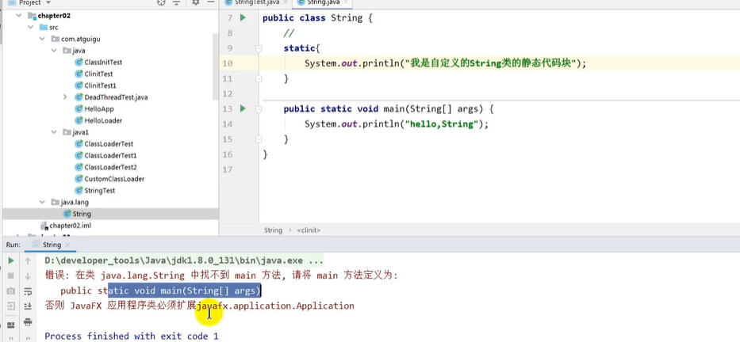
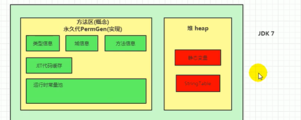
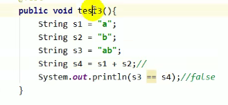

### JVM

#### 第一章：jvm与java体系结构

java（java文件）-》class（字节码文件）


#### 第二章：类加载子系统


加载阶段 连接阶段 初始化阶段

##### 类加载子系统作用：

1. 类加载子系统负责从文件或者网络中加载class文件，class文件再文件开头有特定的文件标识
2. classloader值负责class文件的加载，至于它是否可以运行，则由ExecutionEngine决定
3. 加载的类信息存放于一块称为方法区的内存空间。除了类的信息外，方法区中还会存放运行时常量池信息，可能还包括字符串变量和数字常量（这部分常量信息是class文件中常量池的内存映射）

##### 类加载过程


1. 通过一个类的全限定名称获取定义此类的二进制字节流
2. 将这个字节流锁代表的静态存储结构转化为方法区的运行时数据结构
3. 在内存中生成一个代表这个类的java.lang.class对象，作为方法去这个类的各种数据的访问入口

类的初始化

1. 出花阶段就算执行类构造器方法clinit过程
2. 此方法不需要定义，是javac编译器中的所有机类变量的赋值动作和静态代码块中的语句合并而来
3. 构造器方法中指令按语句文件中出现的顺序执行
4. clinit不同于类的构造器（构造器是虚拟机视角下的init）
5. 若该类具有父类，jvm会保证子类的clinit执行qian，父类的clinit已经执行完毕
6. 虚拟机必须保证一个类的clinit方法在多线程下被同步加锁

##### 类加载器

1. 引导类加载器（启动类加载器Bootstrap ClassLoader）c，c++实现，用来加载java核心类库（），用于提供jvm自身需要的类。并不继承自java.lang.classLoader,没有父类加载器。加载阔炸雷和应用类加载器，并指定为他们的父类加载器（java_home/jre/lib/rt.jar、resources.jar或sun.boot.class.path）
2. 扩展类加载器（Extension ClassLoader），自定义类加载器（jre/lib/ext）
3. 应用程序类加载器（AppClassLoader）：默认加载程序类中的类

##### 用户自定义类加载器

在java的日常应用程序开发中，类的加载几乎是由上述3中类加载器相互配合执行的，在必要时，我们还可以自定义类的加载器，来定制类的加载方式

为什么要自定义类加载器

1. 隔离加载类
2. 修改类加载方式
3. 扩展加载资源
4. 防止源码泄漏

##### 双亲委派机制

java虚拟机对class文件采用的是按需加载的方式，也就是说当需要使用该类时才会奖他的class文件加载到内存生成class对象。而且加载某个类的class文件时，java虚拟机采用双亲委派，即把请求交由父类处理它时一种任务我委派模式

工作原理：

1. 如果一个类加载器收到了类加载请求，它并不会自己先区加载，而是把这个请求委托给父类的加载器去执行。
2. 如果父类加载器还存在其父类加载器，则进一步向上委托，一次递归，请求最终讲达到顶层的启动类加载器
3. 如果父类加载器可以完成类加载器任务，就成功返回，倘若父类加载器无法完成此类加载任务，子类加载器才会尝试去自己加载，这就是双亲委派模式



###### 优势：

避免类的重复加载

保护程序安全，防止核心api被随意的串改

#### 第三章：运行时数据区


##### jvm中存在的线程：

- 虚拟机线程：这种线程的操作时需要jvm达到安全点才会出现。这些操作必须在不同的线程中发生的原因是他们都需要jvm达到安全点，这样堆才不会比那花。这种线程的执行内心包括“stop the world”的垃圾手机，线程栈手机，线程挂起以及偏向锁撤销
- 周期任务线程：这汇总线程是时间周期事件的体现，他们一般用于周期性操作的调度执行。
- gc线程：提供垃圾回收
- 编译线程：将字节码编译成本地代码
- 信号调度线程：这种线程接收信号并发送给jvm，在它内部通过调用适当的方法进行处理

##### 1、程序计数器（pc寄存器）

jvm的程序计数器中，register源于cpu的寄存器，寄存器存储指令相关的现场信息。cpu只有把数据装载到寄存器才能够运行。

这里，并非是广义上所值的物理寄存器，或许将其翻译为pc计数器。jvm中的pc寄存器是对物理pc寄存器的一种抽象模拟

特点：

1. 它是一块很小空间，可以忽略不急
2. 在jvm中，每个线程都有自己的程序计数器，是线程私有 的，生命周期与线程的生命周期保持一致
3. 任何时间一个线程都只有一个方法在执行，也就是所谓的当前方法。程序计数器会存储当前线程正在执行的java方法的jvm指令。或者，如果是在执行native方法，则是未指定值（undefined）
4. 它是程序控制流的指示器，分支，循环，跳转，异常处理，线程回复等基础功能都需要依赖这个计数器来完成
5. 字节码解释器工作时就是通过改变这个计数器值来选取吓一跳需要执行的字节码指令
6. 它是唯一一个在java虚拟机规范中没有规定任何outfoMemoryError情况的区域


###### 面试题

1、使用pc寄存器存储字节码地址有什么用？为什么使用pc寄存器记录当前线程的执行地址

​	cpu要不断切换各个线程，这时候切回来以后需要知道从哪里开始的

​	jvm的字节码解释器就需要通过改变pc寄存器的值来明确下一条应该执行什么样的字节码指令

##### 2、虚拟机栈

java虚拟机早期也叫java栈。每个线程在创建时都会创建一个虚拟机栈，其内部方法保存一个个的栈帧。对应着一个个的java方法调用

###### 开发中遇到的异常：

StackOverflowError，OutOfMemoryError

FILO


每个栈帧中存储着：

- 局部变量表，其实是一个表，主要用于存储方法参数和定义在方法体内的局部变量
- 操作数栈（表达式栈）
- 动态连接（指向运行时常量池的方法引用）
- 返回方法地址（方法正常退出或者异常退出的定义）
- 一些附加信息

###### 1）局部变量表 关于Slot的理解

- jvm会为局部变量表中的每一个slot都分配一个访问索引，通过这个索引即可以成功访问到局部变量表中指定的局部变量值
- 当一个实例方法被调用的时候，它的方法参数和方法体内部定义的局部变量将会按照顺序被复制到局部变量表中的每一个slot上
- 如果需要访问局部变量表中一个64bit的局部变量值时，只需要使用前一个索引即可。（long和double）
- 如果当前栈帧是由构造方法或者实例方法创建的，那么该对象引用this将会存放在index为0的slot处，其余的参数按照参数顺序继续排列
- 栈帧中的局部变量表中的槽位是可以重复利用的，如果一个局部变量过了其作用域，那么在其作用域之后申明的新的局部变量就有可能被复用到过期变量的槽位，从而达到节省资源的目的

###### 为什么static方法中不能调this

如果是类中的非静态方法，那么在局部变量表中的0位置会由this变量，如果是static则没有this变量，this是当前实例的引用


###### java变量的分类

按照数据类型分：基本数据类型，引用数据类型

按照类中声明的位置分：

成员变量：在使用前，都默认经历初始化值

- 类变量
- 实例变量

局部变量：在使用前，必须要进行显式赋值，否则编译不能通过。

​	局部变量表中的变量也是重要的垃圾回收根节点，只要被局部变量表中直接或者间接引用的对象，都不会被回收

###### 2）操作数栈

操作数栈可理解为java虚拟机栈中的一个用于计算的临时数据存储区。

###### 3）动态连接

###### invokedynamic指令

动态类型语言和静态类型语言两者的区别在于对类型的检查是在编译器还是运行期，满足前者是静态类型语言，反之是动态类型语言。

在直白一点就是，静态类型语言是判断变量自身的类型信息；动态类型语言是判断变量值的类型信息，变量没有类型信息，变量值才有类的信息

###### java语言中方法重写的本质：

1. 找到操作数栈顶的第一个元素所执行的对象的实际类型，记作c
2. 如果在类型c中找到与常量中的描述符合简单名称都相符的方法，则进行访问权限校验，如果通过则返回这个方法的直接引用，否则返回异常illegalAccessError
3. 否则，按照继承关系从下往上依次对c的各个父类进行第二步的搜索和验证过程
4. 如果始终没有找到合适的方法，则抛出AbstractMethodError异常

###### 4)返回地址

记录pc寄存器退出时候的值

- 返回指令包含ireturn（）当返回值是boolean，byte，char，short和int类型时使用
- lreturn，freturn，dreturn以及areturn，另外还有一个return指令供声明为void的方法
- 实例化初始化方法、类和接口的初始化方法使用

###### 5）一些附加信息

对程序提供调试的一些信息

###### 6）栈的面试题目

- 举例栈溢出的题目（StackOverFlowError）
  - 通过-Xss设置栈的大小：OOM
- 调整栈的大小，就能保证不出现溢出吗
  - 不能，只能让出现的事件晚一点
- 分配的栈内存越大越好吗
  - 
- 垃圾回收是否会设计到虚拟机栈
  - 不会，方法栈不存在gc，只通过进栈出栈
- 方法中定义的局部变量是否线程安全
  - 也不一定
  - 如果只有一个线程操作此数据，则是线程安全的
  - 如果有多个线程操作此数据，则此数据是共享数据，如果不考虑线程同步机制的化，则会存在线程安全

#### 第四章：本地方法接口

简单的讲，一个native method就是一个java调用非java代码的接口。一个native method是这样一个java方法：该方法的实现由非java语言实现，比如c。这个特征并非java语言特有，很多其他的编程语言都有这一机制，比如在c++中可以用extern c告知c++编译器去调用一个c的函数

在i当以一个native method时，并不提供具体实现，因为其实现体是由非java语言在外面实现的。

本地接口的作用是融合不同的编程语言为java所用，它的初衷是融合c/c++程序

##### 本地方法栈

用来管理本地方法的栈，也是线程私有的。运行被实现程固定或者是课动态扩展的内存大小

**当某个线程调用一个本地方法时，它就进行如了一个全新的，不受虚拟机限制的 世界。它和虚拟机拥有相同的权限**

- 本地方法可以通过本地方法接口来访问虚拟机内部的运行时数据库
- 它甚至可以直接使用本地处理器中的寄存器
- 直接从本地内存的对中分配任意数量的内存
- （这只是hotspot）并不是所有的jvm都支持本地方法。因为java虚拟机规范并没有明确要求本地方法栈的使用语言、具体实现方式，数据结构。如果jvm产品

#### 第五章：堆-Xms10m -Xmx10m

##### 一、核心概述

对于进程唯一，一个进程对应一个jvm实例，对于线程来说数据共享

- 在jvm启动时就会创建，空间也会确定。是jvm管理的最大一块内存空间。
  - 内存大小是可以条件的javac-》java

- 对象和数组永远不会存储在栈中
- 栈帧出栈之后，堆中的对象不会立即被回收会被gc回收

##### 二、内存细分

分代垃圾回收算法


Eden

新生代-》老年代-》元空间


###### 设置参数

-Xms 用来设置堆空间（年轻代+老年代）的初始内存大小

​	-X是jvm运行参数

​	ms是memory start

PrintGCDeatails

初始内存：

- 物理电脑内存/64
- 最大内存大小：物理电脑内存/4

java中Runtime是单例的，就相当于是运行时数据区

如何查看设置的参数：方式一：jps/ jstat -gc 进程id

##### 三、OOM

当内存超过堆空间大小的时候会报OOM

OutOfMemoryError：java heap space


##### 四、年轻代老年代

- 内存在jvm中的java对象可以分为两类
  - 一类是声明周期较断的瞬时对象，这一类对象的创建和消亡都非常迅速
  - 另外一类对象的声明周期缺非常长，在某些极端的情况下还能够与jvm的生命周期保持一致
- java堆区进一步细分的话，可以划分为年轻代和老年代
- 其中年轻代划分为eden，survivor0和survivor1有时候也叫（from ，to）
  - 默认-xx:NewRatio=2,表示新生代占1老年代占2，新生代占整个堆的1/3
  - 默认可以修改-xx:NewRatio=4,新生代一，老年代4

-XX：NewRatio:设置新生代与老年代比列。默认2

-XX:SurvivorRatio:设置新生代中Eden区域Survivor区的比例默认是8

-XX:-UseAdaptiveSizePolicy:关闭自适应的内存分配策略


###### 常用调优工具


###### MinorGC、Major GC与Full GC

新生代：MinorGC或者Young GC

老年代：MajorGC/Old GC。只是老年代的垃圾手机

​	目前只有CMS GC会有单独收集老年代的行为

混合收集：收集整个新生代以及部分老年代的垃圾收集

​	目前只有G1 GC会有这种行为

整堆收集（Full GC）收集整个java堆和方法区的垃圾收集

###### MinorGC触发机制

- 当年轻代空间不足时，就会触发MinorGC，这里的年轻代满指的时Eden代满，Survivor满不会引发gc。
- 因为java对象大多都具备朝生夕灭的特性，所以MinorGC非常平凡，一般回收速度也比较快。这一定义即清晰又易于理解
- MinorGC会引发STW，暂停其他用户的线程，等待垃圾回收结束，用户线程才恢复运行

###### Major GC触发条件

- 出现MajorGC经常会伴随至少一次的MinorGC
- 也就是再老年代空间不足的时候，会先尝试触发MinorGC。如果之后空间还不足，则触发MajorGC
- MajorGC速度一般会比MinorGC满10倍以上，STW的时间更长
- 如果MajorGC后，内存还不足，就OOM了

###### Full GC触发：

- 调用System.gc();
- 老年代空间不足
- 方法区空间不足
- 通过MinorGC后进入老年代的平均大小大于老年代的可用内存

###### 内存分配策略

- 优先分配到eden
- 大对象直接分配到老年代
- 打对象直接分配到老年代
  - 尽量避免程序中出现过多的大对象
- 长期存货的对象分配等老年代
- 动态对象年龄判断
  - 如果Survivor区中相同年龄的所有对象大小综合大于survivor空间的一般，年龄大于或等于改年龄对象可以直接进入老年代，无需等到MaxTenuringThreshold中要求的年龄
- 空间分配担保
  - 

###### 什么TLAB


默认情况是开启的，占1%的eden区


#### 第六章、方法区/元空间


- 方法去与java堆一样，是各个线程共享的内存区域
- 方法区在jvm启动的时候倍创建，并且它的实际的物理内存中和java堆区一样可以不连续
- 方法区的大小跟堆一样，可以选择固定大小或者扩展
- 方法去的大小决定了系统可以保存多少个类，如果系统定义了太多的类，导致方法溢出，虚拟机通用会抛出内存移除错误
  - 加载大量的第三方jar包：Tomcat部署工程过多
- 关闭jvm会释放这个区域的内存

##### 设置方法区大小

##### 解决OOM

1. 要解决OOM异常或者heap space的异常，一般的手段首先通过内存映像分析工具（Eclipse Memory Analyzer）对dump出来的堆存储快照进行分析，重点是确认内u才能中的对象是否是必要的，也就是要先分清楚到底是出现了内存泄漏还是内存溢出
2. 如果是内存泄漏，内进一步通过工具查看泄漏对象到gc roots的应用链。于是就能找到卸扣对象是通过增氧的路径与gcroot相关联并导致拦击收集器无法自动回收他们。掌握了泄漏对象的类信息，以及gcroot引用链的信息，就可以比较准确定位出泄漏代码的位置
3. 如果不存在内存泄漏，换句话说就是内存中的对象确实都还或者，按就应当检查虚拟机的对参数，与及其物理内存比看是否还可以调大，从代码上检查是否存在某些对象生命周期过长，持有状态时间过长的情况，尝试减少程序运行期间的内存消耗

##### 一、方法区内部结构


主要存储类信息、常量、静态变量、即时编译器编译后的代码缓存

###### 类信息：

1. 每个加载的类型（class、 interface、enum、annotation）
2. 这个类信息的完整有效名称（全名=包名.类名）
3. 这个类型的直接父类的完整有效名（对于interface或者java.lang.Object，都没有报名）
4. 这个类型的修饰符
5. 这个类型直接接口的一个有序表

###### 运行时常量池

- 运行时常量池是方法区的一部分
- 常量池表是class文件的一部分，用于存放编译生成的各种字面量域符号引用。这部分内容将在类加载后存放到方法区的运行时常量池中
- 运行时常量池在加载类和接口到虚拟机后，就会创建对应的运行时常量池

###### 方法区的演进细节

1. 只有hotspot才有永久代
2. 
3. 1.6之前，有永久代，静态变量存放在永久代上
4. 1.7有永久代，但已经渐渐时区永久代，字符串常量池、静态变量移除，保存在堆空间中
5. 1.8无永久代，类型信息、字段、方法、常量保存在本地内存的元空间，但字符串常量池、静态变量仍然在堆

###### 字符串常量池为什么调整

jdk7将Stringtable放到了堆空间中，因为永久代的回收效率很低，在fullgc的时候才会触发。二fullgc是老年代的空间不足，永久代不足时才会触发，这就导致stringtable回收效率不高。而我们开发中有大量的字符串被创建，回收效率低，导致永久代内存不足。放到堆里，能及时回收内存

静态变量放在那

###### 方法区的垃圾收集

- 该类所有的实例都已经被回收，也就是java堆中不存在该类及其任何子类的实例
- 加载该类的类加载器已经被回收，这个条件除非是经过精心设计的可替换类加载器如OSGI、JSP的重加载等，否则很难达成
- 该类对应的java.lang.class对象没有任何地方被引用，无法在任何地方通过反射访问该类

##### 对象的创建方式

1. new
   - 变形：单例模式
   - xxxbuilder/xxfactory静态方法
2. class的newInstance():反射的方式，只能调用空参的构造器，权限必须是public
   - Constuctor的newInstance();反射的方式，可以调用空参、带参的构造器，权限没有要求
3. 使用clone():不调用任何构造器，当前类需要实现Cloneable接口，实现clone();
4. 使用反序列化：从文件中，从网络中
5. 第三方库Objenesis

##### 创建对象的步骤

1. 判断对象对应的类是否加载、链接、初始化：虚拟机遇到一条new指令，首先区检查这个指令的参数能否在Mataspace的常量池中定位到一个类的符号引用，并且检查这个符号引用代表的类是否已经被加载

   解析和初始化。如果没有，那么在双亲委派模式下使用当前类加载器以classloader+报名+类名为key进行查找对应的.class文件。如果没有找到文件，则抛出classNotFoundException异常，如果找到，则进行类加载，并生成对应的class类对象

2. 为对象分配内存

3. 处理并发安全问题

   - 采用cas失败重试、区域枷锁保证更新的原子性
   - 每个线程预先分配一块TLAB--通过XX;+/-UseTLAB参数来设定

4. 初始化分配到的空间-所有属性设置默认

5. 设置对象头的信息

6. 属性的显式初始化、代码块初始化、构造器初始化

##### 对象的内存布局

1. 对象头
   - 运行时元数据：哈希值、gc分代年龄、锁状态标志、线程持有的锁、偏向线程id、偏向时间截
   - 指针类型：指向类元数据InstanceClass，确定对象所属类型
2. 实例数据：
3. 对齐填充：不是必须的，也没特别含义
4. 

##### hascode方法

很多地方会利用hash来提高查找效率。在java的Object累中有个

```java
public native int hashCode();
```

​	根据方法声明可知，改方法返回一个int类型的数值，并且是本地方法，因此在Object累中并没有给出具体的实现。

​	hash用来判断集合中是否一集存放

##### 对象访问的方式：

1. 句柄访问：空间有点浪费。栈空间的地址比较稳定
2. 对象指针（hotspot）：访问方便

#### 第七章、直接内存

1. 不是虚拟机运行时的一部分
2. 是java堆外的 、直接向系统申请内存
3. 来源于nio，同堆中的DirectByteBuffer操作Native内存
4. 通常，访问直接内存的速度会由于java堆
5. 直接内存也会造成OOM

#### 第八章、执行引擎

##### 1、什么是解释器，什么是jit编译器

解释器：当java虚拟机启动时会根据预定义的规范对字节码采用卓航解释的方法执行，每条字节码文件中的内容翻译为对应平台的本地机器指令执行

jit编译器：就是虚拟机将源码直接编译成和本地机器平台相关的机器语言

###### 1）机器码

- 各种二进制方式表示的指令，叫做机器去指令码（00111011）

###### 2)指令

- 指 将特定的01序列简化成对应指令（mov，inc），可读性好
- 不同硬件平台，执行同一个操作，对应的机器可能不同，所以不同的硬件平台的同一种指令比如mov对应的机器码不同

###### 3）汇编

- 由于指令可读性不好
- 也需要翻译才能使用

###### 4）高级语言

- 更接近人类语言

###### 5）字节码

- 时一种中间状态的二进制文件，比机器起码更抽象，要至一七转义后才能称为机器码
- 字节码主要为了实现特定软件运行和软件环境，与硬件无关
- 字节码的实现方式是通过编译器和虚拟机

##### 2、解释器：

是一个运行时翻译者，翻译成不同平台jvm的字节码。在设计和实现上非常简单，因此除了java语言之外，还有许多高级语言同样也是基于解释器执行的。基于解释器执行已经比较抵消，并且时常被c/c++程序员调侃

为了解决这个问题，jvm平台支持一种就做即时编译的技术，目的是避免幻术被解释执行，而是将整个函数体编译为机器码，每次函数执行时，只执行编译后的机器码即可，这种方式可以使执行效率大幅度提示

##### 3、jit编译器

- 前端编译器.java->.class
- 后端编译器jit .class-》机器码
- 静态前端编译器.java->机器码

###### 热点代码探测

循环的代码就算一个热点代码。

hotspot vm用热点探测方式是基于计数器热点探测，阈值是10000次

*******

将代码直接翻译成机器指令，执行效率要快


###### java为什么要保留解释器

当虚拟机启动的时候，解释器可以首先发挥作用，而不必等待即时编译器全部编译完成再执行，这样可以省去很多不必要的编译时间。并且随着程序运行时间的推移，即时编译器才能发挥作用，根据热点探测功能，将有价值的字节码编译为本地机器指令，以换取更阿公的程序执行效率


热度衰减

#### 第九章、String

- 声明final，不可继承

  ```java
  final char value[];//（jdk1.8）
  final char byte[];//jdk1.9
  ```

  

- 实现了Serialiable接口：表示字符串是支持序列化的

- 实现了Comparable接口

##### String内存分配

字符串常量池不允许存放相同字面量的字符串，原理是hashtable

##### 字符串拼接操作

- 常量与常量的拼接结果再在常量池，原理是编译优化
- 常量池不会u才能在相同的常量
- 只要其中有一个是变量，结果就在堆中。变量拼接的原理是StringBuilder
- 如果拼接的结果调用intern()方法，则主动将常量池中还没有的字符串对象放入池中，并返回此对象
- **如果拼接符号的前后出现了变量**则相当于在堆空间中new String(),具体内容为拼接的字符串
- intern()判断字符串常量池中是否存在javaEEHadoop值，如果存在，则返回常量池中的结果地址

s1+s2的执行细节：

1. StringBuilder s=new StringBuilder();
2. s.append(a);
3. s.append(b);
4. s.toString()--->类似于new String("ab");
5. 在jdk5.0用的是StringBuffer


字符串拼接操作不一定用到是StringBuilder

如果平均符号左右都是字符串常量或引用，则仍然使用编译器优化，即非StringBuilder的方式

###### StringBuilder

1. 体会效率：通过StringBuilder的append()方式添加字符串的效率要远高于String的字符串拼接方式
   1. StringBuilder自始至终只创建了一次对象，String拼接要先newStringBuilder，然后再newString。
   2. 而且String的方式占用的内存更大
2. 改进方式：再实际开发中，如果基本确定要添加字符串长度高于每个限定值情况下，建议使用StringBuilder s=new StringBuilder(int capcity)

##### intern()的使用


两个对象：new关键字在堆中创建的，另一个：字符串常量池中的对象


深入刨析StringBuilder.toString();在字符串不创建ab


###### 总结：

jdk1.6中

- 如果串池中有，则并不会放入。返回已有的串池中的对象地址
- 如果没有，会把此对象复制一份，放入串池中，并返回串池的地址

jdk1.7以后

- 如果串池中有，则不会放入，如果已有返回串池地址
- 如果没有，则会把对象的引用地址复制一份，放入串池，并返回串池中的引用返回串池的地址

对于程序中大量存在的字符串，尤其其中存在很多重复的字符串的时候，会节省内存

##### StringTable垃圾回收

#### 第十章、垃圾回收

##### 一、什么是垃圾

- 在运行程序中没有任何指针指向的对象，这个对象就需要被垃圾回收
- 如果不及时对内存中的垃圾进行清理，那么这些垃圾对象所占的内存空间会一直保留到应用程序结束，被保留的空间无法被其他对象使用。甚至导致内存溢出。  

##### 二、早期垃圾回收

这种方式可以灵活控制内存释放的时间，但是会给开发人员带来平凡申请和释放内存的管理负担。倘若有溢出内存区间由于程序员编码的问题，会造成内存泄漏的问题

##### 三、java垃圾回收机制

自动内存管理，无需开发人员手动分配内存。

使得程序员更加专注于业务开发

对于java开发人员而言，自动内存管理就像是一个黑匣子，过度依赖于自动，就会弱化java开发人员在程序出现内存溢出时定位问题和解决问题的能力

此时了解jvm的子哦对那个内存分配和内存回收原理就显得格外的重要。只有真正了解jvm是如何管理内存之手，我们才能在遇见OOM时，快速地根据错误异常日志定位问题和解决问题

当需要排查各种内存溢出、内存泄漏问题时，当垃圾手机称为系统达到更高并发量的瓶颈，我们就必须对这些自动化的技术实施必要的监控和调节

**频繁手机young区，较少收集old区，几乎不动Perm区（元空间）**

##### 四、垃圾回收算法

######  标记阶段：、

在堆里存放着几乎所有的java对象实例，在gc执行垃圾回收之前，首先需要区分出内存中那些是存活对象，那些是已经死亡的对象。只有被标记为已经死亡的对象，gc才会在执行垃圾回收时，释放掉其所占的空间，为此这个过程我们可以称为垃圾标记阶段

- 引用计数法：堆每个对象保存一个整数型的引用计数属性。用于记录对象被引用的情况
  - 缺点：增加了开销，增加了时间开销，无法处理循环引用的缺点
  - 优点：实现简单，垃圾对象便于辨识、回收没有延迟性
- 可达性分析算法
  - 以跟对象集合GC Roots为起点，按照从上到下的方式，搜索堆跟对象集合所连接的目标对象是否可达
  - 使用可达性分析算法后，内存中的存活对象都会被跟对象集合直接或间接连接着，搜索所走过的路径称为引用链
  - 如果目标对象没有任何引用链相连，则是不可达的，着就意味着该对象已经死亡，可以被标记为垃圾
  - 可以解决循环引用的问题
- gc root包括
  - 虚拟机栈中引用的对象
  - 本地方法栈
  - 方法区中类静态属性引用
  - 方法区常量引用的对象
  - 被同步锁锁synchronized持有的 对象
  - java虚拟机内部引用
    - 基本数据类型对应的Class对象，一下常驻的异常对象，系统类加载器
  - 反应java虚拟机内部情况的JMXBean、JVMTI中注册的回调，本地代码缓存
  - **处理以上**根据用户锁选用的垃圾收集器已经当前回收的内存区域不同，还可以有其他对象零时加入，共同构成完整gcroot。比如：分代收集和局部回收
    - 如果指针支队jacva堆中的某一块区域进行垃圾回收（比如：典型的指针堆新生代），必须考虑到内存区域是虚拟机自己的实现细节，更不是孤立封闭的，这个区域的对象完全由可能被其他区域的对象锁引用，这时候就需要一并将关联的区域对象也加入gc root集合中区考虑，才呢个保证准确性


###### 清除阶段：

- 标记-清除（Mark-Sweep）算法：标记被引用的对象，	
  - 缺点：效率不高，gc要停止程序，用户体验差，清理出来的内存不连续，会产生内存碎片
- 复制算法：（年轻代+）将或者的内存空间分为两块，每次只使用其中一块，在垃圾回收时将正在使用的内存中的存活对象赋值到违背使用的内存块中，之后清除正在使用的的内存块中的所有对象，交换两个内存的角色，最好完成垃圾回收
  - 优点：运行高效、复制后连续空间，连续高效
  - 缺点：需要两倍内存，gc嗨哟啊维护栈中对象引用关系，开销也不小
  -  如果垃圾很多，复制算法复制的对象也不算大
- 标记-压缩（Mark-Compact）算法
  - 


###### 对象的finalization机制

1. 可触及的
2. 可复活的：可能会在finalize（）方法中符号
3. 不可触及的：finalize（）被调用，并且没有复活

当垃圾回收器发现没有引用指向一个对象，即，垃圾回收此对象之前，总会先调用这个对象的finalize()方法。

finalzie()方法允许在子类中被重写，用于在对象被回收时进行资源释放。通常在这个方法中进行一些资源释放和清理工作，比如关闭文件、套接字和数据库连接等

###### 分代收集算法

1. young区域

增量收集算法：

#### 第十一章、垃圾回收

##### System.gc()

​	在默认情况下，通过System.gc()或者Runtiem.getRuntime().get()的调用，会显式触发Full GC，同时堆老年嗲和新生代进行回收，尝试释放被丢弃对象占用的内存

​	然而System.gc()/Runtiem.getRuntime().get()调用附带一个免责声明，无法保证堆垃圾收集器的调用。仅仅是提醒jvm来回收，但不一定会回收

​	jvm实现这可以通过System.gc()调用来决定JVM的gc。而一般情况下，垃圾回收应该是自动进行的，无需手动触发，否则就太过于麻烦了。在一些特殊情况下，如果我们正在编写一个性能的基准，我们而已在运行之间调用System.gc()。

​	但是System.finalizegc

##### 内存溢出

大多数情况下，gc会进行各种年龄断的垃圾回收，实在不行，来一次独占式Full GC操作。

javadoc中堆OutOfMemoryError的解释是，没有空闲的内存，并且垃圾收集器也无法提供更多内存

###### 原因：

1. java虚拟机的堆内存设置不够
2. 代码中创建了大量大对象，并且长时间不能被垃圾收集器收集

##### 内存泄漏的例子：

严格意义上只有对象不再被程序用到了，但是gc又不能回收他们的情况，才交内存泄漏

实际情况有时候会导致对象的声明周期变长，甚至导致OOM，也可以叫做宽泛意义上的内存泄漏

尽管内存泄漏并不会引起程序崩溃，但是一旦发生，程序中可用内存会被蚕食，直至耗尽所有内存，最终出现内存泄漏

###### 举例

1. 单例模式：到哪里的声明周期应该和应用程序一样长，所以单例程序中，如果持有对外部对象的引用的话，那么这个外部对象是不能被回收的，则会导致内存泄漏的产生，
2. 一些close的资源被关闭导致内存泄漏：数据库连接，网络连接和io连接必须手动close，否则不能被回收

##### stop the world

在gc时间发生时，会产生程序的停顿。应用线程都会被暂停，有点像卡死

- 可达性根系算法中，枚举根节点（gc root）会导致所有的java执行线程停顿。
  - 分析工作必须在一个能确保一致性的快照中进行

##### 垃圾回收的并行与并发

并行：只多条垃圾收集线程并行工作，用户线程处于等待状态

并发：用户线程和垃圾收集线程同时执行

##### 安全点与安全区域

安全点：程序并非在所有时间点上能停下来执行gc，能停下来的点叫做安全点。如果太少可能导致gc等待时间太长，如果频繁可能导致运行时的性能问题。

安全区域：当线程处于sleep状态或者blocked状态，这时候线程无法响应jvm的中断请求。安全与去是指在一段代码片段中，引用不会发生变化，什么时候都能gc，那么就出现了安全区域

##### 关于引用的种类

都继承了Reference<T>java.lang.ref


##### 强引用

最传统 的引用定义，是指在程序代码之中普遍存在的引用赋值，即类似“Object obj=new Object()”.无轮任何情况下都不会被回收

###### 软引用

在内存不足将会回收

##### 弱引用

只要垃圾收集，都会被回收

##### 虚引用

一个对象是否又虚引用的存在，完全不会堆器生存时间构成影响，也无法通过虚引用获得一个对象的实例。为一个对象设置序引用关系的唯一目的就算能在这个对象被收集器回收时收到一个系统通知。用于对象回收跟踪

#### 第十二章、垃圾回收器


##### Serial回收器：串行回收

jdk1.3之前回收新生代唯一的选择，使用复制算法。

老年代有 Serial old

- serial old运行在Cilent模式下是默认的老年代的垃圾回收器（标记压缩算法）
- Serial old在Server模式下：1
  - 新生代的Parallel Scavenge配合使用
  - 作为老年代cms收集器
- 优势：简单高效

##### ParNew回收：并行回收

采用并行回收。Server模式是默认的垃圾回收器

##### Parallel Scavenge回收器：吞吐量优先

采用复制算法，吞吐量优先的垃圾收集器

适合在后台高效的运行。执行批量处理

Paraller old标记整理算法

##### CMS回收器：低延迟

Concurrent-Mark-Sweep收集器，这款收集器是HotSpot虚拟机中第一款真正意义上的并发收集器，实现了垃圾收集线程和用户线程同时工作

标记清除算法

##### G1回收器：区域化分代式

并行回收器，它把堆内存分割为很多不相关的区域。使用不同的Region来表示Eden，s1，s0，幸存者1，老年代等。

g1 gc有计划的避免在整个java堆中进行全区域的垃圾收集。G1跟踪各个Region里面的垃圾堆积的价值大小，在后台维护一个优先列表，每次根据允许的时间，优先回收价值最大 的Region。jdk9默认使用

jdk8默认是pareller

###### 特征：

- 并行与并发：
  - 

