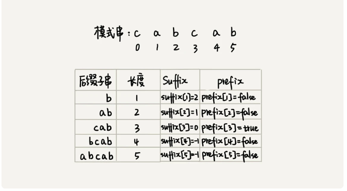

#### 10月28日

jenkins介绍：https://blog.csdn.net/qq_59114219/article/details/126372801

java8 **Java 8 特性 – 终极手册**：https://www.bilibili.com/read/cv14169138

java Stream 文档：https://blog.csdn.net/QiuHaoqian/article/details/120942134

Stream

新增加的Stream API (java.util.stream)引入了在Java里可以工作的函数式编程。这是目前为止对java库最大的一次功能添加，希望程序员通过编写有效、整洁和简明的代码，能够大大提高生产率。

Stream API让集合处理简化了很多（我们后面会看到不仅限于Java集合类）。让我们从一个简单的类Task开始来看看Stream的用法。

```java
public class Streams {
    private enum Status {
        OPEN, CLOSED
    };
    private static final class Task {
        private final Status status;
        private final Integer points;
        Task( final Status status, final Integer points ) {
            this.status = status;
            this.points = points;
        }
        public Integer getPoints() {
            return points;
        }   
        public Status getStatus() {
            return status;
        }
        @Override
        public String toString() {
            return String.format( "[%s, %d]", status, points );
        }
    }
} 
```

Task类有一个分数的概念（或者说是伪复杂度），其次是还有一个值可以为OPEN或CLOSED的状态.让我们引入一个Task的小集合作为演示例子：

```java
final Collection< Task > tasks = Arrays.asList(
    new Task( Status.OPEN, 5 ),
    new Task( Status.OPEN, 13 ),
    new Task( Status.CLOSED, 8 )
);
```

第一个问题是所有的开放的Task的点数是多少？在java 8 之前，通常的做法是用foreach迭代。但是Java8里头我们会用Stream。Stream是多个元素的序列，支持串行和并行操作。

```java
// Calculate total points of all active tasks using sum() 
final long totalPointsOfOpenTasks = tasks
    .stream()
    .filter(task -> task.getStatus() == Status.OPEN)
    .mapToInt( Task::getPoints )
    .sum();
System.out.println("Total points: " + totalPointsOfOpenTasks); 
```

最后，就像前面提到的，Stream API不仅仅处理Java集合框架。像从文本文件中逐行读取数据这样典型的I/O操作也很适合用Stream API来处理。下面用一个例子来应证这一点。

```java
final Path path = new File( filename ).toPath();
try( Stream< String > lines = Files.lines( path, StandardCharsets.UTF_8 )
   ) {
    lines.onClose( () -> System.out.println("Done!") ).forEach( System.out::println );
} 
```

##### stream

Here we use `widgets`, a `Collection<Widget>`, as a source for a stream, and then perform a filter-map-reduce on the stream to obtain the sum of the weights of the red widgets. 

The classes [`Stream`](https://docs.oracle.com/javase/8/docs/api/java/util/stream/Stream.html), [`IntStream`](https://docs.oracle.com/javase/8/docs/api/java/util/stream/IntStream.html), [`LongStream`](https://docs.oracle.com/javase/8/docs/api/java/util/stream/LongStream.html), and [`DoubleStream`](https://docs.oracle.com/javase/8/docs/api/java/util/stream/DoubleStream.html) are streams over objects and the primitive `int`, `long` and `double` types

```java
int sum = widgets.stream()
                      .filter(b -> b.getColor() == RED)
                      .mapToInt(b -> b.getWeight())
                      .sum();
```

```java
     int sumOfWeights = widgets.parallelStream()
                               .filter(b -> b.getColor() == RED)
                               .mapToInt(b -> b.getWeight())
                               .sum();
```

```java
     List<String> l = new ArrayList(Arrays.asList("one", "two"));
     Stream<String> sl = l.stream();
     l.add("three");
     String s = sl.collect(joining(" "));
=========out==========
    one two three
```

##### stream methods of way

- From a [`Collection`](https://docs.oracle.com/javase/8/docs/api/java/util/Collection.html) via the `stream()` and `parallelStream()` methods;
- From an array via [`Arrays.stream(Object[\])`](https://docs.oracle.com/javase/8/docs/api/java/util/Arrays.html#stream-T:A-);
- From static factory methods on the stream classes, such as [`Stream.of(Object[\])`](https://docs.oracle.com/javase/8/docs/api/java/util/stream/Stream.html#of-T...-), [`IntStream.range(int, int)`](https://docs.oracle.com/javase/8/docs/api/java/util/stream/IntStream.html#range-int-int-) or [`Stream.iterate(Object, UnaryOperator)`](https://docs.oracle.com/javase/8/docs/api/java/util/stream/Stream.html#iterate-T-java.util.function.UnaryOperator-);
- The lines of a file can be obtained from [`BufferedReader.lines()`](https://docs.oracle.com/javase/8/docs/api/java/io/BufferedReader.html#lines--);
- Streams of file paths can be obtained from methods in [`Files`](https://docs.oracle.com/javase/8/docs/api/java/nio/file/Files.html);
- Streams of random numbers can be obtained from [`Random.ints()`](https://docs.oracle.com/javase/8/docs/api/java/util/Random.html#ints--);
- Numerous other stream-bearing methods in the JDK, including [`BitSet.stream()`](https://docs.oracle.com/javase/8/docs/api/java/util/BitSet.html#stream--), [`Pattern.splitAsStream(java.lang.CharSequence)`](https://docs.oracle.com/javase/8/docs/api/java/util/regex/Pattern.html#splitAsStream-java.lang.CharSequence-), and [`JarFile.stream()`](https://docs.oracle.com/javase/8/docs/api/java/util/jar/JarFile.html#stream--).

##### parallelStream 和Stream

并行Stream和串行Stream

##### distinct和set去重测试

```java
        Stream<Double> stream = Stream.generate(Math::random).limit(10000000);
        Set<Double> set = new HashSet<>();
        long t1 = new Date().getTime();
        stream.forEach(e->{
            set.add(e);
        });
        long t2 = new Date().getTime();
        System.out.println((t2 - t1) / 1000);
        stream = Stream.generate(Math::random).limit(10000000);
        long t3 = new Date().getTime();
        stream.distinct();
        long t4 = new Date().getTime();
        System.out.println((t4 - t3) / 1000);
=============out===============
4
0
```


#### 10月31日

##### vue router api

router.start

```
router.start({
  template: '<router-view></router-view>'
}, '#app')
```

##### vuex mapGetters

在Vue项目的开发过程中必然会使用到vuex，对vue项目公用数据进行管理，从而解决组件之间数据相互通信的问题，如果不使用vuex，那么一些非父子组件之间的[数据通信](https://so.csdn.net/so/search?q=数据通信&spm=1001.2101.3001.7020)将会变得极为繁琐。

| **State**    | **共享状态（即变量）**                                       |
| ------------ | :----------------------------------------------------------- |
| **Mutation** | **更改vuex的store中state的唯一方法，只有通过提交mutation才能修改状态（变量值）** |
| Action       | 类似mutation，修改store中的状态。但是刚才说过只有通过提交mutation才能修改状态，所以Action也是通过提交mutation修改store中的状态 ，与Mutataion不同的是Action支持异步操作 |
| Module       | 模块，在大型项目中为了方便状态的管理和协作开发将store拆分为多个子模块（modules），每个子模块拥有完整的state、mutation、action、getter。（这里先不介绍） |
| Getter       | 基于state的派生状态，可理解为组件中的计算属性                |

vuex新手文档：https://www.cnblogs.com/lxbxyz/p/13128021.html

##### V-on指令的使用

给标签绑定事件


#### 11月2日

##### BM字符串匹配算法

模式串哈希表建立

```java
private static final int SIZE = 256; // 全局变量或成员变量
private void generateBC(char[] b, int m, int[] bc) {
    for (int i = 0; i < SIZE; ++i) {
        bc[i] = -1; // 初始化bc
    }
    for (int i = 0; i < m; ++i) {
        int ascii = (int)b[i]; // 计算b[i]的ASCII值
        bc[ascii] = i;
    }
}
```

只考虑坏字符代码

```java
public int bm(char[] a, int n, char[] b, int m) {
    int[] bc = new int[SIZE]; // 记录模式串中每个字符最后出现的位置
    generateBC(b, m, bc); // 构建坏字符哈希表
    int i = 0; // i表示主串与模式串对齐的第一个字符
    while (i <= n - m) {
        int j;
        for (j = m - 1; j >= 0; --j) { // 模式串从后往前匹配
            if (a[i+j] != b[j]) break; // 坏字符对应模式串中的下标是j
        }
        if (j < 0) {
            return i; // 匹配成功，返回主串与模式串第一个匹配的字符的位置
        }
        // 这里等同于将模式串往后滑动j-bc[(int)a[i+j]]位
        i = i + (j - bc[(int)a[i+j]]);
    }
    return -1;
}
```



第一个for循环用来初始化。第二个for循环用来从头到尾遍历检测每个位置前面是否存在与好后缀末尾字符匹配。如果能匹配上（进入while循环），就往前匹配在这个字符前的高位也是否能匹配上，并将低位存储在suffix数组内。这里的低位表示长度短的好后缀（同理高位），这个while循环就是负责在能匹配低位的基础上往前匹配高位也能否匹配上。一句话概括，从头到尾遍历每个位置匹配好后缀末尾，匹配上就逐位往前匹配，并将能匹配上的好后缀放入其相应的suffix数组位置内。

```java
// b表示模式串，m表示长度，suffix，prefix数组事先申请好了
private void generateGS(char[] b, int m, int[] suffix, boolean[] prefix) {
    for (int i = 0; i < m; ++i) {// 初始化
        suffix[i] = -1; prefix[i] = false;
    }
    for (int i = 0; i < m - 1; ++i) { // b[0, i]
        int j = i;
        int k = 0; // 公共后缀子串长度
        while (j >= 0 && b[j] == b[m-1-k]) { // 与b[0, m-1]求公共后缀子串 
            --j;
            ++k;
            suffix[k] = j+1; //j+1表示公共后缀子串在b[0, i]中的起始下标
        }
        if (j == -1) prefix[k] = true; //如果公共后缀子串也是模式串的前缀子串
    }
}
```

bm完整代码

```java
// a,b表示主串和模式串；n，m表示主串和模式串的长度。
public int bm(char[] a, int n, char[] b, int m) {
    int[] bc = new int[SIZE]; // 记录模式串中每个字符最后出现的位置
    generateBC(b, m, bc); // 构建坏字符哈希表
    int[] suffix = new int[m];
    boolean[] prefix = new boolean[m];
    generateGS(b, m, suffix, prefix);
    int i = 0; // j表示主串与模式串匹配的第一个字符
    while (i <= n - m) {
        int j;
        for (j = m - 1; j >= 0; --j) { // 模式串从后往前匹配 
            if (a[i+j] != b[j]) break; // 坏字符对应模式串中的下标是j
        }
        if (j < 0) {
            return i; // 匹配成功，返回主串与模式串第一个匹配的字符的位置
        }
        int x = j - bc[(int)a[i+j]];
        int y = 0; if (j < m-1) { // 如果有好后缀的话
            y = moveByGS(j, m, suffix, prefix);
        }
        i = i + Math.max(x, y);
    }
    return -1;
}
// j表示坏字符对应的模式串中的字符下标; m表示模式串长度
private int moveByGS(int j, int m, int[] suffix, boolean[] prefix) {
    int k = m - 1 - j; // 好后缀长度
    if (suffix[k] != -1)
        return j - suffix[k] +1;
    for (int r = j+2; r <= m-1; ++r) {
        if (prefix[m-r] == true) {
            return r; 
        }
    } 
    return m;
}
```


##### @builder

```java
@builder
public class User {
	private String id ;
	private String name ;
	private Integer age ;
 // ignore getter/setter 
 }
```

```java
public static void main(String[] args) {
		User user = User.builder()
            		.id("11")
            		.name("小明")
            		.age(17)
            		.build();
		System.out.println(user);
	}
```

#### 11月7日

##### Nexcus简介

Nexus 是一个强大的 Maven 仓库管理器，它极大地简化了自己内部仓库的维护和外部仓库的访问。利用 Nexus 你可以只在一个地方就能够完全控制访问 和部署在你所维护仓库中的每个 Artifact。Nexus 是一套 “开箱即用” 的系统不需要数据库，它使用文件系统加 Lucene 来组织数据。Nexus 使用 ExtJS 来开发界面，利用 Restlet 来提供完整的 REST APIs，通过 m2eclipse 与 Eclipse 集成使用。Nexus 支持 WebDAV 与 LDAP 安全身份认证。

**nexus安装**：https://blog.51cto.com/u_14901322/2521560

##### vue代理服务器

```javascript
module.exports = {
    publicPath: "/",
    devServer: {
        proxy: {
            "/api": {
                // 代理名称   凡是使用/api开头的地址都是用此代理
                target: "http://1.2.3.4:5000/", // 需要代理访问的api地址
                changeOrigin: true, // 允许跨域请求
                pathRewrite: {
                    // 重写路径，替换请求地址中的指定路径
                    "^/api": "/", // 将请求地址中的/api替换为空，也就是请求地址中不会包含/api/
                },
            },
        },
    },
};
```

##### MaterShpere

官方文档：https://metersphere.io/docs/v2.x/system_arch/#2

**技术栈：**

- 后端: [Spring Cloud](https://www.tutorialspoint.com/spring_cloud/spring_cloud_introduction.htm)
- 前端: [Vue.js](https://vuejs.org/)
- 中间件: [MySQL](https://www.mysql.com/), [Kafka](https://kafka.apache.org/), [Redis](https://redis.io/), [Minio](https://min.io/), [Prometheus](https://prometheus.io/)
- 基础设施: [Docker](https://www.docker.com/), [Kubernetes](https://kubernetes.io/)
- 测试引擎: [JMeter](https://jmeter.apache.org/)

1、学习MeterShere自动化测试平台

2、与导师交流修改第二次评估ppt

3、学习vue的代理配置 

4、学习nexus概念和配置 

#### 11月9日

##### zk下载地址：

##### https://archive.apache.org/dist/zookeeper/

##### kafka配置：

##### https://www.cnblogs.com/azhuya/p/15125433.html

1、运行metersphere前端程序运行成功

2、运行metersphere后端编译构建成功，zk，kafka未安装

3、学习maven的install功能和deploy功能

4、学习路径相关


#### 11月10日

##### server.http.port和server.port

最近springboot项目为了安全启用了https，但是项目中还写了接口供其他程序调用，这个接口必须是http的。研究发现原来一个springboot项目是可以有一个http端口和一个https端口的。

##### shiro

通常，公司的项目都会有严格的认证和授权操作，在Java开发领域常见的安全[框架](https://so.csdn.net/so/search?q=框架&spm=1001.2101.3001.7020)有Shiro和Spring Security。Apache Shiro是一个开源的轻量级Java安全管理框架，提供认证、授权、密码管理、缓存管理等功能，相对于Spring Security框架更加直观，易用，同时也能提供健壮的安全性。

对于Spring Boot项目，[Shiro](https://so.csdn.net/so/search?q=Shiro&spm=1001.2101.3001.7020)官方提供了shiro-spring-boot-web-starter来简化Shiro在Spring Boot中的配置，不需要手动整合。

**Shiro 核心组件**


Realm

Realm Bean是ShiroConfig配置类中的第1个Bean，此处只展示一个LdapReam Bean。注解@DependsOn表示组件依赖，下图中表示依赖lifecycleBeanPostProcessor。LifecycleBeanPostProcessor用来管理shiro Bean的生命周期，在LdapReam创建之前先创建lifecycleBeanPostProcessor。

SecurityManager

Shiro通过SecurityManager来管理内部组件实例，并通过它来提供安全管理的各种服务。modularRealmAuthenticator是shiro提供的realm管理器，用来设置realm生效, 通过setAuthenticationStrategy来设置多个realm存在时的生效规则。

shiro流程图


##### https

http存在三个弊端：
无法保证消息的保密性
无法保证消息的完整性和准确性
无法保证消息来源的可靠性
https就是为了解决上述问题应运而生的。

为了保证消息的保密性，就需要用到加密和解密。加解密算法目前主流的分为对称加密和非对称加密。
**1.对称加密（共享密匙加密）：**客户端和服务器公用一个密匙用来对消息加解密，这种方式称为对称加密。客户端和服务器约定好一个加密的密匙。客户端在发消息前用该密匙对消息加密，发送给服务器后，服务器再用该密匙进行解密拿到消息。

对称加密的优点：
对称加密解决了http中消息保密性的问题

对称加密的缺点：
对称加密虽然保证了消息保密性，但是因为客户端和服务器共享一个密匙，这样就使得密匙特别容易泄露。
因为密匙泄露风险较高，所以很难保证消息来源的可靠性、消息的完整性和准确性。

**2.非对称加密（公有密匙加密）：**既然对称加密中，密匙那么容易泄露，那么我们可以采用一种非对称加密的方式来解决。

采用非对称加密时，客户端和服务端均拥有一个公有密匙和一个私有密匙。公有密匙可以对外暴露，而私有密匙只有自己可见。

使用公有密匙加密的消息，只有对应的私有密匙才能解开。反过来，使用私有密匙加密的消息，只有公有密匙才能解开。这样客户端在发送消息前，先用服务器的公匙对消息进行加密，服务器收到后再用自己的私匙进行解密。

非对称加密的优点：
非对称加密采用公有密匙和私有密匙的方式，解决了http中消息保密性问题，而且使得私有密匙泄露的风险降低。因为公匙加密的消息只有对应的私匙才能解开，所以较大程度上保证了消息的来源性以及消息的准确性和完整性。

非对称加密的缺点：非对称加密时需要使用到接收方的公匙对消息进行加密，但是公匙不是保密的，任何人都可以拿到，中间人也可以。那么中间人可以做两件事，第一件是中间人可以在客户端与服务器交换公匙的时候，将客户端的公匙替换成自己的。这样服务器拿到的公匙将不是客户端的，而是服务器的。服务器也无法判断公匙来源的正确性。第二件是中间人可以不替换公匙，但是他可以截获客户端发来的消息，然后篡改，然后用服务器的公匙加密再发往服务器，服务器将收到错误的消息。非对称加密的性能相对对称加密来说会慢上几倍甚至几百倍，比较消耗系统资源。正是因为如此，https将两种加密结合了起来。

3.数字证书与数字签名

为了解决非对称加密中公匙来源的不安全性。我们可以使用数字证书和数字签名来解决。

数字证书的申请

在现实中，有一些专门的权威机构用来颁发数字证书，我们称这些机构为认证中心（CA Certificate Authority）。

我们（服务器）可以向这些CA来申请数字证书。

###### DSA算法、ECC、DH

