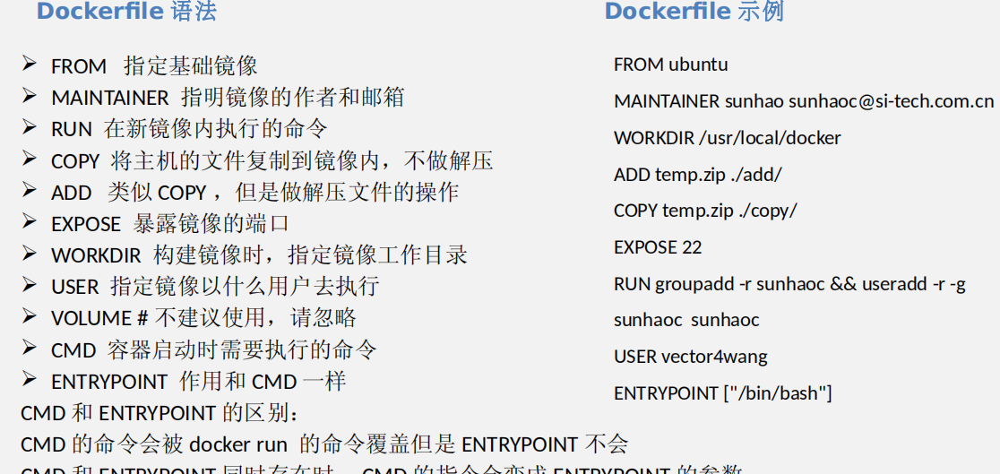
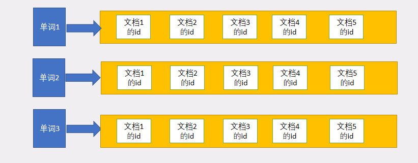
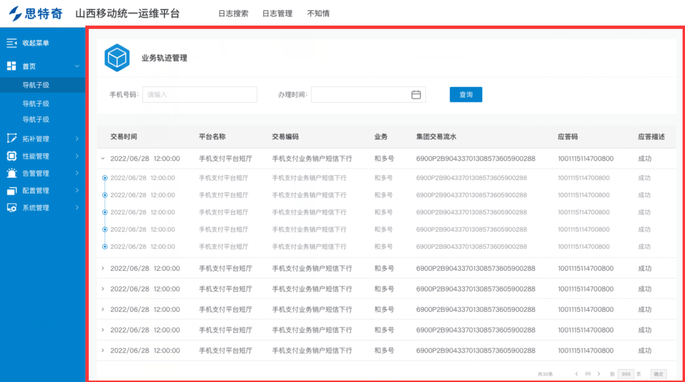

csd

### 8月4号

学习内容：

1、完成了代理软件proxifier的下载，并且配置了代理

2、对电脑的环境进行了配置，安装了fis、npm的环境配置，为今后的开发做准备。

3、学习了日志收集平台的架构，复习了昨天学习到的系统架构所设计技术的理论知识。

4、学习了监控系统的后端架构，对后端的架构知识有了进一步的认识。

5、通过文档，学习了devops系统的使用。学习了容器系统的使用。

**反思**：对devops系统和容器配置系统掌握并不是很好，需要继续学习。通过今天的学习，虽然了解到了各个系统功能的相关架构，但是对系统架构中对应技术的使用还有不足，不会使用。

#### 笔记：

##### devops生产环境使用：

1. gitlab地址： http://172.18.238.62:9002/ 
2. 新建产品线组explore groups，填写相关信息
3. 进入产品线组，new project，输入相关信息
4. 使用svn git上传代码
5. 

##### 应用管理

1. 新建应用
2. 点击环境管理
3. 新建主机，支持单台主机录入，支持批量。配置管理-》环境管理-》主机管理-》新建-》填写信息
4. 关联环境。配置管理-》环境管理。然后关联主机

还有代码审查的过程。

devops还具备了，快速构建任务，发布任务的功能

### 8月5号学习

1、学习了devops平台的相关功能，详细学习了产品线的构建、项目的构建。

2、学习了git的相关命令，复习了git的使用原理，学习了svn版本管理的相关知识，查阅了git与svn的具体区别。

3、复习了容器系统的使用方法。复习了容器系统涉及到的相关功能。

**反思：**今天学习了容器系统的使用，复习了版本管理svn和git。虽然学习了理论知识，由于公司网络问题并没有将所学的理论知识投入实践，之后我会将所学的理论知识投入到实践中去，证明所学的理论知识，并强化所学理论知识，也是自己对所学知识的证明。

#### 笔记：

##### 容器系统

**功能**

1. 应用的新建与配置
2. 应用组的操作
3. 服务
4. 网络策略
5. 引用商店
6. 配置管理
7. 配置负载均衡
8. 存储管理
9. 镜像管理
   1. 持续集成：通过⾃动化的构建（包括编译、打包、⾃动化测试、发布）来尽快地发现集	成错误，⼤⼤减轻开发运维团队的⼯ 作，提⾼软件开发的效率。
10. 数据库服务
11. 弹性伸缩：创建自动的伸缩规则，实现应用的自动弹性伸缩
12. 日志管理
13. 资源管理：可以将多个主机添加到主机组，资源会在特定的主机组中调度
14. 监控警告：告警策略功能可以在应用程序出现性能问题时，

通过邮件或短信发送提醒。随时随地，全面掌控业务系统的运行状态

##### git和svm的区别

1. svn是集中话的版本控制，git是分布式的
2. svn原始文件存储，体积较大。git按照数据源的方式存储，体积小。
3. git的分支操作不会影响其他人员，svn会。
4. svn是集中式版本控制系统，版本库是集中放在中央服务器的，而工作的时候，用的都是自己的电脑，所以首先要从中央服务器得到最新的版本，然后工作，完成工作后，需要把自己昨晚的活推送到中央服务器。集中式版本控制系统是必须联网才能工作，堆网络宽要求较高
5. git是分布式版本控制系统，没有中央服务器，每个人的电脑就是一个完整的版本库，工作的时候不需要联网，因为版本都在自己电脑上，协同的方法是这样的。git可以直接看到更新了那些代码和文件

##### git工作区和命令


### 8月8日

#### 学习总结：

1. 学习了容器的知识。
2. 学习了docker的运作方式。
3. docker的原理。学习了关于镜像的知识
4. 学习了k8s的架构。
5. 学习了k8s各个组件的相关知识。
6. 学习了k8s运维可能会出现的问题。
7. 学习了fis项目的运行和配置。

**总结：**今天学习了容器的知识，了解了docker和k8s。了解了k8s的相关架构和组织原理，但是对这些组件的相关知识掌握不完全。记不住具体组件的用途，只了解了个大概。

由于公司的网络问题，堆积了很多的任务：maven仓库的构建，elasticsearch数据库的安装与实践，docker 以及k8s的实践。

#### 笔记：

#### docker

##### docker的运作方式

docker是基于go语言开发的云开源项目。诞生 于DotCloud 2013年。Docker的主要目标是：Build，Ship and Run Any App，Anywhere 等生命周期的管理，达到应用组件级别的一次封装，到处运行。

Docker 是利用一个更好层次的控制工具，对进程进行封装隔离，是属于操作系统层面的虚拟化技术。隔离的进程独立于其他的进程。

Linux Container = Namespace + Cgroup

1. namespace 命名空间，主要做访问隔离
2. Cgroup 是control group的简称，又称为控制组，做资源控制。

hypervisor层，容器相比虚拟机，省去了hypervisor层的开销。

**hypervisor层：**虚拟机监视器，用来建立与执行虚拟机的软件、固件或硬件。一种运行在基础物理服务器和操作系统之间的中间软件，可以运行多个操作系统和应用共享硬件。

##### 容器和虚拟机的比较


##### docker 的运行


##### docker镜像命令

1. docker images 列出所有镜像
2. docker search TERM 搜索容器镜像
3. docker pull/push IMAGE 下载上传镜像
4. docker rmi IMAGE 删除镜像
5. docker commit CONTAINER IMAGE 建立容器镜像
6. docker build -t REPO:TAG PATH 建立容器镜像
7. docker tag IMAGE:TAG NEWIMAGE 给镜像打标签 



#### k8s

kubernetes 是google开源的容器集群管理系统，其提供应用部署、维护，扩展机制等功能。利用kerbernets能够方便管理跨及其运行容器应用。k8s支持在平台上运行，也支持在物理主机上运行。


##### k8s架构


是容器管理系统，本质是基于容器技术的mini-Paas平台

##### k8s组件


1. APISERVER 提供rest擦欧总接口

2. controller-manager执行大部分集群层次功能，执行生命周期功能（命名空间创建，声明周期 、事件垃圾手机等）。执行api业务逻辑。控制管理提供自愈、扩容、应用声明周期绑定和提供

3. schedduler组件为容器自动选择运行的主机。

4. kube-Proxy:每一个 woker 节点都需要运行一个 kube-proxy 守护进程，它能够按需为 Service 资源对象生成 IPTABLES 或 IPVS 的规则 ，从而捕获访问当前 Service 的 ClusterIP 的流量，并将其转发至正确的后端 Pod 对象。

5. Container Runtime Container-runtime 负责下载镜像和运行容器。 K8s 本身并不提供容器运行时环境，但提供了接口，可以插入所选择的 

   容器运行时的环境。目前， Kubernetes 支持的容器运行时环境至少包括 Docker 、 RKT 、 CRI-O 和 Fraki 等。 Kubelet 作为客户端与 container-runtime 进行通信。 

##### 命令行方式部署 

kubectl create -f file.yaml  或者  kubectl apply -f file.yaml 

##### 运维问题

k8s service创建之后，无法访服务？

- 线查看相关endpoint是否也被创建出来
- 确认endpoint后，在确认网络是否可达
- 同时查看网络策略是否做了配置

访问某个pod时，网络不可达？

- 测试该宿主主机的其他pod是否可达
- 如果不可达，确认该宿主主机的网络插件是否正常
- 如果可达，确认相关网络策略

 访问nodeport的service时，有的主机能通，有的不能？

- 先确认不通的主机网络插件是否有异常
- 查看防火墙是否为deny

Pod 里运行的程序，无法写文件？ 

- 指定文件属主： pod.spec.securityContext. fsGroup

Pod 运行成功后，用户却都是 root ？ 

-  可以通过在写 Dockerfile 时，指定 USER 
- pod.spec.securityContext. runAsUser 也可以指定

Pod 创建成功了，但是在 k8s 集群却没有发现新建 POD ? 

一般这种问题，可能有多种情况导致的： 

- 先确认 k8s 集群是否是正常的 
- 再查看 deployment 或者 statefulset 的信息，通
- kubectl describe 的命令 , 可以获取信息提示 
- 检查该 namespace 的相关资源配额，是否已经达到最 

大值

### 8月9日

#### 学习总结

1. 学习了Elasticsearch的相关配置，es的安装，es的配置等等。
2. 学习了es的搜索引擎的数据结构——倒排索引。与正向索引不同的是，通过存储文档的单词来索引文档id。由此提高的查询效率。但是也由相应的弊端，如果单词量过于庞大，会影响查询结果的准确性。
3. 学习了es中的各个专有名词的概念：index  ，type和id的概念
4. 学习了es集群状态的工作流程。es会自动的复制主分片副分配，保持负载均衡。分片是存储数据的，是一个独立的搜索引擎，类似容器，可以在节点复制迁移。
5. 学习了es的增删查改：es的增删查改使用http的restful风格的请求方式。获取的结果以json字符串的形式返回。或者说，es存储数据的方式就是json字符。
6. 复习了昨天所学的k8s的内容。k8s使得部署和管理微服务架构应用程序变得很简单，它能够批量的在服务器集群上部署应用，减少操作冗余。
7. 学习了eureka和zookeeper的区别。了解了cap原则。eureka保障ap。高可用和网络容错。zookeeper保障cp。数据一致性和容错性。zookeeper在数据全部同步之后才会返回给用户。

今天学习的中途，忘记的昨天所学的k8s的相关概念，和一些知识点。然后对昨天所学的知识进行了复习，并查阅资料，进一步加深了理解。

#### 笔记:

#### Elasticsearch：

Elasticsearch是一个实时分布式搜索和分析引擎。它让你以前所未有的速度处理大数据称为可能。

它用于全文搜索、结构化搜索、分析以及将这三者混合使用。

**Lucene：**不是全文检索引擎，是全文检索引擎的架构，提供了完整的查询引擎和索引引擎。是一个简单的工具包，方便在目标系统中实现全文检索的功能了。

##### Elasticsearch特点：

1. 分布式的实时文件存储，每个字段都被引擎索引并可被搜索。
2. 分布式的 实时分析搜素引擎
3. 可以扩展到上百台服务器，处理pb级结构化或非结构化数据。

##### Elasticsearch为java用户提供的两种客户端：

- 节点客户端：节点客户端以无数据节点身份加入集群，换言之，它自己不存储任何数据，但是它只读数据在集群的位置，并且能够直接转发请求到对应节点上。
- 传输客户端：轻量级的传输客户端，能够发送请求的到远程集群。它自己不加入集群。知识简单转发请求给集群中的节点。

传输协议为Elasticsearch Transport Protocol。

##### Elasticsearch的工作原理

1. 在Elasticsearch中，文档归属于一种类型 type，而这些类型存在索引index中。
2. 可以包含多个索引indices，每个搜索引擎可以包含多个类型types，每一个类型包含多个文档documents 行，然后每个文档包含多个字段fields 列

##### Elasticsearch索引的数据结构

倒排索引：又叫反向索引，通过单词索引全文的索引。便于搜索的数据结构。

正向索引：当用户发起查询，搜索引擎会扫描引库中二点所有文档，找出所有包含文件此的文档。这样一次从文档中查询是否有关键词的方法。通过全文查找单词的方法。

###### 单词文档矩阵

单词-文档矩阵是表达两者之间所具有的一种包含关系的概念模型。

- d1:乔布斯去了中国
- d2:苹果今年仍能占据大多数触摸屏产能
- d3:苹果公司首席执行官史蒂夫乔布斯宣布，ipad2将上市
- d4:乔布斯推动了世界，iphone、ipad、ipad2，一款一款接连不断
- d5:乔布斯吃了一个苹果

文档矩阵：

|        | d1   | d2   | d3   | d4   | d5   |
| ------ | ---- | ---- | ---- | ---- | ---- |
| 苹果   |      | √    | √    |      | √    |
| 乔布斯 | √    |      | √    | √    | √    |
| ipad2  |      |      | √    | √    |      |

文档矩阵就是倒排索引的一种存储方式。可以通过倒排索引，获取包含这个档次的文档列表。倒排索引主要由两个部分组成：“单词词典”：“倒排文件”


TF（term frequency）：单词在文档中出现的次数。

pos：单词在文档中出现的位置

| 单词 id（wordid） | 单词（word） | 排列表（docid；TF；\<Pos\>） |
| ----------------- | ------------ | ---------------------------- |
| 1                 | 乔布斯       | \(1;1;\<1\>\);\(3;1\<6\>\)   |
| 2                 | ...          | ...                          |
| 3                 | ..           | ..                           |

pos:单词出现的位置

tf：单词出现的频率

wordid：单词id

##### es的增删查改

put方法增加

```json
PUT /megacorp/employee/1 
{ 

"first_name" : "John", 

"last_name" : "Smith", 

"age" : 25, 

"about" : "I love to go rock climbing", 

"interests": [ "sports", "music" ] 

} 
```

get方法查询

```json
GET /megacorp/employee/1
```

head查询是否存在

delete 删除

查询年龄大于30的员工

```json
GET /megacorp/employee/_search


{ "query" : { "filtered" : { "filter" : { "range" : { "age" : { "gt" : 30 } <1> } },"query" : { "match" : { "last_name" : "smith" <2> } } } } }
```

filtered过滤器。gt ：granter than

##### es的分布式

es致力于隐藏分布式系统的复杂性。以下操作都是在底层自动完成的。

- 将文档分区到不同的容器或者分片中，他们可以存在于一个或多个节点中。
- 将分片均匀的分配到各个节点，对索引和搜索做负载均衡
- 冗余每一个分片，防止硬件故障造成的数据丢失。
- 将集群中任意一个节点上的请求路由相应数据所在的节点。
- 无论是增加节点还是移除节点，分片都可以做无缝的扩展和迁移。

##### 集群健康

green 表示主要分片和复制分片都可用

yellow表示主要分片可用，但不是所有复制分片都可用

red不是所有的主要分片都可用

##### es分片

一个分派你是一个最小级别单元。一个分片是一个Lucene实例，并且它本身就是一个完整的搜索引擎。

分片是es在集群中分发数据的关键。分片想象成数据的容器。文档存在分片中，然后分片分配到你集群中的节点上。当你爹集群扩展或者缩小。es将会自动在节点间迁移分片。

##### es索引

指向一个或多个分片的逻辑命名空间。

##### 文档元数据

###### _index文档存储的地方

索引类似于关系型数据库里的数据库——是我们存储和索引关联数据的地方

###### _type文档代表的对象的类

就是类，对象。每个类型都有自己的映射

###### _id文档的唯一标识

每个字符串标识一个id

##### 创建索引文档

文档通过其 _index 、 _type 、 _id 唯一确定

#### zookeeper

cap原则   ：c（consistency）数据一致性，a（available）可用性，p（partition tolerance）服务容错性

eureka 满足AP 可用性和容错性。当网络故障是，eureka的自我保护机制不会立即剔除服务，虽然用户获取到的服务不一定是可用的，但至少能够获取服务列表，用户访问服务列表时，还可以利用重试机制，找到正确的服务。

zookeeper满足cp，数据一致性和容错性。在数据全部同步之后才会返回给用户。

### 8月10日

工作内容：

1. 总结上周的学习笔记，思考反思，学习日志，日志并发布到圈子。
2. 使用git拉取了部门pnms项目的前端项目和后端项目。
3. 对后端项目配置了msyql数据库，使得项目能够正常运行。
4. 通过配置nginx的配置文件nginx.bak使得资源能够正确访问。

笔记：

1. nginx配置目录：works\node_global\node_modules\fis\node_modules\fis-command-server\lib\nginx\conf

在运行启动项目的过程中，遇到了很多问题。后端项目遇到了有些看不懂代码，项目代码量过于庞大。看代码的时候花费了较长的时间。花费一定的时间理解了代码。修改数据库连接的位置不够明确，询问导师之后解决了此问题。

### 8月11日

工作：

1. 研究了pnms项目的前端目录结构
2. 参考demo样例将report项目的index页面中加入了轮播展示信息的效果。
3. 参考demo将report项目的index页面的右下角加入的滑动窗口的功能
4. 学习了pnms项目的后端目录结构，编写了小需求：根据信息得到各个接口的阈值数量。此接口编写完成。

总结：在今天做需求的过程中遇到了困难。在做滑动窗口页面的时候一个png图片一只无法显示，检测浏览器network等都正常，经过询问导师，原因是样式冲突，更改class名后问题解决。

在编写后端项目需求的时候，由于公司项目和在学习接触的项目有些不同，一时间看不懂目录结构。

### 8月12日


1. 今天完成了部门提供的任务，任务需求是将数据库中各个组件的积压量显示到对应的模块中，并且当积压量达到阈值的，或达到既定的条件的时候将显示红色字体。效果图如下所示。
2. 以上需求，今天完成了后端接口的编写，编写所设计技术为springboot和公司自己封装的mybatis。
3. 在前端页面中，修改了显示内容，使得具体数字能够很好的显示。
4. 在消费进程一栏增加了相应的内容，但是页面中的box被撑大，页面撑大，背景图片有些不够。然后调节style样式解决问题。
5. 学习了JavaScript的switch的语法，并且使用其完成了相应的业务需求。
6. 学习了JavaScript对象object转json字符串。
7. 学习了使用JavaScript给页面中通过id获取dom并修改指定样式和显示内容

工作学习感悟：

​	在今天编写需求的过程中遇到了一些问题。首先后端接口给前端return一个hashmap。在前端处理数据的时候，出现了无法解析json字符串串的问题。经过查阅百度，解决了问题，需要先用JSON.stringify 方法将传来的data数据转为字符串，然后再用JSON.parse方法转化为object对象然后使用。

​	然后，遇到了字体不能按照相关条件变成红色，但是经过努力思考之后解决了这个问题。在编写需求的过程中遇到了很多不会的知识，所以今天也学习了很多的知识。

### 8月15日

```java
private static final int QUICKSORT_THRESHOLD = 286;
private static final int INSERTION_SORT_THRESHOLD = 47;
private static final int COUNTING_SORT_THRESHOLD_FOR_BYTE = 29;
private static final int COUNTING_SORT_THRESHOLD_FOR_SHORT_OR_CHAR = 3200;
```

#### 排序

java中Arrays.sort方法中的排序，为了达到企业级的方式法，能够用于生产。兼顾的多种排序算法的优缺点，编写了sort算法。在sort中，当数组长度低于286时，使用快排。快速排序进一步优化为两个privot的快速排序。一定程度上降低了代码递归的层数，增加代码的安全性，防止stackoverflow。在快排的区间元素小于46时，使用插入排序。插入排序为进一步优化的遍历一次插入两值的排序，减小了循环次数，提高性能。

##### pari排序的快速排序部分

1.  首先选取两个pivot，pivot的选取方式是将数组分成近视等长的六段，而这六段其实是被5个元素分开的，将这5个元素从小到大排序，取出第2个和第4个，分别作为pivot1和pivot2；

2.  Pivot选取完之后，分别从左右两端向中间遍历，左边遍历停止的条件是遇到一个大于等于pivot1的值，并把那个位置标记为less；右边遍历的停止条件是遇到一个小于等于pivot2的值，并把那个位置标记为great

3.  然后从less位置向后遍历，遍历的位置用k表示，会遇到以下几种情况:

a.  k位置的值比pivot1小，那就交换k位置和less位置的值，并是less的值加1；这样就使得less位置左边的值都小于pivot1，而less位置和k位置之间的值大于等于pivot1

b.  k位置的值大于pivot2，那就从great位置向左遍历，遍历停止条件是遇到一个小于等于pivot2的值，假如这个值小于pivot1，就把这个值写到less位置，把less位置的值写道k位置，把k位置的值写道great位置，最后less++，great--；加入这个值大于等于pivot1，就交换k位置和great位置，之后great—

4.  完成上述过程之后，带排序的子区间就被分成了三段(pivot2)，最后分别对这三段采用递归就行了。

#### 语法

新语法：直接打破a后面的代码块，即直接break两层循环。

```java
a:
for（）{
    for（）{
        break a;
    }
}
```

#### 跳表

跳表图解：https://juejin.cn/post/6844903446475177998

w：写

e：输入

r：读

x：输出

#### 工作

1. 对上周开发的pnms项目在git上进行了提交，学习了git在idea中的使用方法
2. 对上周开发的pnms_web项目在git上进行了提交。
3. 修改了统一业务受理过程追溯改造cosmic@合规性检查@20220815.xlsx文件中错误的地方
4. 学习了java中break的新语法，与c语言中的goto相似，但却又有很多不一样的地方
5. 今天学习了redis使用的数据结构之一跳表，了解了跳表增删查改数据的时间复杂度和具体原理。
6. 学习了java中Arrays.sort中pair排序算法的思想。学习了快速排序和插入排序的优化算法和核心思想。


1. 复习了上周已经学习的前端知识点
2. 复习了git的使用
3. 复习了上周的所学知识。

今天的工作更多的是学习，学习了新的数据结构，学习了新的算法思想。学习了编写代码的逻辑思想。完成了导师指派的任务。今天是入职来第一次将自己所写的代码提交到公司的gitlab。为公司，为部门的项目提供了自己的一份力，感觉到自己价值在思特奇大家庭中有所实现。今天导师教授了git如何在idea如何提交，让我受益颇多。

### 8月16日

JAVA中使用散列表的数据类型：

 HashTable: 

1、默认初始大小：11 

2、装载因子：0.75 

3、散列函数：int hash = key.hashCode(); int index = (hash & 0x7FFFFFFF) % tab.length;

 4、当装载因子大于0.75时，启动扩容机制 

4、冲突解决方法：

使用单链表解决hash冲突 HashMap: 

1、默认初始大小：16 

2、装载因子：0.75 

3、散列函数： hash(Object key) { int h; return (key == null) ? 0 : (h = key.hashCode()) ^ (h >>> 16); } 

4、当装载因子大于0.75时，启动扩容机制

 5、使用单链表解决hash冲突，当链表长度大于8，将单链表转换成红黑树 ThreadLocalMap 

1、初始容量：16 2、装载因子：2/3 

3、散列函数： 

```java
hash(Object key) { 
    int HASH_INCREMENT = 0x61c88647;
    AtomicInteger nextHashCode = new AtomicInteger(); 
    nextHashCode.getAndAdd(HASH_INCREMENT);
    int threadLocalHashCode = nextHashCode();
    int i = threadLocalHashCode  & (table.length - 1); 
} 

```

4、当装载因子大于2/3时，启动扩容机制 

5、使用线性探测的开放地址法解决hash冲突 

#### xterm

　xterm 是一个使用 TypeScript 编写的前端终端组件，可以直接在浏览器中实现一个命令行终端应用。Xterm.js 适用于大多数终端应用程序，如 bash，vim 和 tmux，这包括对基于curses的应用程序和鼠标事件的支持。Xterm.js 非常快，它甚至还包括一个GPU加速的渲染器。 

xterm入门：https://www.cnblogs.com/goloving/p/15021509.html

xterm和jsch的问题：https://www.modb.pro/db/425469

JSch 是SSH2的一个纯Java实现。它允许你连接到一个sshd 服务器，使用端口转发，X11转发，文件传输等等。你可以将它的功能集成到你自己的 程序中。同时该项目也提供一个J2ME版本用来在手机上直连SSHD服务器。 

xterm Java后端+vue前端demo实现:

后端：https://gitee.com/TPSHION/tpshion-webssh-server

前端：https://gitee.com/TPSHION/tpshion-webssh-web

#### 工作内容

1. 修改Y-SHELL项目中存在的bug，bug为终端输入框不能撑满全部页面的问题。还有一个如果同行命令输入过多，shell并不会换行，而是从头覆盖命令。
2. 通过此项目学习了xterm的相关知识，学习 了ssh连接的相关知识
3. 学习了vue前端项目的相关知识，学习了java websocket的相关知识，学习了jsch的相关知识。
4. 通过学习查阅资料，撑满整个页面的bug得到修复，并且shell可以通过浏览器大小自适应大小，超额完成任务
5. 但是换行的功能并没有解决，经过资料查阅，需要经过前后端行数的信息交互才能解决bug。

今天是进入公司以来遇到的最难解决的bug，但是经过我的学习，明天一定会解决。今天学习了散列表的相关知识，学习了java hashmap的相关知识，增加了算法思维。

明天需要学习部门flink项目的架构和代码，思考如何实现相关需求，需要加一个功能，将不同项目的不同格式的日志整合为一个格式，然后存入es中

### 8月17日

学习笔记：

xterm col 默认80 ， row 默认24 ， 如果后端和前端设置不一致，那么会出现压行现象。

本次出现问题的原因就是前后端列数设置不同，导致问题出现。在websocket连接的时候将列数作为参数传递给后端，后端设置pty大小，问题即可解决。

xterm自适应浏览器大小代码：

```javascript
      window.addEventListener("resize", resizeScreen)// 将resizescreen 函数加入到window resize 的事件监听函数中去，发生大小变化，执行resizeScreen函数
      function resizeScreen() {
        fitAddon.fit()// 终端大小适应屏幕
        _this.socket.onsend(JSON.stringify({type:"resize", data: _this.term.cols})); //转换为字符串
      }
```

java后端设置ptysize代码：

```java
    public void resize(String col){
        ((ChannelShell)channel).setPty(true);
        ((ChannelShell)channel).setPtySize(Integer.valueOf(col), 47 , 640, 480);
    }
```

git 拉取其他分支代码

git clone默认拉取master分支代码

git clone -b 分支名 git仓库链接


#### 工作

1. 修改昨天y-shell遗留bug，昨天遗留bug为 如上图，命令输入过长，多余命令会将本行覆盖，并且左边依然有空余，但是命令并不会显示到左边。
2. 经过查阅资料和对xterm以及对java jsch 的学习，了解相关原理之后，解决了此bug 
3. 并且解决了显示不能全屏的问题，添加了多余功能，终端大小可以随浏览器大小切换。

今天经过努力解决了上述问题，有很大的收获，也有很大的成就感。通过这个项目，我学到了vue的相关知识，学到了websocket的相关知识。还了解了java的jscf的知识。

学习总结：xterm col 默认80 ， row 默认24 ， 如果后端和前端设置不一致，那么会出现压行现象。本次出现问题的原因就是前后端列数设置不同，导致问题出现。在websocket连接的时候将列数作为参数传递给后端，后端设置pty大小，问题即可解决。

### 8月18日

#### 学习笔记

e2e：端到端：端到端是网络连接。网络要通信，必须建立连接，不管有多远，中间有多少机器，都必须在两头（源和目的）间建立连接，一旦连接建立起来，就说已经是端到端连接了，即端到端是逻辑链路，这条路可能经过了很复杂的物理路线，但两端主机不管，只认为是有两端的连接，而且一旦通信完成，这个连接就释放了，物理线路可能又被别的应用用来建立连接了。TCP就是用来建立这种端到端连接的一个具体协议，SPX也是。 

#### hadoop、hbase、zookeeper关系

**hadoop**是[分布式](https://so.csdn.net/so/search?q=%E5%88%86%E5%B8%83%E5%BC%8F&spm=1001.2101.3001.7020)系统的一个文件系统，主要有3部分分别是hdfs，yarn，mapreduce 

hdfs
hdfs是hadoop管理储存的实现。
hdfs概念
数据块：就像单机系统（一台PC）上的数据块一样，提供磁盘读写的最小单位，也就是磁盘读某个数据时会把改块的数据一次性全部读入。不过单机系统上的数据块大小为512字节，hdfs数据块大小为128MB。
namenode和datanode：分布式系统储存和单机储存另一个不同就是，读取/写入某个数据时，分布式系统需要确定这个数据放在哪个主机。这也是namenode和datanode解决的问题。namenode储存着这些文件的具体位置（具体在哪个主机和哪个块）和元数据（文件的一些属性），datanode是hdfs的工作结点，负责储存并检索数据块。因为namenode如果损坏后整个系统就不能使用，所以为了高可用性secondnamenode出现了，它相当于namenode的副本。

**Hbase**是一个面向列族的存储器，即Hbase在存储的时候将所有的列族成员都一起放在[HDFS](https://so.csdn.net/so/search?q=HDFS&spm=1001.2101.3001.7020)中存储，存储图片的数据比较大，图片的元数据比较少，所以分成两个列族来储存。 

**zookeeper**的一个应用场景：有一组服务器提供某种服务，我们希望客户端都能找到其中一台服务器，然后我们需要维护这组服务器的成员列表，这个列表不能在某个服务器上，来避免单点故障，并且如果某个服务器出现故障，那么就需要从列表中删除改节点。这个场景不是一个被动的分布式结构，它能够在某个外部事件发生主动的修改数据结构，zookeeper提供的就是这种服务。下面介绍它是如何实现这种应用的。


flink官网：https://nightlies.apache.org/flink/flink-docs-release-1.10/zh/flinkDev/ide_setup.html

flink github学习项目： https://github.com/zhisheng17/flink-learning

#### spark和flink的区别

1）设计理念  　　

1、Spark的技术理念是使用微批来模拟流的计算,基于Micro-batch,数据流以时间为单位被切分为一个个批次,通过分布式数据集RDD进行批量处理,是一种伪实时。  　　

2、Flink是基于事件驱动的，是面向流的处理框架, Flink基于每个事件一行一行地流式处理，是真正的流式计算. 另外他也可以基于流来模拟批进行计算实现批处理。  

（2）架构方面  　　

1、Spark在运行时的主要角色包括：Master、Worker、Driver、Executor。  　　

2、Flink 在运行时主要包含：Jobmanager、Taskmanager和Slot。  

（3）任务调度  　　

1、Spark Streaming 连续不断的生成微小的数据批次，构建有向无环图DAG，根据DAG中的action操作形成job，每个job有根据窄宽依赖生成多个stage。  　　

2、Flink 根据用户提交的代码生成 StreamGraph，经过优化生成 JobGraph，然后提交给 JobManager进行处理，JobManager 会根据 JobGraph 生成 ExecutionGraph，ExecutionGraph 是 Flink 调度最核心的数据结构，JobManager 根据 ExecutionGraph 对 Job 进行调度。  

（4）时间机制  　　

1、Spark Streaming 支持的时间机制有限，只支持处理时间。使用processing time模拟event time必然会有误差， 如果产生数据堆积的话，误差则更明显。  　　

2、flink支持三种时间机制：事件时间，注入时间，处理时间，同时支持 watermark 机制处理迟到的数据,说明Flink在处理乱序大实时数据的时候,更有优势。  

（5）容错机制  　　

1、SparkStreaming的容错机制是基于RDD的容错机制，会将经常用的RDD或者对宽依赖加Checkpoint。利用SparkStreaming的direct方式与Kafka可以保证数据输入源的，处理过程，输出过程符合exactly once。　

2、Flink 则使用两阶段提交协议来保证exactly once。  

（6）吞吐量与延迟  　　

1、spark是基于微批的,而且流水线优化做的很好,所以说他的吞入量是最大的,但是付出了延迟的代价,它的延迟是秒级;  　　

2、而Flink是基于事件的,消息逐条处理,而且他的容错机制很轻量级,所以他能在兼顾高吞吐量的同时又有很低的延迟,它的延迟能够达到毫秒级; 

#### 心得

#### 重大故障管理规程

目的：明确重大故障定义、规范重大故障处理流程，知道故障发生部门及时进行故障的分析与定位给、及时回复生产、并对故障进程复盘、排查、分析，降低故障发生频率，追求生产系统领故障，提升生产效率。

《重大故障管理规程》是为了明确重大故障定义、规范重大故障处理流程，知道故障发生部门及时进行故障的分析与定位给、及时回复生产、并对故障进程复盘、排查、分析，降低故障发生频率，追求生产系统领故障，提升生产效率。这门课程中也提到了项目成员、项目负责人等角色在发生故障之后，需要做的事情。故障紧急，是一个紧急预案，学习这门课程可以在关键时刻给予一个标准化的处理流程。因为在紧急时刻，人都是慌慌张张，脑子一热，大脑一片空白，根本不知道应该接下来做什么。在发生故障超过一定时间没有进行处理的，做出动作的，将纳入考核，这是对我们的一种激励，以免出现不作为的现象。这门课的学习，告诉了我公司系统出现重大故障的时候应该怎么做，做什么，怎么样做才能做到最好。这门课程中，关于出现重大问题的各种措施，我一定牢记心中，尽我最大的努力做到零故障，即使出现了故障，也要尽最大的努力，快速做出反应，给公司，给客户的损失降到最少，甚至没有。 

#### 生产运营违规（13类问题）讲解

《生产运营违规（13类问题）》这门课讲解了在我们日常的上班过程中，经常出现的问题。作为一名思特奇人，应当诚实守信，忠于职守。在这13类问题中，处罚的条目都是涉及到诚实守信、忠于职守的问题。比如请假领不住、法定节假日领补助、外出申请带考勤。带考勤肯定是员工不诚实守信，虚假报工，领补助和法定节假日领补助也一样，没有工作，却欺骗公司自己工作了，需要发放补助。又比如报工重复，报工不足等问题，自己干的工作不上报，或者说改做的工作没有完成才会出现这类问题，那么这肯定是不忠于职守的表现。这门课程，规范了我的行为，用实际的例子，和应有的处罚规范我，提醒我在日常工作中的行为规范，教会了我如果做一名非常优秀、非常规范的思特奇人。

#### 生产操作规程

经过在公司近一个月的学习，我了解到了生产操作规范的重要性。在这门课程中，我学到了生产环境的操作流程、动作的规范性。这让我了解到了在生产环境中应当注意什么，做什么。比如常规在linux认为正常的不能再正常的操作，在生产环境的时候要格外的注意，不能用kill、mv、vi等 。在这门课程中，我还学到了不同生产账号的作用，了解到了项目经理，运营组织等角色在生产环境中的职责，扮演的角色。这能使我在今后的工作中，遇到自己没有权限，解决不了的问题的时候，可以找对应的负责人解决问题。之后，又学到了生产账号的申请，课程中强调了生产账号管理和使用原则，虽然我现在还没有生产账号，但正是因为提前学习，了解使用方法，才能在将来的工作中，不出错不掉链子，全心工作。学习此门课程，最大的感悟就是，在生产环境中，要小心再小心，遇到问题立马上报，切不可自己做觉得，以免给公司造成不可挽回的损失。

#### 工作内容

1. 创建分支，将y-shell项目代码上传至gitlab
2. 学习思特奇大学发布的课程，《重大故障管理规程》、《生产运营规范（13类问题）》、《生产操作规程》。并且写了笔记和课后总结，已经课后思考
3. 学习shanxi_mobile项目目录，学习其工作原理，查看项目配置
4. 学习zookeeper、hbase、Hadoop架构相关知识，了解其在大数据项目中扮演的不同角色
5. 学习kafaka相关知识
6. 在GitHub拉取flink学习项目，并学习flink使用场景，已经flink、spark的相关知识、流式处理和批处理的相关知识。

今天学习了各种大数据框架，大数据存储数据库，学习了公司项目中的代码，代码量庞大，有些看不懂。之前只知道zookeeper和hadoop都是分布式集群。但是我发现在一个项目中，即会用到zookeeper也会用到Hadoop心里有些疑惑。今天了解了一下两个框架具体的不同点。之前知道了公司项目中用flink来过滤日志格式，清洗日志，具体也不知道其具体作用，今天了解到flink用于实时数据计算，采用流式处理。

之后是思特奇大学的课程。这三门课，让我学会了在生产中出现重大故障的时候应该怎么处理，生产账号应该如何使用，在日常的生活中，应该如何做一名忠于职守、诚实授信的人。


### 8月19日

#### 笔记

哈希算法作用：

1. 安全加密：哈希算法应用之安全加密，MD5和SHA。 
2. 唯一标识
3. 数据校验，检验下载的文件是否完整或被恶意篡改
4. 散列函数
5. 负载均衡。客户端ip地址进行哈希，然后取模运算
6. 数据分片。同一关键词哈希一样，会被放到一个服务器中，方便统计次数
7. 判断图片是否在图库中。在服务器中使用散列表存储图片，用哈希函数计算图片哈希，分配不同的服务器
8. 分布式存储，一致性哈希

flink

flink程序的数据流结构：

- source：数据输入，flink在流处理和批处理上的source有:本地集合的source、文件的source、网络套接字的source、自定义的source一般有kafka、mq、nifi
- transtformation：数据转换的各种操作，有map，flatmap，filter，keyby，reduce，fold，split，select 等操作，可以将数据转换计算成想要的数据
- sink：数据输出，flink将转换尖酸后的数据发送的地点，有：文件，打印，写入socket、自定义sink：kafka、rabbitmq、mysql 、es 、hadoop filesys

有很多不同版本的connector


#### 工作



1、做红色方框内的页面内容，并调用后端接口将数据渲染至页面中。前端框架vue，后端框架springboot

2、在gitlab上拉取对应公司项目代码（包括前端项目和后端项目），编译并运行

3、在写页面之前，学习了vue框架的知识

4、在github上拉取了几vue技术架构的管理系统进行学习，学习相关功能代码的编写。

5、到目前位置，页面还未开始编写

### 8月22日

#### 笔记

##### 跨域问题：

出于浏览器的同源策略限制。同源策略（Sameoriginpolicy）是一种约定，它是浏览器最核心也最基本的安全功能，如果缺少了同源策略，则浏览器的正常功能可能都会受到影响。可以说Web是构建在同源策略基础之上的，浏览器只是针对同源策略的一种实现。同源策略会阻止一个域的。javascript脚本和另外一个域的内容进行交互。所谓同源（即指在同一个域）就是两个页面具有相同的协议（protocol），主机（host）和端口号（port）

springboot跨域配置

```java
@Configuration
public class CorsConfig {
    private CorsConfiguration buildConfig() {
        CorsConfiguration corsConfig= new CorsConfiguration();
        corsConfig.addAllowedOrigin("*");
        corsConfig.addAllowedHeader("*");

        corsConfig.addAllowedMethod("OPTIONS");
        corsConfig.addAllowedMethod("HEAD");
        corsConfig.addAllowedMethod("GET");
        corsConfig.addAllowedMethod("PUT");
        corsConfig.addAllowedMethod("POST");
        corsConfig.addAllowedMethod("DELETE");
        corsConfig.addAllowedMethod("PATCH");
        //同上 所有方法
        corsConfig.addAllowedMethod("*");
        return corsConfig;
    }
 
    @Bean
    public CorsFilter corsFilter() {
        UrlBasedCorsConfigurationSource source = new UrlBasedCorsConfigurationSource();
        // 配置所有请求
        source.registerCorsConfiguration("/**", buildConfig());
        return new CorsFilter(source);
    }
}

```

工作：


1、完成此页面的制作，成功调用后端接口得到数据，并渲染页面

2、完成后端接口的业务逻辑优化，自己编写端口，为前端提供数据。


前端不太熟悉，页面制作遇到困难。然后后端接口虽然有，但是得不到具体的数据，前端不能得到数据，无法得知前端页面制作结果。然后自己编写接口，构造样例数据，在前端显示样例数据，完成工作。并在编写途中，发现原有接口判断bug，并对接口进行了优化。之后前端页面出现bug，自己无法解决，请教导师解决问题。今天学到了在浏览器上调试JavaScript代码。

### 8月23日

#### 笔记：

#### 一键报障系统

功能：

http://eip.teamshub.com/t/6105465?orgNo=10000&code=&ticket=ST-1015130-f7LR9mlGeIcqbvNTVrcQ-cas01.example.org

1、报障工单的创建，前后端，可携带文件。

2、展示报障工单页面。字段：工单编号、标题、创建时间、标题、创建人、工单状态（关闭、运行）、故障性质（一键报障、快捷~）、操作（催单、中途一件添加）

3、报障工单个人待办页面：---该页面是否需要？不需要的话直接从工单查询页面选中某一条点击进入工单详情页面进行处理也可以 

4、展示：个人待办工单列表（BOMC处理完回复以后的工单），展示字段包括：工单编号、标题、创建时间、创建人等 。

点击工单标题可进入工单处理页面 

5、报障工单详情页面： 4.1展示： a.展示工单创建时候的字段信息 b.展示BOMC工单各环节流转信息-----> 工单流转状态同步接口（BOMC-->我们） c.展示BOMC处理完回复过来的信息-----> 报障单回复接口，可带附件 上传附件接口(BOMC-->我们) 4.2操作： a.驳回（发起方对工单回复不满意发起驳回（工单再处理）操作 报障单驳回接口  （我们-->BOMC） b.关闭： 报障单关闭接口  （我们-->BOMC） c.附件下载 附件下载接口 （我们-->BOMC） 

#### 工作&学习：

1、复习之前学习的知识，总结之前的工作，复盘之前项目中出现的问题并总结。

2、学习省一级BOMC一键报障接口规范。

3、学习省一级BOMC一键报障接口规范中的一些参数的具体内容，所代表含义。

4、学习一键报障系统的具体功能实现、需要编写的具体需求。

5、准备未来星结营评估ppt。

今天觉得之前学习的知识要遗忘了，所以今天抽出了一点时间复习了之前所学知识：flink、es等。然后总结了之前的工作。对之前编写的项目出现的问题进行了复盘和总结，并对其进行的文档记录，以便以后更好的学习，更好的编写项目。

然后在昨天的开会中，需要跟部门人员协同写一个一键报障项目。今天学习了此项目接口的规范、所需要字段。还学习了一键报障系统的业务逻辑，以及所需要实现的功能。

### 8月24日

#### 笔记

#### 搜索二叉树

插入

jdk8 treemap

hover-mess 

```
      kpivalues.add("TPersonPaymentDest");
        kpivalues.add("TbroadbandStopDest");
        kpivalues.add("TIPTVStopDest");
        kpivalues.add("TUpssPayDest");
        kpivalues.add("TPersonStopDest");
```

#### 工作

1、优化磐基云的监控系统、使得省一级boss等成为真实数据，并详细信息在模块间轮巡

2、优化监控页面的预警弹窗，让显示数据变为真实数据。

3、过滤监控预警页面中的yj开关机的数据，不本模块预警显示在滑动窗口中。

4、优化磐基云监控平台的kpivalue 后端接口，优化kpivalue前后端交互过程，使得代码更加简洁。

5、优化磐基云监控平台的yjqhvalue后端接口，优化yjqhvalue的前端代码，简化代码，复用代码。

由于之前的疏忽，之前开发的代码并没有保留，导致今天重新写了一遍之前的需求，但是在原有的基础上，简化的前端对于后端数据的处理，优化了代码。在后端，各个模块的积压量阈值判断两个接口复用了同一函数，减少了代码量。比之前的优化大大增加。今天并在之前的功能上添加了新的功能，使得系统的功能更加完整和完善。


### 8月25日

工作交付


#### 笔记：

#### java stream：

stream的使用方法

jdk8 


- 终结方法：返回值类型不再是`Stream`接口自身类型的方法，因此不再支持类似`StringBuilder`那样的链式调用。本小节中，终结方法包括`count`和`forEach`方法。
- 非终结方法：返回值类型仍然是`Stream`接口自身类型的方法，因此支持链式调用。（除了终结方法外，其余方法均为非终结方法。


类似sql的使用：

```java
list

        .stream

        .filter(e -> e.d == 2)

        .map(e -> {

                Class AB  = new Class();

                AB.a = e.a;

                AB.b = e.b;

                return AB;

                })

        .collect(Collectors.toList());
```

stream与其他集合的转化

```java


        List<String> list = new ArrayList<>();

        // ...

        Stream<String> stream1 = list.stream();

        Set<String> set = new HashSet<>();

        // ...

        Stream<String> stream2 = set.stream();

        Vector<String> vector = new Vector<>();

        // ...

/// map
        Stream<String> stream3 = vector.stream();

        Stream<String> keyStream = map.keySet().stream();

        Stream<String> valueStream = map.values().stream();

        Stream<Map.Entry<String, String>> entryStream = map.entrySet().stream();

```


#### Stream性能：

在少数据量的处理场景中（size <= 1000）
stream 的处理效率是不如传统的 iterator 外部迭代器处理速度快的，但是实际上这些处理任务本身运行时间都低于毫秒，这点效率的差距对普通业务几乎没有影响，反而 stream 可以使得代码更加简洁；

在大量数据（size > 10000）
stream 的处理效率会高于 iterator，特别是使用了并行流，在 cpu 恰好将线程分配到多个核心的条件下（当然 parallel stream 底层使用的是 JVM 的 ForkJoinPool，这东西分配线程本身就很玄学），可以达到一个很高的运行效率，然而实际普通业务一般不会有需要迭代高于 10000 次的计算；

Parallel Stream （并行流）
Parallel Stream 受引 CPU 环境影响很大，当没分配到多个 cpu 核心时，加上引用 forkJoinPool 的开销，运行效率可能还不如普通的 Stream；

使用建议
简单的迭代逻辑，可以直接使用 iterator，对于有多步处理的迭代逻辑，可以使用 stream，损失一点几乎没有的效率，换来代码的高可读性是值得的；

单核 cpu 环境，不推荐使用 parallel stream，在多核 cpu 且有大数据量的条件下，推荐使用 paralle stream；

stream 中含有装箱类型，在进行中间操作之前，最好转成对应的数值流，减少由于频繁的拆箱、装箱造成的性能损失。

性能测试：https://www.cnblogs.com/ffpy/p/15715802.html

总体上，常规迭代循环，性能更高一点，数据量越大， 差异更明显。

#### mybatis Example[Criteria]：

mybatis-generator会为每个字段产生如上的Criterion，如果表的字段比较多,产生的Example类会十分庞大。理论上通过example类可以构造你想到的任何筛选条件。在mybatis-generator中加以配置，配置数据表的生成操作就可以自动生成example了。具体配置可以参考MBG有关配置。 下面是mybatis自动生成example的使用。 


创建方法：

```java
Criteria criteria = session.createCriteria(Mytest.class);
criteria.orEqualTo();// 或操作
criteria.andEqualTo();// 与操作
criteria.addLike();// 模糊操作
```


#### 交付

磐基云监控预警首页：

功能一：磐基云监控预警页面，弹窗预警变为网页右下角滑动窗口预警

开发前：


开发后：


功能二：将图中模块信息提示添加轮巡显示，显示真实数据。


磐基云监控预警详情页：

pnms后端：

获取每个模块的kpivalue并判断是否复合条件，将模块名和kpi的值还有是否复合条件封装为map然后传给前端。


前端：

获取到值，根据html页面以模块名字命名，给对应模块的标签赋值，如果不满足阈值，将字体设置为红色。


开发前：


这次的开发是对上次之前的一个完善和交付，在这次的开发过程中，学习了项目中现有的代码编写，并转化为自己的知识。在这次的编写中，发现了上次接口的不足之处，对上次的接口进行了优化。提高了代码的使用率，减小的整体代码的编写量。这次的开发，学习了代码的编写方式，代码的编写规范，也发现了新的集合stream，并学习了新集合的用法，并对新集合的性能进行了分析。

#### 工作&学习

1、完善磐基云监控平台监控系统，对昨天开发的功能进行了测试。

2、git创新新的分支，提交代码。

3、对滑动窗口的大小进行了内容的适配，之前内容有遮挡，显示不全的问题。

4、学习了stream集合的使用，了解了stream在性能方面和传统迭代器的比较。

5、学习了mybatis example criteria 的用法，是一直新的查询方式。

6、内部开会讨论一键报障系统页面的详细功能

今天在编写项目的过程中，发现了项目中之前代码的亮点。发现了自己没有了解的技术，然后对技术进行了深入的学习，并对本技术在性能方面进行了了解、对技术有了更深入的了解。今天完成了对昨天开发的测试，并用git提交了代码。

#### 一键报障系统页面内部讨论总结

经内部讨论达成一致，一键报障涉及页面如下：

  1.创建报障单页面：包含规范里所有字段  

2.我的报障单查询页面：报障单编号、工单标题、当前处理人、工单状态、创建人、创建时间、完成时间、操作

 a.支持根据工单编号、创建时间、工单类型、工单状态（处理中、待关闭、已关闭）等查询 

b.操作：催单、中途意见添加、查看详情

 c.该页面只展示自己发起的报障单，不展示其他人发起的 

d.最上面按工单状态分别展示各状态工单数量，点击数量列表区域展示选中状态的工单列表 

e.工单关闭后催单、中途意见添加按钮隐藏，不允许点击  

3.报障单详情页面（可关单、驳回） 

a.上方展示工单创建各字段信息，下方展示工单处理过程，悬浮展示关单和驳回按钮

b.点击关单按钮弹出小窗口填写处理意见后确定完成关单操作，点击驳回按钮弹出小窗口填写处理意见后确定完成驳回操作

c.工单关闭后关单和驳回按钮置灰或者隐藏，不允许点击  

### 8月26日

工作&学习：

1、整理结营评估材料。

2、学习一键报障系统的页面样例、学习一键报障系统的接口规范，学习一键报障系统的详细业务逻辑。

3、回顾一个月所作工作，所学知识。

4、为接下来的一键报障系统的开发做准备

笔记

1.创建报障单：样式可以参考下面的样例

 

字段信息：

 

 

2.我的报障单查询页面：可参考一下页面

 

具体展示内容：

列表上面增加：

a. 按工单状态分别展示各状态工单数量，点击数量列表区域展示选中状态的工单列表，效果类似：

b.查询条件

工单编号、报障时间段、工单状态（处理中、待关闭、已关闭）、订单编号

列表字段：

工单编号、工单标题、当前处理人、工单状态、创建人、创建时间、完成时间、操作

操作列展示：催单|中途意见添加|查看详情

 

3.报障单详情页面：

查询页面点击查看详情按钮弹出详情页面，详情页效果类似如下：

上面是工单发起信息

下面是流转过程：按时间轴倒序排列展示

悬浮展示关单和驳回按钮

#### 周总结：

1、本周完成了业务受理过程追溯页面的制作，编写后端接口模拟数据。

2、完成后端接口的业务逻辑优化，自己编写端口，为前端提供数据。

3、学习了跨域的定义和springboot对跨域的配置

4、学习省一级BOMC一键报障接口规范。

5、学习省一级BOMC一键报障接口规范中的一些参数的具体内容，所代表含义。

6、学习一键报障系统的具体功能实现、需要编写的具体需求。

7、准备未来星结营评估ppt。

8、优化磐基云的监控系统、使得省一级boss等成为真实数据，并详细信息在模块间轮巡

9、优化监控页面的预警弹窗，让显示数据变为真实数据。

10、过滤监控预警页面中的yj开关机的数据，不本模块预警显示在滑动窗口中。

11、优化磐基云监控平台的kpivalue 后端接口，优化kpivalue前后端交互过程，使得代码更加简洁。

12、优化磐基云监控平台的yjqhvalue后端接口，优化yjqhvalue的前端代码，简化代码，复用代码。

13、交付磐基云监控系统的相关功能代码。

本周完成了业务受理过程追溯页面的编写，并开发后端数据测试接口；修改了磐基云平台监控系统的bug，优化报警功能，可实时报警。完成了磐基云平台监控系统首页的滑动窗口和轮播窗口真实数据的显示，完成了报警窗口服务模块的过滤


### 8月29日

1、参加与bomc一键报障系统需求讨论的会议。

2、在linux上配置elasticsearch，现在的进度是本机能通过localhost访问es，但是另一台机器上无法访问。初步断定是阿里云的问题。

3、学习linux的命令。tar 、rm -rf等命令。学习linux的环境变量的配置。

4

### 8月30号

#### 工作：

1、在windows安装es和kibana。

2、未来之星结营汇报

3、总结会议纪要，总结导师的点评然后学习。

4、学习es的增删查改，在kibana平台上面实践，练习es的使用。


今天在windows本机上装了es和kibana，这样方便自己日后的学习和研究。今天进行了结营汇报，向导师们汇报了自己的进入思特奇一个以来做了什么，学到了什么。导师们也给了建议，特别是在编码规范的问题上做了强调，要我在下一阶段要重点学习编码规范。

#### 笔记


es增删查改实操记录

es是面向文档，这意味着它可以存储整个对象或文档。然而不仅仅是存储，还会索引每个文档的内容使之可以被搜索。

增

使用post增加，可以不加id，put必须传id

在es的8.0以后，类型取消，用_doc取代

Click the Variables button, above, to create your own variables.PUT /secisland// 增加个文档POST test/_doc/dd/{  "name" : "小明",  "age" : 12}GET test/_doc/dd/get testGET person/_doc/2GET person/_searchPUT /megacorp/_doc/1 {   "first_name" : "John",   "last_name" : "Smith",   "age" : 25,   "about" : "I love to go rock climbing",   "interests": [ "sports", "music" ] }PUT /megacorp/_doc/2 {   "first_name" : "Jane",  "last_name" : "Smith",  "age" : 32,  "about" : "I like to collect rock albums",  "interests": [ "music" ]}PUT /megacorp/_doc/3 { "first_name" : "Douglas","last_name" : "Fir","age" : 35,"about": "I like to build cabinets","interests": [ "forestry" ] }//按id之查找GET /megacorp/_doc/2//按字段查找   last_nameGET /megacorp/_search?q=last_name:smith//全盘搜索GET /megacorp/_search{  "query": {    "match": {      "last_name": "smith"    }  }}//级联过滤，高于30岁，的smith 其中gte表示大于等于,lte表示小于等于,gt表示大于,lt表示小于GET /megacorp/_search{   "query" : {    "bool" : {       "filter" : {         "range" : {           "age" : {            "gt" : 30           }        }      },      "must": {        "match" : {          "last_name" : "smith"         }      }    }  } }


正确的过滤：

GET /megacorp/_search
{ 
  "query" : {
    "bool" : { 
      "filter" : { 
        "range" : { 
          "age" : {
            "gt" : 30 
          }
        }
      },
      "must": {
        "match" : {
          "last_name" : "smith" 
        }
      }
    }
  } 
}


我看了你的ppt内容调理挺清晰，我能通过你的ppt看到你的这一阶段你到底做了什么东西，做的每一个需求他的效果然后能大概看到用的技术。但是只能看到一些表面的东西。

q：问一点你之前没说你是来自于那个部门。a：未来之星的，项目是跟随csd。

csd是偏向大数据。

一个建议：关于编码规范，对新人来说，编码规范比较重要。公司的编码规范看过没，q：看着里面还是在用汉语拼音做变量的名称，用到了ifelse判断，有更好的写法？

这个我了解过，用switch。然后尽量用英文规范的命名。因为项目中之前字段是拼音，为了好标识，我就也跟随用了拼音。

q:你的需求多长时间用在开发上面，多少时间用在学习上面

a： 接到开发需求进行开发，会先倾向于完成项目。然后每天开发五到六个小时之后。然后复盘总结今天遇到的问题，百度查找，记录学习笔记、写一些帖子。

q:你优秀项目能再放一下演示视频吗？

做了两个页面的需求，一个首页，一个详情页。

第一、在首页增加一个详细信息轮巡的功能

第二、将弹出窗口变成右下角的滑动窗口。

详情页：

在显示的每个模块上，增加积压量的显示。需要在数据库调取数据。计数器每隔两秒，获取一次时间。

建议：总结的材料比较简略，只放了两张图，圈子里需要再总结一下。总体ppt后半部分不错，前半部分有项目的呈现，下阶段目标用了smart列。里面A里面的熟练掌握还需要注意一下。


建议：代码规范不好，接下来需要细细看。if else 的问题。不能只能纯业务板块，编码规范要好。下一阶段的计划需要注意，要结合自己下一阶段的工作。


### 8月31日

#### 工作&学习

1、学习es多索引嵌套查询，过滤，分组

2、学习es数据类型，过滤；了解了es的transform机制。

3、学习缴费端到端稽核（基于日志）的需求。需求需要从两个服务的日志中查出两个服务日志中流水号并集去掉交集的部分。

4、完成了模拟缴费端到端中上诉需求的es查询逻辑代码。

5、总结昨天未来星结营汇报的导师问答，补充了会议纪要。

今天首先接到需要找出两个索引中不重复id值的记录。以此事件驱动进行学习。途中遇到了对多个索引查询方式不了解。之前只学习了简单的查询，但不会复杂的嵌套查询。然后通过查询也不能完成需求，然后转向聚合。然后通过聚合的方式，完成了任务。学到了很多es的知识。

#### 笔记

过滤查询：http://www.360doc.com/content/22/0627/09/13042814_1037571558.shtml

代码：

```
//成功
GET index1,index2/_search
{
  "size": 0,
  "aggs": {
    "group_by_uid": {
      "terms": {
        "field": "name.keyword",
        "size": 1000000
      },
      "aggs": {
        "count_indices": {
          "cardinality": {
            "field": "_index"
          }
        },
        "values_bucket_filter_by_index_count": {
          "bucket_selector": {
            "buckets_path": {
              "count": "count_indices"
            },
            "script": "params.count < 2;"
          }
        },
        "index_name":{
          "terms": {
            "field": "_index",
            "size": 1
          }
        }
      }
    }
  }
}
```

结果：


#### 

合并多子句：

叶子子句：用以在将查询字符串与一个字段笔记

复合子句：用以合并其他的子句。bool子句允许合并其他合法子句，must，must_not should


#### 过滤与查询

1、term过滤

用于精确匹配那些值，比如数字，日期，bool值或not_analyzed的字符串

2、terms过滤

terms允许多个匹配条件

3、range 允许安装指定范围查找数据

gt :: 大于 

gte :: 大于等于 

lt :: 小于 

lte :: 小于等于

4、bool过滤

可以用来合并多个过滤条件结果的bool逻辑

must 多个查询条件的完全匹配，and

must_not 多个条件相反的匹配。

should 有一个条件匹配，相当于or

5、match_all查询

使用match_all可以查询到所有文档，是没有查询条件下的默认语句

```
{ "match_all": {} }
```

6、match查询

7、multi_match

在match基础上的多个搜索字段

8、bool查询

bool 查询与 bool 过滤相似，用于合并多个查询子句。不同的是， bool 过滤可以直接给 

出是否匹配成功， 

而 bool 查询要计算每一个查询子句的 _score （相关性分值）。 


是一个标准查询，不管需要全文查询还是精确查询，基本上都要用它。如果使用match查询一个全文吧字段，它会在真正查询之前用分析器先分析match一下查询字符

```
//分页
GET /_search { "from": 30, "size": 10 }

```


#### 多索引和多类别

#### 映射

映射是定义存储结构和索引的文档类型以及字段的过程。索引中的每一个文档都有一个类型，每种类型都有它自己的映射。一个映射定义了文档结构内每个字段的数据结构类型。映射通过配置来定义字日期类型等等，或者文档中所有字段的值是否被_all字段索引等。


字符串数据类型：

- 全文本。全文本值通常用于基于文本的相关性搜索，全文本字段可以分词，即在索引执行之前通过一个分词器将字符串转换为单词列表。分词操作使得Elasticsearch可以在全文本字段上搜索单词。全文本字段不可用于排序，而且很少用于聚合。

#### 元数据

每个文档都有与之关联的元数据，元字段是为了保证系统正常运转的内置字段。\_index表示索引字段，\_type表示映射字段，_id表示文档主键字段，这些字段都是以下划线开头的。当映射类被创建的时候，可以自定义一些元字段的行为。


##### \_all

是一个特殊的包含全部内容的字段，在一个大字符串中关联所有其他字段的值，使用空格作为分隔符。所以被分析和索引但不会被存储。使用\_all字段可以对文档的值进行搜索但不必知道包含所需值的字段明。

##### \_id字段

每个被索引的文档都关联一个\_type字段和一个\_id字段没有索引，它的值可以从uuid字段生产。

id字段的值可以在查询以及脚本中访问，但是在聚合或者排序的时候用，要使用\_uid字段而不能用\_id字段。

### 9月1日

#### 工作&学习

1、在springboot中整合es，并进行了简单的增删查改。

2、git上拉取日志日志中心项目，编译运行此项目，准备接手日志中心的es统计需求。

3、学习Linux的iptables命令

4、学习docker知识，在Linux上安装了docker。

昨天编写了复合需求的es查询。今天在springboot中整合了es。编写了简单的api对es进行了调用。今天在看项目的时候，看到了dockerfile，然后安装docker准备学习一下。并整理了docker的安装的学习笔记。


#### 笔记

docker安装

安装工具

```shell
sudo yum install -y yum-utils device-mapper-persistent-data lvm2
```

添加镜像

```shell
# docker 官方源
sudo yum-config-manager --add-repo https://download.docker.com/linux/centos/docker-ce.repo
# 阿里云源
sudo yum-config-manager --add-repo http://mirrors.aliyun.com/docker-ce/linux/centos/docker-ce.repo
```

安装Docker-ce

```shell
# 安装前可以先更新 yum 缓存：
sudo yum makecache fast
# 安装 Docker-ce
sudo yum install docker-ce
```

若安装特定版本

```shell
$ yum list docker-ce --showduplicates | sort -r
# docker-ce.x86_64       18.06.1.ce-3.el7              docker-ce-stable
# docker-ce.x86_64       18.06.1.ce-3.el7              @docker-ce-stable
# docker-ce.x86_64       18.06.0.ce-3.el7              docker-ce-stable
# docker-ce.x86_64       18.03.1.ce-1.el7.centos       docker-ce-stable
# docker-ce.x86_64       18.03.0.ce-1.el7.centos       docker-ce-stable
# docker-ce.x86_64       17.12.1.ce-1.el7.centos       docker-ce-stable
# 选择版本安装
$ sudo yum install docker-ce-<VERSION STRING>

# 选择安装 docker-ce-18.06.1.ce
$ sudo yum install docker-ce-18.06.1.ce
```

启动Docker后台服务

```shell
$ sudo systemctl start docker
```

命令

```shell
$ docker --help

管理命令:
  container   管理容器
  image       管理镜像
  network     管理网络
命令：
  attach      介入到一个正在运行的容器
  build       根据 Dockerfile 构建一个镜像
  commit      根据容器的更改创建一个新的镜像
  cp          在本地文件系统与容器中复制 文件/文件夹
  create      创建一个新容器
  exec        在容器中执行一条命令
  images      列出镜像
  kill        杀死一个或多个正在运行的容器    
  logs        取得容器的日志
  pause       暂停一个或多个容器的所有进程
  ps          列出所有容器
  pull        拉取一个镜像或仓库到 registry
  push        推送一个镜像或仓库到 registry
  rename      重命名一个容器
  restart     重新启动一个或多个容器
  rm          删除一个或多个容器
  rmi         删除一个或多个镜像
  run         在一个新的容器中执行一条命令
  search      在 Docker Hub 中搜索镜像
  start       启动一个或多个已经停止运行的容器
  stats       显示一个容器的实时资源占用
  stop        停止一个或多个正在运行的容器
  tag         为镜像创建一个新的标签
  top         显示一个容器内的所有进程
  unpause     恢复一个或多个容器内所有被暂停的进程
```

http://172.18.238.62:9002/SITECH-iULMP/iULMPV1.0.0/iULMPV1.0.0/unify-log-v2/-/tree/master_shanxi_V2

#### linux iptables

uptables服务不是真正的防火墙，只是用来定义防火墙规则功能的防火墙管理工具。将定义好的规则交由内核中的netfilter即网络过滤器来读取，从而真正实现防火墙功能

```shell
iptables -nL --line-number #查看iptables规则（列出序号）
iptables -t filter -D INPUT 1 #通过序号删除链中的规则（或者原添加规则命令中直接-A/-I换成-D也可删除）
#查看iptables默认加载的内核模块
lsmod| egrep "nat|filter"
iptables -F #清除所有规则，只留下默认规则
iptables -N #创建用户自定义的链
iptables -X #清除用户自定义的链
iptables -Z #链的计数器清零
iptables -t filter -A INPUT -p tcp --dport 22 -j DROP #-j jump
#-A 添加规则到链的结尾，最后一条 -I 插入规则到链的开头，第一条。 越靠前的规则优先级越高。
iptables -I INPUT 2 #指定位置插入规则，插入到INPUT链的第二行
#禁止10.0.0.0网段连入
iptables -t filter -A INPUT -i eth0 -s 10.0.0.0/24 -j DROP
#取反匹配（不同centos版本!位置有变化）
iptables -t filter -A INPUT -i eth0 -s ! 10.0.0.0/24 -j DROP
#-p协议 (all, tcp, udp, icmp),默认all

iptables -A INPUT -m iprange --src-range 13.32.4.168-13.32.4.176 -j ACCEPT #匹配源IP
iptables -A INPUT -m iprange --dest-range 8.8.8.2-8.8.8.22 -j DROP #匹配目标IP

#匹配端口范围
--sport 22:80
-m multiport --dport 21,22,23,80,3306

#匹配网络接口
-i 匹配包进入的网卡
-o 匹配包流出的网卡

#icmp有很多类型，--icmp-type 8代表ping
#禁ping
iptables -I INPUT -p icmp --icmp-type 8 -j DROP
iptables -I INPUT -p icmp --icmp-type 8 -s 10.0.0.0/24 -j ACCEPT

#匹配网络状态 -m state --state
#允许关联的状态包通过，一般用于ftp服务，比喻：看电影出去接电话或者WC，回来也得允许进去
iptables -A INPUT -m state --state ESTABLISHED,RELATED -j ACCEPT
iptables -A OUTPUT -m state --state ESTABLISHED,RELATED -j ACCEPT
```


#### 笔记

es请求与java api的转化

### 9月2日

#### 工作

1、写日志中心需求，编写es查询：通过日志流水号去重统计指定服务的十分钟内流水数量。

2、将es查询请求转化为Java代码与es交互。

3、在linux服务器上安装kiana 和 es 。

4、参考学习导师的es java api 并学习java api 。


今天的工作继续完成日志中心的需求。虽然对es的查询编写比较熟悉了，但是对java操作es的api不够熟练。查询转化比较困难。然后参考了导师之前编写的代码进行了学习，有了很大的收获，通过今天的学习，对es的操作更加的熟练了。


es与java 语句的转化

es

```
GET /logfmt_692_20220902/_search
{
  "query": {
    "bool": {
      "must": [
        {
          "term": {
            "field_values.spanname.keyword": {
              "value": "com_sitech_custsvc_comp_inter_qryUserInfo_IUserInfoQueryCoSvc_queryUserBase"
            }
          }
        },
        {
          "range": {
            "timestamp": {
              "gte": 10
            }
          }
        }
      ]
    }
  }, 
  "size": 0, 
  "aggs": {
    "count": {
      "cardinality": {
        "field": "field_values.Trace_id.keyword"
      }
    }
  }
}
```

java

```java
 public List<Map<String, String>> getFlowStatisticsTotal(String serviceName) {
        SearchRequest searchRequest = new SearchRequest(ServiceCallDistribution.esbBIndex);

        //bool查询
        BoolQueryBuilder boolQueryBuilder = QueryBuilders.boolQuery();
        //时间戳范围
        RangeQueryBuilder rangeQueryBuilder = new RangeQueryBuilder("timestamp");
        rangeQueryBuilder.gte(DATE.getTime() - 600000);
        //term不分词匹配
        TermQueryBuilder termQueryBuilder = new TermQueryBuilder(ServiceCallDistribution.spanNameField, serviceName);
        boolQueryBuilder.must(rangeQueryBuilder).must(termQueryBuilder);
        CardinalityAggregationBuilder cardinalityAggregationBuilder = AggregationBuilders
                .cardinality("count")
                .field(TRACE_ID);
        SearchSourceBuilder sourceBuilder = new SearchSourceBuilder();
        sourceBuilder.size(0)
                .aggregation(cardinalityAggregationBuilder)
                .query(boolQueryBuilder);
        searchRequest.source(sourceBuilder);

        return null;
    }
```


周总结

1、在windows安装es和kibana。

2、未来之星结营汇报

3、总结会议纪要，总结导师的点评然后学习。

4、学习es的增删查改，在kibana平台上面实践，练习es的使用。

5、学习es多索引嵌套查询，过滤，分组

6、学习es数据类型，过滤；了解了es的transform机制。

7、学习缴费端到端稽核（基于日志）的需求。需求需要从两个服务的日志中查出两个服务日志中流水号并集去掉交集的部分。

8、完成了模拟缴费端到端中上诉需求的es查询逻辑代码。

9、总结昨天未来星结营汇报的导师问答，补充了会议纪要。

10、写日志中心需求，编写es查询：通过日志流水号去重统计指定服务的十分钟内流水数量。

12、将es查询请求转化为Java代码与es交互。

13、在linux服务器上安装kiana 和 es 。

14、参考学习导师的es java api 并学习java api 。

在windows本机上装了es和kibana，这样方便自己日后的学习和研究。今天进行了结营汇报，向导师们汇报了自己的进入思特奇一个以来做了什么，学到了什么。导师们也给了建议，特别是在编码规范的问题上做了强调，要我在下一阶段要重点学习编码规范。

复合需求的es查询。今天在springboot中整合了es。编写了简单的api对es进行了调用。今天在看项目的时候，看到了dockerfile，然后安装docker准备学习一下。并整理了docker的安装的学习笔记。继续完成日志中心的需求。虽然对es的查询编写比较熟悉了，但是对java操作es的api不够熟练。查询转化比较困难。然后参考了导师之前编写的代码进行了学习，有了很大的收获，通过今天的学习，对es的操作更加的熟练了。


### 9月5日

springboot定时器的三种方式：

1、20220905完成多云平台的云主机的api资源统计功能开发 完成百分之5
2、修改磐基云监控平台预警系统出现的业务逻辑问题 完成50%
3、完成日志平台的服务统计模块功能 完成90%


### 9月6日

#### PagerHelper

service实现类

@Service
public class QueryUser2 implements Query2 {
    @Autowired
    UserMapper userMapper;

    @Override
    public List<User> selectAll(int pageNum,int pageSize) {
        PageHelper.startPage(pageNum,pageSize);
        List<User> users = userMapper.selectAll();
        PageInfo<User> pageInfo = new PageInfo<>(users);
        return pageInfo.getList();
    }
}
注意：只有紧跟着PageHelper.startPage(pageNum,pageSize)的sql语句才被pagehelper起作用

#### 工作

1、20220906完成多云平台的云主机的api资源统计功能开发 完成百分之10

2、对磐基云平台详情页面监控系统存在的业务逻辑性bug完成了修改，并对其进行了测试，功能复合预期 完成百分之100

3、日志平台：完成了不通服务之间统计不存在流水号的后端接口。完成百分之80

4、日志平台：设计了统计表的数据库，并插入测试数据，并编写获取折线统计表数据。 完成百分之50；

5、日志平台：新建定时器，编写定时统计服务，将服务存储至新建立的数据库中。 完成百分之50


### 9月7号

##### 1. match

`match`：模糊匹配，需要指定字段名，但是输入会进行分词，比如"hello world"会进行拆分为hello和world，然后匹配，如果字段中包含hello或者world，或者都包含的结果都会被查询出来，也就是说match是一个部分匹配的模糊查询。查询条件相对来说比较宽松。

##### 2. term

`term`:  这种查询和match在有些时候是等价的，比如我们查询单个的词hello，那么会和match查询结果一样，但是如果查询"hello world"，结果就相差很大，因为这个输入不会进行分词，就是说查询的时候，是查询字段分词结果中是否有"hello world"的字样，而不是查询字段中包含"hello world"的字样，elasticsearch会对字段内容进行分词，"hello world"会被分成hello和world，不存在"hello world"，因此这里的查询结果会为空。这也是term查询和match的区别。

##### 3. match_phase

`match_phase`：会对输入做分词，但是需要结果中也包含所有的分词，而且顺序要求一样。以"hello world"为例，要求结果中必须包含hello和world，而且还要求他们是连着的，顺序也是固定的，hello that word不满足，world hello也不满足条件。

##### 4. query_string

`query_string`：和match类似，但是match需要指定字段名，query_string是在所有字段中搜索，范围更广泛。

####  Text 与. keyword的区别

**Text：**
会分词，然后进行索引
支持模糊、精确查询
不支持聚合


**keyword：**
不进行分词，直接索引
支持模糊、精确查询
支持聚合


####  match\_phrase、match和term的区别

1、match会将句中包含hello或者world都会被查出

```
GET /my_index/address/_search
{
    query: {match:"hello world"}
}
```

2、match\_phrase会将句中包含hello world的查询出来

```
GET /my_index/address/_search
{
    query: {match_phrase:"hello world"}
}
```

3、term不分词，直接全文匹配，只查询字段等于hello world的

困难，今天在写es查询某字段中包含”B01001_8901“的文档，但是在用模糊查询的时候使用”\*B01001_8901\*“不能匹配出结果，经查询，原因是因为在模糊匹配的时候，被匹配字符串不能超过设定值，由于被匹配的message字段长度过长，所以无法查出。最后使用了match\_phrase解决了问题。

javascript学习：https://www.w3school.com.cn/js/js_intro.asp

### 9月8号


#### 笔记：

echarts：

echarts在项目中的引用

```
import * as echarts from 'echarts';

// 基于准备好的dom，初始化echarts实例
var myChart = echarts.init(document.getElementById('main'));
// 绘制图表
myChart.setOption({
  title: {
    text: 'ECharts 入门示例'
  },
  tooltip: {},
  xAxis: {
    data: ['衬衫', '羊毛衫', '雪纺衫', '裤子', '高跟鞋', '袜子']
  },
  yAxis: {},
  series: [
    {
      name: '销量',
      type: 'bar',
      data: [5, 20, 36, 10, 10, 20]
    }
  ]
});
```

基础折线图的使用

```
option = {
  xAxis: {
    type: 'category',
    data: ['A', 'B', 'C']
  },
  yAxis: {
    type: 'value'
  },
  series: [
    {
      data: [120, 200, 150],
      type: 'line'
    }
  ]
};
```

es多索引id缺失实现

```
GET loga,logc,logb/_search
{
  "size": 0,
  "aggs": {
    "group_by_uid": {
      "terms": {
        "field": "field_values.Trace_id.keyword",
        "size": 1000000
      },
      "aggs": {
        "count_indices": {
          "cardinality": {
            "field": "_index"
          }
        },
        "values_bucket_filter_by_index_count": {
          "bucket_selector": {
            "buckets_path": {
              "count": "count_indices"
            },
            "script": "params.count < 3;"
          }
        },
        "index_name":{
          "terms": {
            "field": "_index"
          }
        }
      }
    }
  }
}
```


1、20220908完成多云平台的云主机的api资源统计功能开发 完成百分之20


### 9月9日

1、完成日志系统，esb账务中心展示的前端页面的设计

2、完成前端页面的表格的分页功能

3、增加统计表中的折线统计图样例功能

4、增加了搜索条件功能，选择时间段日期的功能

#### 周总结：

1、修改了磐基云平台服务监控首页的业务逻辑问题，并提交代码

2、完成了日志平台三个服务缺失流水查询的后端接口

3、完成了日志平台每十分钟统计服务流水量，并存入数据库的后端服务

4、完成了日志平台从数据库中获取数统计数据的后端接口。

5、根据需求，编写了对应以上后端接口的前端页面，包括echarts统计表，流水缺失汇总表格，条件查询模块等。

5、根据前端页面，与后端接口对接，并在前端展示获取数据。

#### 下周：

1、完成根据时间查询的后端服务接口。

2、根据后端接口对接前端数据。

3、学习前端javascript ，css知识。

#### 笔记

jTemplate简介

jTemplates是一个基于Jquery的js模板引擎插件。该引擎全部代码由JS实现，可以配合AJAX,JSON一起协同工作，模板内容可以用JS代码，实现了活动更新，可以自动从服务器更新模板生成的内容。 </p><p><span style="white-space:pre"></span>使用jTemplates,<span style="font-family:arial; font-size:13px; line-height:18px">服务端只需要把对象集合序列化成json格式并传入客户端，客户端再把json对象填充模版生成列表，这样一服务端传输的只是json格式的字符串，传输的数据量可是大大减少了，二遍历绑定的工作转移到了客户端，大大减轻了服务端的压力。

jTemplates能免费应用于商业和非商业。下载地址：[http://jtemplates.tpython.com](http://jtemplates.tpython.com/)，实例介绍：

if语法

```
{#if |COND|}..{#elseif |COND|}..{#else}..{#/if}
#if 示例:
{#if $T.hello} hello world. {#/if}
{#if 2*8==16} good {#else} fail {#/if}
{#if $T.age>=18)} 成人了 {#else} 未成年 {#/if}
{#if $T.list_id == 3} System list {#elseif $T.list_id == 4} Users List {#elseif $T.list_id == 5} Errors list {#/if}
```

for语法

```
{#for |VAR| = |CODE| to |CODE| [step=|CODE|]}..{#else}..{#/for}
或
{#for |variable| = |start| to |end| [step=|stepBy|]}..{#else}..{#/for}
#for 示例：
默认步长：{#for index = 1 to 10} {$T.index} {#/for}
正向步长：{#for index = 1 to 10 step=3} {$T.index} {#/for}
负向步长及空循环：{#for index = 1 to 10 step=-3} {$T.index} {#else} nothing {#/for}
也可以在循环中使用变量：{#for index = $T.start to $T.end step=$T.step} {$T.index} {#/for}
说明：{#else}是在{#for...}未能执行的时的输出内容。
```

foreach语法

```
#foreach 内定环境变量：
$index - index of element in table
$iteration - id of iteration (next number begin from 0)
$first - is first iteration?
$last - is last iteration?
$total - total number of iterations
$key - key in object (name of element) (0.6.0+)
$typeof - type of element (0.6.0+)
#foreach 示例所需要的数据：
var data = {
name: 'User list',
list_id: 4,
table: [
{id: 1, name: 'Anne', age: 22, mail: 'anne@domain.com'},
{id: 2, name: 'Amelie', age: 24, mail: 'amelie@domain.com'},
{id: 3, name: 'Polly', age: 18, mail: 'polly@domain.com'},
{id: 4, name: 'Alice', age: 26, mail: 'alice@domain.com'},
{id: 5, name: 'Martha', age: 25, mail: 'martha@domain.com'}
```


### 9月13日

1、日志平台完成了根据时间查询相关信息的功能


2、根据业务的实际数据，修改了代码，使得代码更加帖合业务。

3、由于业务服务名与es的索引名是通配符的关系，学习了通配符匹配的算法，并应用到了业务代码中。

#### 笔记

动态规划的模式串匹配

```
    private boolean isMatch(String s, String p) {
        int m = s.length();
        int n = p.length();
        boolean[][] dp = new boolean[m + 1][n + 1];
        dp[0][0] = true;
        for (int i = 1; i <= n; ++i) {
            if (p.charAt(i - 1) == '*') {
                dp[0][i] = true;
            } else {
                break;
            }
        }
        for (int i = 1; i <= m; ++i) {
            for (int j = 1; j <= n; ++j) {
                if (p.charAt(j - 1) == '*') {
                    dp[i][j] = dp[i][j - 1] || dp[i - 1][j];
                } else if (p.charAt(j - 1) == '?' || s.charAt(i - 1) == p.charAt(j - 1)) {
                    dp[i][j] = dp[i - 1][j - 1];
                }
            }
        }
        return dp[m][n];
    }
```

es索引数据迁移

```
### 直接复制索引到新的索引名称

POST localhost:9200/_reindex
{
  "source": {
    "index": "indexName"
  },
  "dest": {
    "index": "newIndexName"
  }
}

### 查询复制索引到新的索引名称

POST localhost:9200/_reindex
{
  "source": {
    "index": "indexName",
    "type": "typeName",
    "query": {
      "term": {
        "name": "shao"
      }
    }
  },
  "dest": {
    "index": "newIndexName"
  }
}
```

### 9月14日

1、完成了日志平台按照手机号搜索的新前端页面

2、完成了按照手机号查找流水丢失情况的后端接口

3、讲前端接口与后端接口对接，将数据展示到前端页面

4、做了手机号的正则表达式匹配的功能，如果不匹配提示用户

5、git拉取devops前端代码，下载nodejs12.22.1 运行devops前端项目

6、git拉取逆向分析后端代码，学习代码


#### 笔记

解决错误：

Module build failed: Error: Missing binding C:\Users\Administrator\Desktop\新建文件夹\mall\node_modules\node-sass\vendor\win32-x64-64\binding.node

```
解决办法：npm i node-sass
```

**swagger**

你可能尝试过写完一个接口后，自己去创建接口文档，或者修改接口后修改接口文档。多了之后，你肯定会发生一个操作，那就是忘记了修改文档或者创建文档（除非你们公司把接口文档和写接口要求得很紧密😓忘记写文档就扣工资？，否则两个分离的工作总是有可能遗漏的）。而swagger就是一个在你写接口的时候自动帮你生成接口文档的东西，只要你遵循它的规范并写一些接口的说明注解即可。 

```
        <dependency>
            <groupId>io.springfox</groupId>
            <artifactId>springfox-swagger2</artifactId>
            <version>2.9.2</version>
        </dependency>
        <dependency>
            <groupId>io.springfox</groupId>
            <artifactId>springfox-swagger-ui</artifactId>
            <version>2.9.2</version>
        </dependency>
```

url

```
http://localhost:8080/swagger-ui.html
```

使用场景

```
@Api(tags = "角色管理") //  tags：你可以当作是这个组的名字。
@RestController
public class RoleController {
}
```

```
@Api(tags = "用户管理") //  tags：你可以当作是这个组的名字。
@RestController
public class UserController {
}
```

```
@Api(tags = "用户管理")
@RestController
public class UserController {
    // 注意，对于swagger，不要使用@RequestMapping，
    // 因为@RequestMapping支持任意请求方式，swagger会为这个接口生成7种请求方式的接口文档
    @GetMapping("/info") 
    public String info(String id){
        return "aaa";
    }
}
```

```
    @ApiOperation(value = "用户测试",notes = "用户测试notes")
    @GetMapping("/test")
    public String test(String id){
        return "test";
    }
```

参考文档：https://www.cnblogs.com/progor/p/13297904.html#%E4%BC%98%E7%82%B9%E4%B8%8E%E7%BC%BA%E7%82%B9


### 9月15日

#### 笔记

```
GET logfmt_692*,logfmt_690*,logfmt_730*/_search
{
  "query": {
    "bool": {
      "must": [
        {
          "range": {
            "timestamp": {
              "gte": 10
            }
          }
        },
        {
          "match_phrase": {
            "message": "13191033144"
          }
        },
        {
          "terms": {
            "ulmp.inkey": [
              "1n_e2e_esb_01",
              "1n_e2e_esb_0111"
            ]
          }
        }
      ]
    }
  },
  "size": 0,
  "aggs": {
    "group_by_uid": {
      "terms":{
        "field": "field_values.Trace_id.keyword",
        "size": 1000000
      },
      "aggs": {
        "count_indices": {
          "cardinality": {
            "field": "_index"
          }
        },
        "values_bucket_filter_by_index_count": {
          "bucket_selector": {
            "buckets_path": {
              "count": "count_indices"
            },
            "script": "params.count < 3;"
          }
        },
        "index_name": {
          "terms": {
            "field": "_index"
          }
        },
        "time_stamp":{
          "date_histogram":{
            "field": "timestamp",
            "format": "yyyy-MM-dd HH:mm:ss",
            "time_zone":"+08:00",
            "interval": "s"
          }
        },
        "timesort":{
          "bucket_sort":{
            "sort":[
              {
                "count_indices":{
                  "order":"desc"
                }
              }
            ]
          }
        }
      }
    }
  }
}
```

bucket_script

```
        "timecount":{
          "bucket_script":{
            "buckets_path": {
                  "count1" : "1"
            },
            "script":"params.count1 - 1662000000000L"
          }
        },
```

es脚本参考文档：[https://www.jianshu.com/p/7c77f0a73f7b,https://www.pdai.tech/md/db/nosql-es/elasticsearch-x-agg-bucket.html]

```
  "aggs": {
    "script_aggs_test": {
      "sum": {
        "script": {
          "lang": "painless",
          "source": """
            int total = 0;
            for (int i = 0 ;i<doc.tags.length;i++){
              total ++
            }
            return total;
          """
        }
      }
    }
  }
```

```
{
  "aggs": {
    "how_much_man": {
      "sum": {
        "script": {
          "lang": "painless",
          "source": """
            int total = 0;
            for(int i = 0;i<params['_source']['jsbax_sjjh2_xz_ryjbxx_cleaning'].length;i++){
              if(params['_source']['jsbax_sjjh2_xz_ryjbxx_cleaning'][i]['SF']=='男'){
                total++;
              }
            }
            return total;
          """
        }
      }
    }
  }
}
```

script

```

```

script时间

官网Bug: 日期字段公开为 ZonedDateTime，因此它们支持诸如之类的方法getYear，getDayOfWeek 或例如从历元开始到毫秒getMillis。要在脚本中使用它们，请省略get前缀并继续使用小写的方法名其余部分。

getMonth()

getDayOfMonth()

getDayOfWeek()

getDayOfYear()

getHour()

getMinute()

getSecond()

getNano()

```
{
  "script_fields": {
    "date_test": {
      "script": {
        "source": "doc.create_time.value.hour"
      }
    }
  }
}
```

```
{
  "script_fields": {
    "date_test": {
      "script": {
        "source": "[doc.create_time.value.minute,doc.create_time.value.dayOfWeek]"
      }
    }
  }
}
```

script查询

```
GET logfmt_692*/_search
{
  "script_fields": {
    "timestamp": {
      "script": {
        "source": "doc['timestamp'].value",
        "params": {
          "discount":0.8
        }
      }
    }
  }
}
```

1、给之前写的两个页面的服务明细中增加了日期的显示

2、对昨天和今天开发的日志平台的功能进行了测试，并对发现的bug进行了修改

3、研究用es在bucket中的排序，完成排序的需求


### 9月16日

```
        System.out.println("*\n" +
                " *                             _ooOoo_\n" +
                " *                            o8888888o\n" +
                " *                            88\" . \"88\n" +
                " *                            (| -_- |)\n" +
                " *                            O\\  =  /O\n" +
                " *                         ____/`---'\\____\n" +
                " *                       .'  \\\\|     |//  `.\n" +
                " *                      /  \\\\|||  :  |||//  \\\n" +
                " *                     /  _||||| -:- |||||-  \\\n" +
                " *                     |   | \\\\\\  -  /// |   |\n" +
                " *                     | \\_|  ''\\---/''  |   |\n" +
                " *                     \\  .-\\__  `-`  ___/-. /\n" +
                " *                   ___`. .'  /--.--\\  `. . __\n" +
                " *                .\"\" '<  `.___\\_<|>_/___.'  >'\"\".\n" +
                " *               | | :  `- \\`.;`\\ _ /`;.`/ - ` : | |\n" +
                " *               \\  \\ `-.   \\_ __\\ /__ _/   .-` /  /\n" +
                " *          ======`-.____`-.___\\_____/___.-`____.-'======\n" +
                " *                             `=---='\n" +
                " *          ^^^^^^^^^^^^^^^^^^^^^^^^^^^^^^^^^^^^^^^^^^^^^\n" +
                " *                     佛祖保佑        永无BUG\n" +
                " *            佛曰:\n" +
                " *                   写字楼里写字间，写字间里程序员；\n" +
                " *                   程序人员写程序，又拿程序换酒钱。\n" +
                " *                   酒醒只在网上坐，酒醉还来网下眠；\n" +
                " *                   酒醉酒醒日复日，网上网下年复年。\n" +
                " *                   但愿老死电脑间，不愿鞠躬老板前；\n" +
                " *                   奔驰宝马贵者趣，公交自行程序员。\n" +
                " *                   别人笑我忒疯癫，我笑自己命太贱；\n" +
                " *                   不见满街漂亮妹，哪个归得程序员？\n" +
                " *");
```

1、git拉取代码


#### 笔记

rabbitmq原理


RabbitMQ的5大核心概念：Connection（连接）、Channel（信道）、Exchange（交换机）、Queue（队列）、Virtual host（虚拟主机） 

其中，中间的Broker表示RabbitMQ服务，每个Broker里面至少有一个Virtual host虚拟主机，每个虚拟主机中有自己的Exchange交换机、Queue队列以及Exchange交换机与Queue队列之间的绑定关系Binding。producer（生产者）和consumer（消费者）通过与Broker建立Connection来保持连接，然后在Connection的基础上建立若干Channel信道，用来发送与接收消息。 

**Connection**（连接）

每个producer（生产者）或者consumer（消费者）要通过RabbitMQ发送与消费消息，首先就要与RabbitMQ建立连接，这个连接就是Connection。Connection是一个TCP长连接。

**Exchange**（交换机）

Exchange是一个比较重要的概念，它是消息到达RabbitMQ的第一站，主要负责根据不同的分发规则将消息分发到不同的Queue，供订阅了相关Queue的消费者消费到指定的消息。那Exchange有哪些分发消息的规则呢？这就要说到Exchange的4种类型了：direct、fanout、topic、headers。

direct消息：direct类型的Exchange会将消息转发到指定Routing key的Queue上，Routing key的解析规则为精确匹配。也就是只有当producer发送的消息的Routing key与某个Binding key相等时，消息才会被分发到对应的Queue上。 

fanout扇形：该类型通常叫作广播类型，fanout类型的Exchange不处理Routing key，而是会将发送给它的消息路由到所有与它绑定的Queue上。 

topi主题：

topic的意思是主题，topic类型的Exchange会根据通配符对Routing key进行匹配，只要Routing key满足某个通配符的条件，就会被路由到对应的Queue上。通配符的匹配规则如下：

● Routing key必须是一串字符串，每个单词用“.”分隔；

● 符号“#”表示匹配一个或多个单词；

● 符号“*”表示匹配一个单词。

例如：“*.123” 能够匹配到 “abc.123”，但匹配不到 “abc.def.123”；“#.123” 既能够匹配到 “abc.123”，也能匹配到 “abc.def.123”。

比如我们现在有一个topic类型的Exchange，它下面绑定了4个Queue，Binding key分别是 *.ORDER、GOODS.*、#.STOCK、USER.#。

headers：headers Exchange中，Exchange与Queue之间的绑定不再通过Binding key绑定，而是通过Arguments绑定。比如我们现在有一个headers类型的Exchange，下面通过不同的Arguments绑定了三个Queue 

**Queue**（队列）

Queue是一个用来存放消息的队列，生产者发送的消息会被放到Queue中，消费者消费消息时也是从Queue中取走消息。

springboot整合rabbitmq：https://blog.csdn.net/qq_35387940/article/details/100514134

#### 工作：

20220916继续对多云平台的云主机的api资源统计功能进行了开发， 开发完成百分之60

1、对日志平台的功能进行的测试，寻找bug，并解决问题。

2、devops逆向解析的任务管理-文件依赖图 部分模块有不能显示问题，识别模式-微服务特征不能正确显示，对这两个问题进行了研究

3、研究了devops逆向解析模块的后端代码，学习其解析原理。

学习：

1、学习了rabbitmq的相关知识

2、学习了springboot和rabbitmq的整合

### 9月19日


1、20220919继续对多云平台的云主机的api资源统计功能进行了开发， 开发完成百分之70 

2、给日志平台添加按照时间的降序排序功能。

3、研究逆向工程后端代码，研究后端解析前端代码，尝试解决微服务解析不完整的问题

4、学习逆向解析原理，学习解析代码

5、学习rabbitmq的使用场景，具体的使用api


### 9月20日

#### 笔记

1.@RabbitListener 注解是指定某方法作为消息消费的方法，例如[监听](https://so.csdn.net/so/search?q=%E7%9B%91%E5%90%AC&spm=1001.2101.3001.7020)某 Queue 里面的消息。

2.@RabbitListener标注在方法上，直接监听指定的[队列](https://so.csdn.net/so/search?q=%E9%98%9F%E5%88%97&spm=1001.2101.3001.7020)，此时接收的参数需要与发送市类型一致

```

@Component
public class PointConsumer {
	//监听的队列名
    @RabbitListener(queues = "point.to.point")
    public void processOne(String name) {
        System.out.println("point.to.point：" + name);
    }
 
}
```

3.@RabbitListener 可以标注在类上面，需配合 @RabbitHandler 注解一起使用 @RabbitListener 标注在类上面表示当有收到消息的时候，就交给 @RabbitHandler 的方法处理，根据接受的参数类型进入具体的方法中。 

```
@Component
@RabbitListener(queues = "consumer_queue")
public class Receiver {
 
    @RabbitHandler
    public void processMessage1(String message) {
        System.out.println(message);
    }
 
    @RabbitHandler
    public void processMessage2(byte[] message) {
        System.out.println(new String(message));
    }
    
}

```

```
kubectl logs -f -n k8scrm-csd wsg-log-server-7df5c6f98-29tbg --tail=100
```

1、开会，学习逆向解析工具的工作原理、使用流程。交流代码逆向无法识别微服务特征的问题。

2、安装云桌面，学习devops使用，对上周的日志平台进行上线。

3、解决在上线中遇到的问题，对出现问题的地方进行修改。

学习:

学习rabbitmq api的注解@RabbitListener和 @RabbitHandler的使用


在日志平台的上线的过程中遇到了很多的问题，devops平台使用的不熟练，然后业务的逻辑依然不太清晰，业务的逻辑也出了问题，导致上线后的结果有些bug，在解决中。在逆向解析工具代码的研究中，对rabbitmq的api有些欠缺，依然需要努力学习。

### 9月27日

日志平台

### 9月28日

**echarts  dataset的使用**

ECharts 4 开始支持了 dataset 组件用于单独的数据集声明，从而数据可以单独管理，被多个组件复用，并且可以基于数据指定数据到视觉的映射。这在不少场景下能带来使用上的方便。

ECharts 4 以前，数据只能声明在各个“系列（series）”中，例如：

```
option: {
    xAxis: {
        type: 'category',
        data: ['Matcha Latte', 'Milk Tea', 'Cheese Cocoa', 'Walnut Brownie']
    },
    yAxis: {}
    series: [
        {
            type: 'bar',
            name: '2015',
            data: [89.3, 92.1, 94.4, 85.4]
        },
        {
            type: 'bar',
            name: '2016',
            data: [95.8, 89.4, 91.2, 76.9]
        },
        {
            type: 'bar',
            name: '2017',
            data: [97.7, 83.1, 92.5, 78.1]
        }
    ]}
```

这种方式的优点是，直观易理解，以及适于对一些特殊图表类型进行一定的数据类型定制。但是缺点是，为匹配这种数据输入形式，常需要有数据处理的过程，把数据分割设置到各个系列（和类目轴）中。此外，不利于多个系列共享一份数据，也不利于基于原始数据进行图表类型、系列的映射安排。

于是，ECharts 4 提供了 数据集（dataset）组件来单独声明数据，它带来了这些效果：

- 能够贴近这样的数据可视化常见思维方式：基于数据（dataset 组件来提供数据），指定数据到视觉的映射（由 [encode](https://www.w3xue.com/redirect.aspx?id=fcb19db1-7059-42f7-be0f-97802a209d6d) 属性来指定映射），形成图表。
- 数据和其他配置可以被分离开来，使用者相对便于进行单独管理，也省去了一些数据处理的步骤。
- 数据可以被多个系列或者组件复用，对于大数据，不必为每个系列创建一份。
- 支持更多的数据的常用格式，例如二维数组、对象数组等，一定程度上避免使用者为了数据格式而进行转换。

**入门例子**

下面是一个最简单的 dataset 的例子：

```
option = {
    legend: {},
    tooltip: {},
    dataset: {
        // 提供一份数据。
        source: [
            ['product', '2015', '2016', '2017'],
            ['Matcha Latte', 43.3, 85.8, 93.7],
            ['Milk Tea', 83.1, 73.4, 55.1],
            ['Cheese Cocoa', 86.4, 65.2, 82.5],
            ['Walnut Brownie', 72.4, 53.9, 39.1]
        ]
    },
    // 声明一个 X 轴，类目轴（category）。默认情况下，类目轴对应到 dataset 第一列。
    xAxis: {type: 'category'},
    // 声明一个 Y 轴，数值轴。
    yAxis: {},
    // 声明多个 bar 系列，默认情况下，每个系列会自动对应到 dataset 的每一列。
    series: [
        {type: 'bar'},
        {type: 'bar'},
        {type: 'bar'}
    ]}
```

或者也可以使用常见的对象数组的格式：

```
option = {
    legend: {},
    tooltip: {},
    dataset: {
        // 这里指定了维度名的顺序，从而可以利用默认的维度到坐标轴的映射。
        // 如果不指定 dimensions，也可以通过指定 series.encode 完成映射，参见后文。
        dimensions: ['product', '2015', '2016', '2017'],
        source: [
            {product: 'Matcha Latte', '2015': 43.3, '2016': 85.8, '2017': 93.7},
            {product: 'Milk Tea', '2015': 83.1, '2016': 73.4, '2017': 55.1},
            {product: 'Cheese Cocoa', '2015': 86.4, '2016': 65.2, '2017': 82.5},
            {product: 'Walnut Brownie', '2015': 72.4, '2016': 53.9, '2017': 39.1}
        ]
    },
    xAxis: {type: 'category'},
    yAxis: {},
    series: [
        {type: 'bar'},
        {type: 'bar'},
        {type: 'bar'}
    ]};
```

**维度  比较重要**

维度可以有单独的名字，便于在图表中显示。维度名（dimension name）可以在定义在 dataset 的第一行（或者第一列）。例如上面的例子中，'score'、'amount'、'product' 就是维度名。从第二行开始，才是正式的数据。dataset.source 中第一行（列）到底包含不包含维度名，ECharts 默认会自动探测。当然也可以设置 dataset.sourceHeader: true 显示声明第一行（列）就是维度，或者 dataset.sourceHeader: false表明第一行（列）开始就直接是数据。 


`v-model`的值为当前被选中的`el-option`的 value 属性值

```
<template>
  <el-select v-model="value" placeholder="请选择">
    <el-option
      v-for="item in options"
      :key="item.value"
      :label="item.label"
      :value="item.value">
    </el-option>
  </el-select>
</template>

<script>
  export default {
    data() {
      return {
        options: [{
          value: '选项1',
          label: '黄金糕'
        }, {
          value: '选项2',
          label: '双皮奶'
        }, {
          value: '选项3',
          label: '蚵仔煎'
        }, {
          value: '选项4',
          label: '龙须面'
        }, {
          value: '选项5',
          label: '北京烤鸭'
        }],
        value: ''
      }
    }
  }
</script>
```


echarts  X轴参数配置详情

```
mytextStyle={
    color:"#333",                //文字颜色
    fontStyle:"normal",         //italic斜体  oblique倾斜
    fontWeight:"normal",        //文字粗细bold   bolder   lighter  100 | 200 | 300 | 400...
    fontFamily:"sans-serif",    //字体系列
    fontSize:18,                 //字体大小
};
mylineStyle={
    color:"#333",               //颜色，'rgb(128, 128, 128)'，'rgba(128, 128, 128, 0.5)'，支持线性渐变，径向渐变，纹理填充
    shadowColor:"red",          //阴影颜色
    shadowOffsetX:0,            //阴影水平方向上的偏移距离。
    shadowOffsetY:0,            //阴影垂直方向上的偏移距离
    shadowBlur:10,              //图形阴影的模糊大小。
    type:"solid",               //坐标轴线线的类型，solid，dashed，dotted
    width:1,                    //坐标轴线线宽
    opacity:1,                  //图形透明度。支持从 0 到 1 的数字，为 0 时不绘制该图形
};
myareaStyle={
    color:['rgba(250,250,250,0.3)','rgba(200,200,200,0.3)'],//分隔区域颜色。分隔区域会按数组中颜色的顺序依次循环设置颜色。默认是一个深浅的间隔色。
    shadowColor:"red",          //阴影颜色
    shadowOffsetX:0,            //阴影水平方向上的偏移距离。
    shadowOffsetY:0,            //阴影垂直方向上的偏移距离
    shadowBlur:10,              //图形阴影的模糊大小。
    opacity:1,                  //图形透明度。支持从 0 到 1 的数字，为 0 时不绘制该图形
};


grid=[{
    show:true,                       //是否显示
    zlevel:0,                        //所属图形的Canvas分层，zlevel 大的 Canvas 会放在 zlevel 小的 Canvas 的上面
    z:2,                              //所属组件的z分层，z值小的图形会被z值大的图形覆盖
    left:"10%",                      //组件离容器左侧的距离,百分比字符串或整型数字
    top:60,                          //组件离容器上侧的距离，百分比字符串或整型数字
    right:"auto",                    //组件离容器右侧的距离,百分比字符串或整型数字
    bottom:"auto",                   //组件离容器下侧的距离,百分比字符串或整型数字
    width:"auto",                    //图例宽度
    height:"auto",                   //图例高度
    containLabel: true,               //grid 区域是否包含坐标轴的刻度标签，
    backgroundColor:"transparent", //标题背景色
    borderColor:"#ccc",              //边框颜色
    borderWidth:0,                    //边框线宽
    shadowColor:"red",               //阴影颜色
    shadowOffsetX:0,                 //阴影水平方向上的偏移距离
    shadowOffsetY:0,                 //阴影垂直方向上的偏移距离
    shadowBlur:10,                    //阴影的模糊大小
    tooltip:{                        //坐标系特定的 tooltip 设定
        show:true,                   //是否显示提示框组件，包括提示框浮层和 axisPointer
        trigger:"axis",              //触发类型 none不触发  'item' 数据项图形触发，主要在散点图，饼图等无类目轴的图表中使用。  'axis'  坐标轴触发，主要在柱状图，折线图等会使用类目轴的图表中使用。
        position: ['50%', '50%'],    //提示框浮层的位置，默认不设置时位置会跟随鼠标的位置,[10, 10],回掉函数，inside鼠标所在图形的内部中心位置，top、left、bottom、right鼠标所在图形上侧，左侧，下侧，右侧，
        formatter:"{b0}: {c0}<br />{b1}: {c1}", //提示框浮层内容格式器，支持字符串模板和回调函数两种形式,模板变量有 {a}, {b}，{c}，{d}，{e}，分别表示系列名，数据名，数据值等
        backgroundColor:"transparent",        //标题背景色
        borderColor:"#ccc",         //边框颜色
        borderWidth:0,               //边框线宽
        padding:5,                    //图例内边距，单位px  5  [5, 10]  [5,10,5,10]
        textStyle:mytextStyle,      //文本样式
    },
}];
xAxis=[
    {
        show:true,                //是否显示 x 轴
        gridIndex:0,              //x 轴所在的 grid 的索引，默认位于第一个 grid
        position:"bottom",       //x 轴的位置。"top"，"bottom"，默认 grid 中的第一个 x 轴在 grid 的下方（'bottom'），第二个 x 轴视第一个 x 轴的位置放在另一侧
        offset:0,                 //X 轴相对于默认位置的偏移，在相同的 position 上有多个 X 轴的时候有用
        type:"category",         //坐标轴类型。'value' 数值轴，适用于连续数据。'category' 类目轴，适用于离散的类目数据，为该类型时必须通过 data 设置类目数据。
                                   // 'time' 时间轴，适用于连续的时序数据，与数值轴相比时间轴带有时间的格式化，在刻度计算上也有所不同，例如会根据跨度的范围来决定使用月，星期，日还是小时范围的刻度。'log' 对数轴。适用于对数数据
        name:'时间',               //坐标轴名称
        nameLocation:"end",       //坐标轴名称显示位置。可选：'start','middle','end'
        nameTextStyle:mytextStyle,  //坐标轴名称的文字样式
        nameGap:15,                  //坐标轴名称与轴线之间的距离
        nameRotate:0,                //坐标轴名字旋转，角度值
        inverse:false,              //是否是反向坐标轴
        boundaryGap:true,           //类目轴中 boundaryGap 可以配置为 true 和 false。非类目轴，包括时间，数值，对数轴，boundaryGap是一个两个值的数组，分别表示数据最小值和最大值的延伸范围，可以直接设置数值或者相对的百分比，在设置 min 和 max 后无效['20%', '20%']
        min:null,                    //坐标轴刻度最小值。可以设置成特殊值 'dataMin'，此时取数据在该轴上的最小值作为最小刻度。不设置时会自动计算最小值保证坐标轴刻度的均匀分布。在类目轴中，也可以设置为类目的序数
        max:null,                   //坐标轴刻度最大值。可以设置成特殊值 'dataMax'，此时取数据在该轴上的最大值作为最大刻度。不设置时会自动计算最大值保证坐标轴刻度的均匀分布。在类目轴中，也可以设置为类目的序数
        scale:false,                //只在数值轴中（type: 'value'）有效。是否是脱离 0 值比例。设置成 true 后坐标刻度不会强制包含零刻度。在双数值轴的散点图中比较有用。在设置 min 和 max 之后该配置项无效。
        splitNumber:5,             //坐标轴的分割段数，需要注意的是这个分割段数只是个预估值，最后实际显示的段数会在这个基础上根据分割后坐标轴刻度显示的易读程度作调整
        minInterval:0,             //自动计算的坐标轴最小间隔大小,例如可以设置成1保证坐标轴分割刻度显示成整数。只在数值轴中（type: 'value'）有效。
        logBase:10,                 //对数轴的底数，只在对数轴中（type: 'log'）有效
        silent:false,              //坐标轴是否是静态无法交互
        triggerEvent:false,       //坐标轴的标签是否响应和触发鼠标事件
        axisLine:{                 //坐标 轴线
            show:true,             //是否显示坐标轴轴线
            onZero:true,           //X 轴或者 Y 轴的轴线是否在另一个轴的 0 刻度上，只有在另一个轴为数值轴且包含 0 刻度时有效
            lineStyle:mylineStyle
        },
        axisTick :{                 //坐标轴刻度相关设置
            show:true,              //是否显示坐标轴刻度。
            alignWithLabel:false,  //类目轴中在 boundaryGap 为 true 的时候有效，可以保证刻度线和标签对齐
            interval:auto,          //坐标轴刻度的显示间隔，在类目轴中有效。默认会采用标签不重叠的策略间隔显示标签。可以设置成 0 强制显示所有标签。如果设置为 1，表示『隔一个标签显示一个标签』，如果值为 2，表示隔两个标签显示一个标签，以此类推
            inside:false,           //坐标轴刻度是否朝内，默认朝外。
            length:5,                //坐标轴刻度的长度。
            lineStyle:mylineStyle
        },
        axisLabel:{                 //坐标轴刻度标签的相关设置
            show:true,              //是否显示
            interval:"auto",        //坐标轴刻度标签的显示间隔，在类目轴中有效。默认会采用标签不重叠的策略间隔显示标签。可以设置成 0 强制显示所有标签。如果设置为 1，表示『隔一个标签显示一个标签』，如果值为 2，表示隔两个标签显示一个标签，以此类推
            inside:false,           //刻度标签是否朝内，默认朝外
            rotate:0,               //刻度标签旋转的角度，在类目轴的类目标签显示不下的时候可以通过旋转防止标签之间重叠。旋转的角度从 -90 度到 90 度
            margin:8,               //刻度标签与轴线之间的距离
            formatter: function (value, index) {            //使用函数模板，函数参数分别为刻度数值（类目），刻度的索引
                return value+"kg";
            },
            showMinLabel:null,      //是否显示最小 tick 的 label。可取值 true, false, null。默认自动判定（即如果标签重叠，不会显示最小 tick 的 label）
            showMaxLabel:null,      //是否显示最大 tick 的 label。可取值 true, false, null。默认自动判定（即如果标签重叠，不会显示最大 tick 的 label）
            textStyle:mytextStyle
        },
        splitLine:{                 //坐标轴在 grid 区域中的分隔线。
            show:true,              //是否显示分隔线。默认数值轴显示，类目轴不显示。
            interval:"auto",        //坐标轴分隔线的显示间隔，在类目轴中有效。默认会采用标签不重叠的策略间隔显示标签。可以设置成 0 强制显示所有标签。如果设置为 1，表示『隔一个标签显示一个标签』，可以用数值表示间隔的数据，也可以通过回调函数控制。回调函数格式如下：
            lineStyle:mylineStyle
        },
        splitArea:{                 //坐标轴在 grid 区域中的分隔区域，默认不显示。
            interval:"auto",
            show:false,             //是否显示分隔区域
            areaStyle:myareaStyle
        },
        data : ['周一', '周二', '周三', '周四', '周五', '周六', '周日'],             //类目数据，在类目轴（type: 'category'）中有效。
        zlevel:0,                   //X 轴所有图形的 zlevel 值。
        z:0,                        //X 轴组件的所有图形的z值
    }
];
yAxis=xAxis;                        //y轴配置内容同x轴
```

