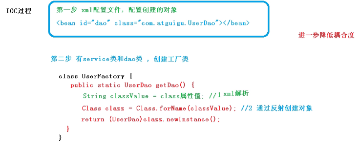
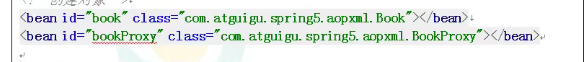
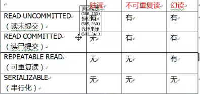
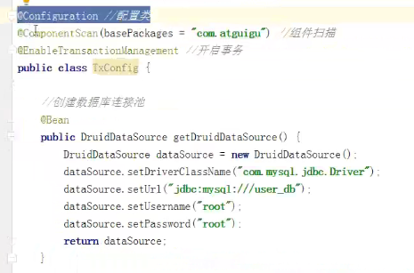

Spring

框架怎么学：框架是一个软件，其他人写好的软件。

1. 知道框架能干什么，mybatis能访问数据库，对表中的数据执行增删改查
2. 框架的语法，框架要完成一个功能，需要一定的步骤支持
3. 框架的内部实现，框架内部怎么做。原理是什么。
4. 通过学习，可以实现一个框架（目标）

#### 一、IOC（Inversion of Control）

```xml
<context:component-scan base-package="org.xf.bean"/>
```

控制反转，是一个理论，概念，思想。把对象的创建，赋值，管理工作都交给代码之外的容器实现，也就是对象的创建是由其他外部资源完成的。

##### 底层原理：xml解析、工厂模式、反射



###### IOC接口（接口）

1. ioc思想基于ioc容器完成，ioc容器底层就是对象工厂

2. Spring提供IOC实现两种方式：

   1. BeanFactory：IOC容器基本实现，是Spring内部的使用接口，不提供开发人员使用

      *加载配置文件时候，不会创建对象，在获取对象使用对象的时候才去创建对象

   2. ApplicationContext：BeanFactory接口的子接口，提供更多强大的功能，一般由开发人员使用

      *加载配置文件的时候就会把配置文件对象进行创建

   3. Application的实现类：

      1. 

**控制**：创建对象，对象的属性赋值，对象之间的关系管理

**反转**：把原来开发人员管理，创建对象的权限转移给代码之外的容器实现。由容器代替开发人员管理对象。创建对象，给属性赋值

**正转**：由开发人员在代码中，使用new构造方法创建对象，开发人员主动管理对象。

```
public static void main(){
	Student stu=new Student();
}
```

**容器**：是一个服务器软件，一个框架（Spring）

为什么要使用ioc：目的是减少对代码的改动，也能实现不同 的功能。实现解耦合

##### 1、**创建对象的方式**

1. 构造方法
2. 反射
3. 序列化
4. 克隆
5. ioc：容器创建对象
6. 动态代理。

##### 2、ioc体现

Tomcat也算是容器：里面存放的由servlet对象，Listener，Filter对象

##### 3、ico技术实现

DI（依赖注入 Dependency Injection）是ioc的技术实现,只需要在程序中提供要使用的对象名称就可以，至于对象如何在容器中创建，赋值，查找都由容器内部实现

spring是使用的di实现了ioc功能，spring底层创建对象，使用的是反射机制

##### 4、依赖

```xml
 <dependency>
      <groupId>org.springframework</groupId>
      <artifactId>spring-context</artifactId>
      <version>5.2.0.RELEASE</version>
 </dependency>
```

##### 5、di注入（applicationContext.xml）

###### 1）byname自动注入

```xml
<?xml version="1.0" encoding="UTF-8"?>
<beans xmlns="http://www.springframework.org/schema/beans"
       xmlns:xsi="http://www.w3.org/2001/XMLSchema-instance"
       xsi:schemaLocation="http://www.springframework.org/schema/beans
       http://www.springframework.org/schema/beans/spring-beans.xsd">


<!--
    di：
        di 给属性赋值
        简单类型：spring中规定java的基本数据类型和String都是简单类型
        1、set注入：spring调用类的set方法，你可以在set方法中完成属性赋值
            <bean id="mystudent" class="org.xf.ba01.Student1" >
                <property name="" value="Lisi">
            </bean>
        2,构造注入
            <constructor-arg>
                name:表示构造方法的形参明
                index：表示构造方法的参数位置，参数从左往右 0 1 2顺序
                value：构造方法的形参类型是简单类型 的
                ref：构造方法的形参类型是引用类型的，使用ref
-->
    <bean id="mystudent" class="org.xf.ba01.Student1" autowire="byName">
        <property name="name" value="asd"/>
        <property name="id" value="1" />

    </bean>
    <bean id="school" class="org.xf.ba01.School">
        <property name="name" value="zb"/>
        <property name="id" value="1"/>
    </bean>
</beans>
```

di注入  构造器注入

```xml
<?xml version="1.0" encoding="UTF-8"?>
<beans xmlns="http://www.springframework.org/schema/beans"
       xmlns:xsi="http://www.w3.org/2001/XMLSchema-instance"
       xsi:schemaLocation="http://www.springframework.org/schema/beans http://www.springframework.org/schema/beans/spring-beans.xsd">

    <bean id="mystu" class="org.xf.ba02.Student1" >
        <constructor-arg name="myname" value="asd"/>
        <constructor-arg name="myid" value="1"/>

    </bean>

    <bean id="school" class="org.xf.ba02.School">
        <property name="id" value="1"/>
        <property name="name" value="zb"/>
    </bean>

</beans>
```

###### 2）byType

​	java类中引用类型的数据类型和spring容器中bean的class属性是同源关系的，这样的bean能够赋值给实现类的关系

同源：

1. java类中引用类型的数据类型和bean的class的值是一样的
2. java类中引用类型的数据类型和bean的class的值父子类关系的
3. java类中引用类型和bean的calss值接口和实现类的关系

语法：

<bean id="" class="" autowire="byType">

**注意**：在byType中，在xml配置文件中声明bean只能有一个符合条件的，多于一个都是错误的

1、多个配置文件的优势

1. 每个文件的大小比一个文件要很小，效率高
2. 避免多人竞争带来的冲突

如果你的项目有多个模块  （相关的功能在一起），一个模块一个配置文件。

​	多文件的分配方式：

1. 按功能模块，一个模块一个配置文件
2. 按类的功能，数据库相关的配置一个文件配置文件，做事务的功能一个配置文件，做service功能的一个配置文件等。


主配置文件名称，不能包含在通配符的范围内，会形成套娃。而且统配符文件，必须要放在一个目录中

##### 二、注解

基于注解的di，通过注解完成java对象的创建，属性赋值

使用步骤：

1. 加入maven依赖，spring-context ，在加入spring-context的同时，间接加入spring-aop依赖。使用注解必须使用spring-aop依赖
2. 在类中，加入spring注解
3. 在spring 的配置文件中，加入一个组件扫描器的标签，说明注解在你的项目中的位置

###### 注解使用步骤

1. 加入依赖

2. 创建类，在类中加入注解

3. 创建spring的配置文件

   声明组件扫描器的标签，指明注解在你的项目中的位置。

4. 使用注解创建对象，创建容器ApplicationContext

###### 1、@component

放在类的上面

```java
@Component("myStudent")
public class Student {
}
```

###### 2、@Respotory

spring中，和@component功能一致，创建对象的注解，是用在持久层上面的dao


###### 3、@Service

根componet功能一致，用在业务层上面的：放在service的实现类上面，创建service对象，service对象是做业务层处理，可以有事务的功能

###### 4、@Controller

放在控制器类的上面，创建控制器对象

**以上三个注解的使用语法和componet一样，都能创建对象，但这三个注解还有额外的功能**

上面三个注解是给项目对象分层的


###### 5、@Value


###### 6、@Autowired

@Qualifier（"userDaoImpl"）

加上是根据类型注入，不加Qualifier注解，Autowired默认根据byType注入

###### 7、@Resource

此注解不是spring中的注解

可以根据类型注入，也可以根据属性注入


###### 8、完全注解开发

1. 创建配置类

   ```java
   @Configuration
   @ComponentScan(basePackages = {"org.xf.bean"})
   public class SpringConfig {
   
   }
   ```

2. ```java
   ApplicationContext context=new AnnotationConfigApplicationContext(SpringConfig.class);
   ```

#### 二、AOP

##### 概念：

1. 面向切面编程，利用Aop可以对业务逻辑的各个部分进行隔离，从而使得业务逻辑各部分之间的耦合度降低，提高程序的可重用性，同时提高了开发的效率
2. 通俗描述，部通过修改代码方式，在主干功能里面添加新功能
3. 

##### AOP底层原理

1、AOP动态代理：

1. 有接口情况：增强类的方法，使用jdk动态代理。创建接口实现类的代理对象，增强类的方法
2. 没有接口：使用CGLIB动态代理；创建子类的代理对象，增强父类方法

##### AOP（JDK动态代理）

Proxy.newProxyInstance方法

方法里面有三个参数：

第一个参数：类加载器

第二个参数：增强方法所在类，这个类实现的接口，支持多个接口

第三个参数，实现这个接口InvocationHandler

##### AOP术语

###### 1、连接点

类里那些方法可以被增强，这些方法称为连接点

###### 2、切入点

实际被真正增强的方法，称为切入点

###### 3、通知（增强）

1. 实际增强的逻辑部分称为通知
2. 通知有多种类型：
   - 前置通知
   - 后置通知
   - 环绕通知
   - 异常通知
   - 最终通知：finally

###### 4、切面

是动作

1. 把通知应用到切入点过程

##### AOP操作

##### 1、Spring框架一般基于AspectJ实现AOP操作

- 什么是AspectJ：不是Spring组成部分，独立AOP框架，一般把AspectJ和Spring框架一起使用，进行AOP操作
- 基于ASPectJ操作
  - 基于xml配置文件实现
  - 基于注解方式实现


##### 2、相关依赖


##### 切入点表达式：

1. 切入点表达式作用：知道那个类里面的那个方法进行增强

2. 语法结构：

   ```java
   excution([权限修饰符][返回类型][类路径][方法名称]([参数列表]))
   ```

   

##### AspectJ注解方式

1. 创建类

2. 创建增强类

3. 在Spring配置文件中开启生成代理对象**完全注解开发**

4. 开启切面扫描

5. 进行通知配置

   1. 在spring配置文件中开启扫描
   2. 使用注解创建User和UserProxy对象
   3. 在增强类上面添加@Aspect
   4. 在spring配置文件中开启生成代理对象

   在增强类的里面，写作为通知方法上面添加通知类型注解，使用切入点表达式配置

6. 公共切入点抽取

   

7. 有多个增强类多同一个方法进行增强

##### AOP操作（AspectJ配置文件）

1. 创建两个类，增强类和被增强类，创建方法
2. 在spring配置文件中创建两个类对象
3. 在spring配置文件中配置切入点


#### JdbcTemplate

spring框架对jdbc进行封装，使用jdbcTemplate方便实现对数据库的操作

##### 1、准备jar包


##### 2、在spring配置文件配置连接池

```xml
 <bean id="dataSource" class="com.alibaba.druid.pool.DruidDataSource"
          destroy-method="close" >
        <property name="driver" value="com.mysql.jdbc.Driver"/>
        <property name="url" value="jdbc:mysql://localhost:3306/ssm?useSSL=false"/>
        <property name="username" value="root"/>
        <property name="password" value="123456"/>
    </bean>
<!--    jdbcTemplate对象-->
    <bean id="jdbcTemplate" class="org.springframework.jdbc.core.JdbcTemplate">
        
        <property name="dataSource" ref="dataSource"></property>
    </bean>
```

#### 事务概念

事务时数据库最基本单元，逻辑上一组操作，要么成功要么都失败

###### 特性

1. 原子性
2. 一致性
3. 隔离性
4. 持久性

###### 事务操作实现

1. 编程式
2. 声明式
   1. 基于注解的方式使用AOP
   2. 基于xml配置文件的实现方式
3. API
   1. 提供一个接口，代表事务管理器，这个接口针对不同的框架

###### 实现步骤

1. 在spring中配置xml环境

2. 开启事务注解 在spring配置文件中引入

3. 在service类上面（获取service类里面方法上面）添加@Transactional

   如果添加到类上面，表示这个类里面的所有方法都可以添加事务

###### @Transactional（）参数

1. propagation：事务传播行为

   多事务方法之间进行调用，这个过程中，事务如何进行管理

   **传播行为**：对数据库表数据进行变化的操作

   - requred：如果add方法本身有事务，调用update放啊之后，update使用当前add方法里面事务

     如果add方法没有事务，调用update之后创建新的事务

   - requred_new 使用add方法调用update方法，无论add是否有十五，都创建新的事务

2. ioslation 事务隔离级别：解决事务的隔离性

   - 事务由特性为隔离性，多十五操作之间不会产生影响。不考虑隔离性产生很多问题
   - 由三个问题：脏读（一个未提交事务，读取到另一个未提交事务的数据)、不可重复度（一个未提交的事务读取到另一个事务中已经修改的数据)、幻读（一个未提交事务读取到另一提交事务添加数据)
   - 通过设置事务的隔离性，解决问题

3. timeout超时时间：事务要在一定时间内提交

4. readOnly 是否只读：默认false。设置true之后，只能查询

5. rollbackFor 回滚：设置查询那些异常可以进行回滚

6. norollbackfor 不回滚：设置那些异常可以不进行回滚

###### 配置类




#### spring5新功能

###### 1、整个框架基于java8

运行时兼容jdk9，许多不建议使用的类和方法在代码库中删除

###### 2、spring5框架自带了通用的日志框架

1. 已经移出Log4JConfigListener，官方建议Log4j2
2. spring框架整合Log4js2

```xml
<!-- log4j2的包：建议2.6以上 开始-->
 <dependency>
      <groupId>org.apache.logging.log4j</groupId>
      <artifactId>log4j-slf4j-impl</artifactId>
      <version>2.6.2</version>
    </dependency>
    <!-- https://mvnrepository.com/artifact/org.apache.logging.log4j/log4j-core -->
    <dependency>
      <groupId>org.apache.logging.log4j</groupId>
      <artifactId>log4j-core</artifactId>
      <version>2.6.2</version>
    </dependency>
<!-- log4j2的包：建议2.6以上 结束-->
```

##### 3、spring5框架核心容器支持@Nullable注解

1. @Nullable注解可以使用在方法上面，属性上面，参数上面，表示方法返回可以为空，属性可以为空，参数可以为空
2. 哟ing在方法上，方法的返回值可以为空
3. 用在方法参数上面，参数的属性可以为空
4. 放在属性上面，表示属性上面可以为空

##### 4、spring5核心容器支持函数式风格GenericApplicationContext


##### 5、支持junit5

junit4演示

junit5


##### springwebflux（）

###### 响应式编程

###### webflux执行流程和核心api

###### springwebflux基于注解的模型

###### 基于函数式编程模型

#####  集成mybatis

###### pom文件

```xml
<?xml version="1.0" encoding="UTF-8"?>

<project xmlns="http://maven.apache.org/POM/4.0.0" xmlns:xsi="http://www.w3.org/2001/XMLSchema-instance"
  xsi:schemaLocation="http://maven.apache.org/POM/4.0.0 http://maven.apache.org/xsd/maven-4.0.0.xsd">
  <modelVersion>4.0.0</modelVersion>

  <groupId>org.xf</groupId>
  <artifactId>spring-mybatis05</artifactId>
  <version>1.0-SNAPSHOT</version>


  <properties>
    <project.build.sourceEncoding>UTF-8</project.build.sourceEncoding>
    <maven.compiler.source>1.8</maven.compiler.source>
    <maven.compiler.target>1.8</maven.compiler.target>
  </properties>

  <dependencies>
    <dependency>
      <groupId>junit</groupId>
      <artifactId>junit</artifactId>
      <version>4.11</version>
      <scope>test</scope>
    </dependency>
    <dependency>
      <groupId>mysql</groupId>
      <artifactId>mysql-connector-java</artifactId>
      <version>8.0.13</version>
    </dependency>
    <dependency>
      <groupId>com.alibaba</groupId>
      <artifactId>druid</artifactId>
      <version>1.0.0</version>
    </dependency>

<!--    做实物的-->
    <dependency>
      <groupId>org.springframework</groupId>
      <artifactId>spring-jdbc</artifactId>
      <version>5.1.9.RELEASE</version>
    </dependency>
    <dependency>
      <groupId>org.springframework</groupId>
      <artifactId>spring-tx</artifactId>
      <version>5.1.9.RELEASE</version>
    </dependency>
<!--    ioc-->
    <dependency>
      <groupId>org.springframework</groupId>
      <artifactId>spring-context</artifactId>
      <version>5.1.9.RELEASE</version>
      <scope>compile</scope>
    </dependency>

    <!-- https://mvnrepository.com/artifact/org.apache.logging.log4j/log4j-slf4j-impl -->
    <dependency>
      <groupId>org.apache.logging.log4j</groupId>
      <artifactId>log4j-slf4j-impl</artifactId>
      <version>2.6.2</version>
    </dependency>
    <!-- https://mvnrepository.com/artifact/org.apache.logging.log4j/log4j-core -->
    <dependency>
      <groupId>org.apache.logging.log4j</groupId>
      <artifactId>log4j-core</artifactId>
      <version>2.6.2</version>
    </dependency>

<!--    mybatis-->
    <dependency>
      <groupId>org.mybatis</groupId>
      <artifactId>mybatis</artifactId>
      <version>3.5.7</version>
    </dependency>
    <dependency>
      <groupId>org.mybatis</groupId>
      <artifactId>mybatis-spring</artifactId>
      <version>1.3.1</version>
    </dependency>

  </dependencies>

  <build>
    <resources>
      <resource>
        <directory>src/main/java</directory><!--所在目录-->
        <includes><!--包括目录下的.properties.xml文件都会扫描到-->
          <include>**/*.properties</include>
          <include>**/*.xml</include>
        </includes>
        <filtering>false</filtering>
      </resource>
      <resource>
        <directory>src/main</directory><!--所在目录-->
        <includes><!--包括目录下的.properties.xml文件都会扫描到-->
          <include>**/*.properties</include>
          <include>**/*.xml</include>
        </includes>
        <filtering>false</filtering>
      </resource>
    </resources>
  </build>

</project>
```

