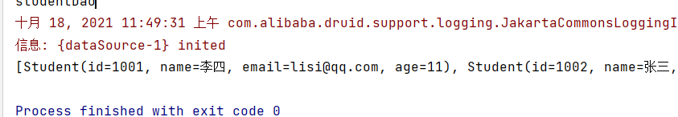
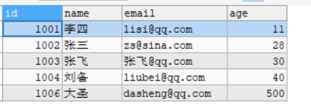
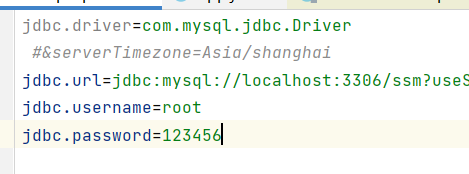
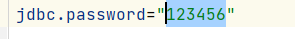
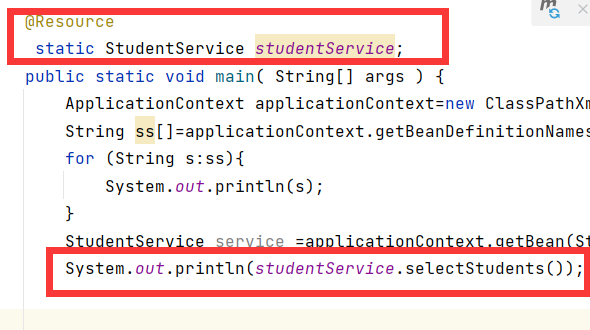
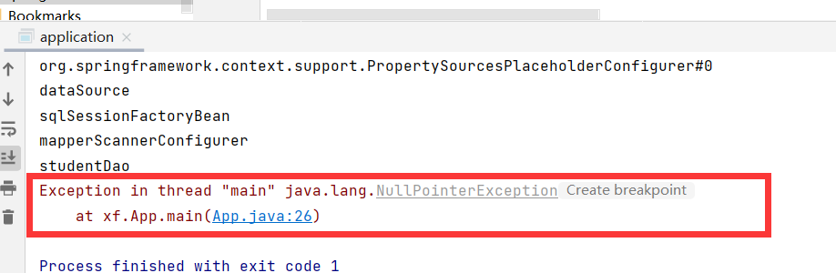
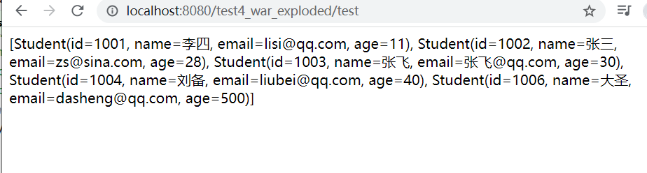
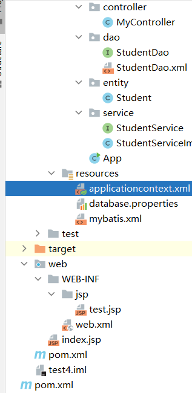
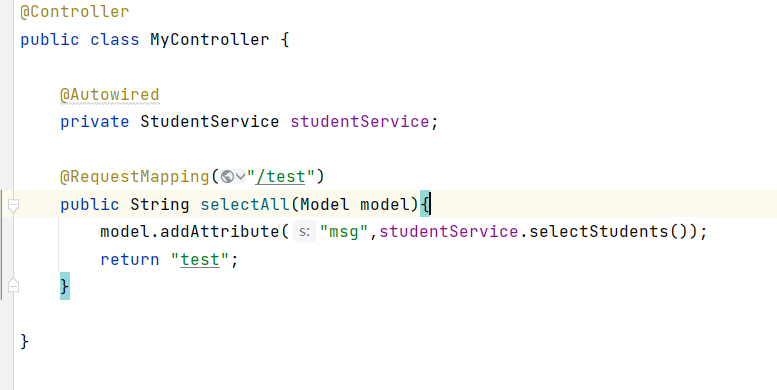

### Spring整合mybatis，servlet即mvc

此文章为最近学习ssm三框架的整理和个人理解，文章中有何错误，欢迎各位大佬指正！

#### 一、关于spring概述：

spring算是java语言的精华所在，spring中ioc的ioc巧妙的运用了反射机理，将内存中需要的java类存储并且保管起来。spring框架就是一个箱子，里面可以放得下所有的类（无论什么类），正是因为这个特性，spring成了整合各个框架的百宝箱。网站上的很多视频，整合ssm三大框架的时候，整合顺序明里暗里的顺序是从mybatis到spring再到servlet（springmvc）。我按照spring吞吐天地的特性。以spring框架为所有框架的中心，发散的向外整合。这个思路，或许可以帮助各位还不了解spring的同学，对spring有个更清晰的认识吧。

下面是关于ssm整合的步骤，方法以及我踩过的一些坑的列举，以及解决方案

#### 二、mybatis介绍

##### 1、mybatis

mybatis是对jdbc的整合，也可以说为mybatis的升级版。mybatis的核心是**动态代理**，动态代理所用的思想是AOP（面向切面编程 ）的思想，即执行原方法，并将原方法增强,还不理解的小伙伴可以自行学习。

##### 2、mybatis使用步骤（即使用到的类）

###### 1)、配置mybtis.xml主配置文件：

```xml
<?xml version="1.0" encoding="UTF-8" ?>
<!DOCTYPE configuration
        PUBLIC "-//mybatis.org//DID Config 3.0//EN"
        "http://mybatis.org/dtd/mybatis-3-config.dtd">
<configuration>
    <!--可以在mapper文件中直接使用别名  ru  xf.entuty.Student可以直接写
            为Student-->
    <typeAliases>
        <package name="xf.entity"/>
    </typeAliases>

    <mappers>
        <!--        一个mapper标签指定一个文件的位置
            从类路径开始的路径信息。
            target/classes类路径-->
        <package name="xf.dao"/>
    </mappers>
</configuration>
        <!--
mybatis的住配置文件：主要定义了数据库的配置信息，sql
-->
```

###### 2）、配置dao接口映射文件(xxxDao.xml)：

```xml
<?xml version="1.0" encoding="UTF-8" ?>
<!DOCTYPE mapper
        PUBLIC "-//mybatis.org//DTD Mapper 3.0//EN"
        "http//mybatis.org/dtd/mybatis-3-mapper.dtd">
<mapper namespace="xf.dao.StudentDao">
    <select id="selectStudents" resultType="xf.entity.Student">
        select id,name,email,age from student order by id
    </select>
</mapper>

        <!--
sql映射文件：写sql语句的，mybatis会执行这些sql
1.指定约束文件
    <!DOCTYPE mapper
        PUBLIC "-//mybatis.org//DTD Mapper 3.0//EN"
        "http//mybatis.org/dtd/mybatis-3-mapper.dtd">
        mybatis-3-mapper.dtd是越苏文件的名称，扩展名是dtd
2、约束文件作用：限制，检查在当前文件中出现的标签，属性必须符合mybatis的要求
3、mapper是当前文件的标签，必须的
namespace：叫做命名空间，唯一值的，可以是自定义的字符串。
要求使用dao接口的全限定名称
4、在当前文件中，可以使用特定的标签，表示数据库的特定操作
<select>
<update>
<insert>
<delete>
-->
```

###### 3)、获取SqlSessionFactoryBuilder对象

```java
SqlSessionFactoryBuilder sqlSessionFactoryBuilder=new SqlSessionFactoryBuilder(new InputStream("mybatis.xml"));
```

###### 4)、获取SqlSessionFactory对象

```java
SqlSessionFactory SqlSessionFactory=sqlSessionFactoryBuilder.getSqlSessionFactory();
```

###### 5)、获取SqlSession对象，

**前面的两步都是为了获取sqlsession对象服务的**，sqlSession即为xxDao接口的实现类，来执行操作数据库的操作

```java
sqlsession sqlsession=sqlSessionFactory.openSession();
 //[重要]6.指定要执行的sql语句的表示。sql映射文件中的namespace+"."+标签的id值
        String sqlId="org.xf.dao.StudentDao"+"."+"selectStudents";

        //7.执行sql语句，通过sqlId找到语句
        c

        //8.输出结果
        list.forEach(student -> System.out.println(student));

        //9.关闭sqlsession对象
        sqlSession.close();

```

###### 6)、sqlsession可以的到xxDao的实现类

```java
xxDao dao=sqlSession(xxDao.class);
dao.selectAll();
```

#### 三、spring整合mybatis

​	刚刚说，spring可以将所有的类都放在自己的容器中，这个容器可以比作百宝箱或者工具箱，我们可以把我们要用的工具放进去，需要的时候拿出来。那么我们只需要把上面提到的类全部放到百宝箱中，用的时候再拿出来用，把东西放进去就是一个整合的过程，拿出来，即我测试百宝箱是否好用，东西是不是放进去了

那么先在开始整合：

##### 1、spring配置步骤：

###### 1）、配置spring主配置文件applicationcontext.xml

```xml
<?xml version="1.0" encoding="UTF-8"?>
<beans xmlns="http://www.springframework.org/schema/beans"
       xmlns:xsi="http://www.w3.org/2001/XMLSchema-instance"
       xmlns:context="http://www.springframework.org/schema/context"
       xmlns:mvc="http://www.springframework.org/schema/mvc"
       xsi:schemaLocation="http://www.springframework.org/schema/beans
       http://www.springframework.org/schema/beans/spring-beans.xsd
       http://www.springframework.org/schema/mvc
       http://www.springframework.org/schema/mvc/spring-mvc.xsd
       http://www.springframework.org/schema/context
       http://www.springframework.org/schema/context/spring-context.xsd">
    <!--声明自动扫描，如果包中有注解，则自动添加为bean-->
    <context:component-scan base-package="xf"/>
    <!--注解驱动-->
    <mvc:annotation-driven/>
    <!--spring主配置文件-->
<!--    用于存放所有使用类至内存的容器-->

    <!--controller控制层配置-->

    <!--dao层持久类配置-->

    <!--servcie服务层配置-->


    <!--数据库配置  整合mybatis-->
    <!--关联数据库配置文件-->
    <context:property-placeholder location="classpath:database.properties"/>
    <!--连接池配置-->
    <bean id="dataSource" class="com.alibaba.druid.pool.DruidDataSource" destroy-method="close">
        <property name="url" value="${jdbc.url}"/>
        <property name="username" value="${jdbc.username}"/>
        <property name="password" value="${jdbc.password}"/>

    </bean>

    <!--配置sqlsessionfactory-->
    <bean id="sqlSessionFactoryBean" class="org.mybatis.spring.SqlSessionFactoryBean">
        <property name="dataSource" ref="dataSource"/>
        <property name="configLocation" value="classpath:mybatis.xml"/>
    </bean>
    <!--声明扫描器，创建dao对象-->

    <bean id="mapperScannerConfigurer" class="org.mybatis.spring.mapper.MapperScannerConfigurer">
        <property name="sqlSessionFactoryBeanName" value="sqlSessionFactoryBean"/>
        <property name="basePackage" value="xf.dao"/>
    </bean>
</beans>
```

**上面的文件中，只是配置了关于mybatis使用基本类的加载，事务，过滤器等相关组件并未加载**,大家可以看到sqlsession、sqlsessionfactory等相关类都进行了加载。

###### 2）、数据库配置文件（database.properties）：

```properties
jdbc.driver=com.mysql.jdbc.Driver
 #&serverTimezone=Asia/shanghai
jdbc.url=jdbc:mysql://localhost:3306/ssm?useSSL=false&serverTimezone=UTC
jdbc.username=root
jdbc.password=123456
```

**配置完成后，就能用了**

###### 3）、测试一下效果：

```java
 public static void main( String[] args ) {
        ApplicationContext applicationContext=new ClassPathXmlApplicationContext("applicationcontext.xml");
        String ss[]=applicationContext.getBeanDefinitionNames();
        for (String s:ss){
            System.out.println(s);
        }
        StudentService service =applicationContext.getBean(StudentService.class);
        System.out.println(service.selectStudents());


    }
```

结果：





##### 2、我遇到的一些坑

###### 1）properties配置文件：



这个地儿等于号后面不需要加双引号

排错排了两天，才偶尔发现系统识别不了双引号，真是太痛苦了，呜呜呜呜呜呜呜

###### 2)@Autowired注解注入static变量问题




把static用到spring的@Autowired上，会导致注入的对象一致报空指针。**这个错误也是排了两天才发现，呜呜呜呜呜**

静态变量，类变量不是对象 的属性，而是一个类的属性，所以静态方法是属于类的，普通方法才是属于实体对象，也就是new出来的对象。spring注入是在容器中实例化对象，所以不能使用静态方法

**关于不能注入的原因**

当类加载器加载静态变量时，spring的上下文环境还没被加载。

这是因为初始化类的加载升序导致的。程序启动时会加载根路径下所有的类。不管这个类是否会用到都会区加载；会先初始化静态变量和执行静态代码块，这时无法创建对象

#### 四、spring整合springmvc（servlet）

springmvc的底层是servlet。

##### 1、servlet配置（web.xml）：

```xml
<?xml version="1.0" encoding="UTF-8"?>
<web-app xmlns="http://xmlns.jcp.org/xml/ns/javaee"
         xmlns:xsi="http://www.w3.org/2001/XMLSchema-instance"
         xsi:schemaLocation="http://xmlns.jcp.org/xml/ns/javaee http://xmlns.jcp.org/xml/ns/javaee/web-app_4_0.xsd"
         version="4.0">
    <!-- 中央调度器 -->
    <servlet>
        <servlet-name>spring</servlet-name>
        <servlet-class>org.springframework.web.servlet.DispatcherServlet</servlet-class>
        <init-param>
            <!-- ContextconfigLocation配置springmvc加载的配置文件
            适配器、处理映射器等
             -->
            <param-name>contextConfigLocation</param-name>
            <param-value>classpath:applicationcontext.xml</param-value>
        </init-param>
        <load-on-startup>1</load-on-startup>
    </servlet>
    <servlet-mapping>
        <servlet-name>spring</servlet-name>
        <!-- 1、.action访问以.action结尾的  由DispatcherServlet进行解析
             2、/,所有访问都由DispatcherServlet进行解析
         -->
        <url-pattern>/</url-pattern>
    </servlet-mapping>

    <!--注册spring的监听器-->
    <context-param>
        <param-name>contextConfigLocation</param-name>
        <param-value>classpath:applicationcontext.xml</param-value>
    </context-param>
    <listener>
        <listener-class>org.springframework.web.context.ContextLoaderListener</listener-class>
    </listener>

    <!--注册字符集过滤器-->
    <filter>
        <filter-name>characterEncodingFilter</filter-name>
        <filter-class>org.springframework.web.filter.CharacterEncodingFilter</filter-class>
        <init-param>
            <param-name>encoding</param-name>
            <param-value>utf-8</param-value>
        </init-param>
        <init-param>
            <param-name>forceRequestEncoding</param-name>
            <param-value>true</param-value>
        </init-param>
    </filter>
    <filter-mapping>
        <filter-name>characterEncodingFilter</filter-name>
        <url-pattern>/*</url-pattern>
    </filter-mapping>
</web-app>
```

##### 2、applicationcontext.xml

这个文件中时只需要把视图解析器配置好即可

```xml
  <!--controller控制层配置-->
    <!--视图解析器-->
    <bean class="org.springframework.web.servlet.view.InternalResourceViewResolver">
        <property name="suffix" value=".jsp"/>
        <property name="prefix" value="/WEB-INF/jsp/"/>
    </bean>
```

#### 五、结果演示：







到此，整合完成