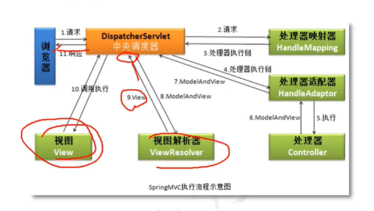
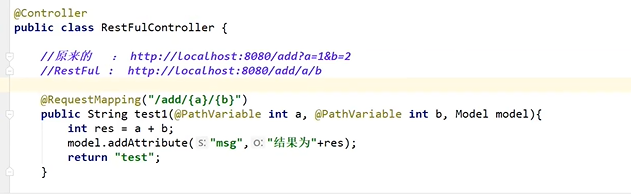
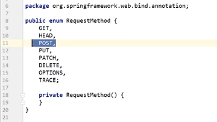
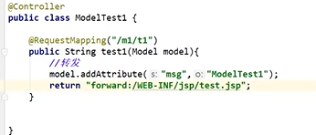
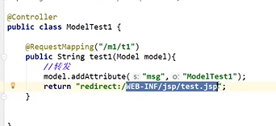
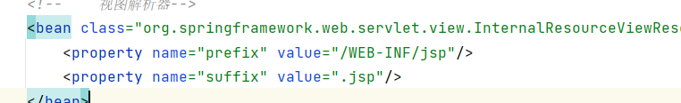
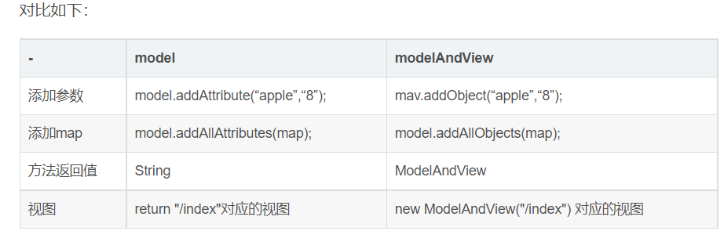
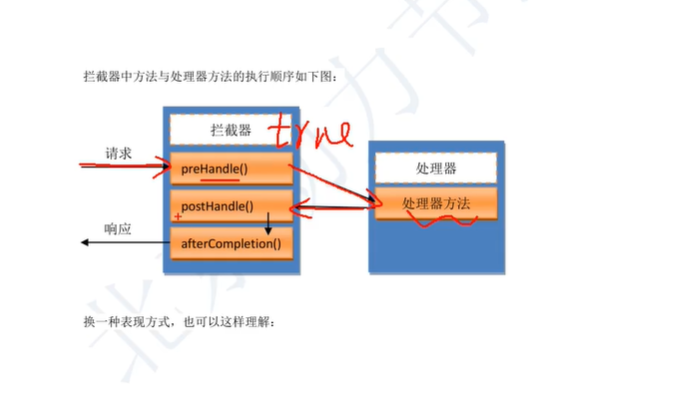
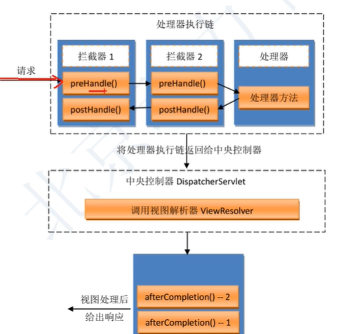

### spring mvc



#### 一、概述

​	是基于spring的一个框架，实际上就是spring的一个模块，专门做web开发的，理解为是servlet的一个升级

​	web开发的底层是servlet，框架是在servlet基础智商加入一些功能，让你做web开发方便

**springmvc**就是一个spring，spring是容器，ioc能够管理对象，使用

```
<bean> @Component @Repository @Service @controller
```

springmvc能够创建对象，让入道容器中（springmvc容器），springmvc容器中，把创建的对象作为控制器使用，这个控制器对象能接受用户的请求，显示处理结果，就当做是一个servlet的使用

**使用@Controller注解创建的一个普通类的对象**，不上servlet，springmvc赋予了控制器对象一些额外的功能

web开发底层是servlet，springmvc中有一个对象是servlet：DIspatherServlet：负责接受用户的所有请求，用户把请求给了DispatherServlet。DiapatherServlet把请求转发给我们的Controller对象，最后是Controller对象处理请求

index.jsp--->DispatherServlet(Servlet)--->转发，分配给controller对象（@Controller注解创建的对象）

**重点：**在web.xml中注册springmvc框架的核心对象DispatcherServlet

1. DispatherServlet叫做中央调度器，是一个servlet，他的父类是继承HttpServlet
2. DispatherServlet也叫做前端控制器（front controller）
3. DispatherServlet负责接受用户提交的请求，调用其它的控制器对象，并把请求的处理结果显示给用户

##### pom.xml代码

相关依赖

```xml
<?xml version="1.0" encoding="UTF-8"?>
<project xmlns="http://maven.apache.org/POM/4.0.0"
         xmlns:xsi="http://www.w3.org/2001/XMLSchema-instance"
         xsi:schemaLocation="http://maven.apache.org/POM/4.0.0 http://maven.apache.org/xsd/maven-4.0.0.xsd">
    <modelVersion>4.0.0</modelVersion>

    <groupId>org.example</groupId>
    <artifactId>springmvc</artifactId>
    <packaging>pom</packaging>
    <version>1.0-SNAPSHOT</version>
    <modules>
        <module>test1</module>
        <module>test2</module>
    </modules>

    <properties>
        <project.build.sourceEncoding>UTF-8</project.build.sourceEncoding>
        <maven.compiler.source>1.8</maven.compiler.source>
        <maven.compiler.target>1.8</maven.compiler.target>
    </properties>

    <dependencies>
        <dependency>
            <groupId>junit</groupId>
            <artifactId>junit</artifactId>
            <version>4.11</version>
            <scope>test</scope>
        </dependency>

        <!--Spring项目支持-->
        <dependency>
            <groupId>org.springframework</groupId>
            <artifactId>spring-webmvc</artifactId>
            <version>5.1.9.RELEASE</version>
        </dependency>
        <!--servlet的支持-->
        <dependency>
            <groupId>javax.servlet</groupId>
            <artifactId>servlet-api</artifactId>
            <version>2.5</version>
        </dependency>
        <!--jsp的支持-->
        <dependency>
            <groupId>javax.servlet.jsp</groupId>
            <artifactId>jsp-api</artifactId>
            <version>2.2</version>
        </dependency>
        <!--jsp的jstl标签库支持-->
        <dependency>
            <groupId>javax.servlet</groupId>
            <artifactId>jstl</artifactId>
            <version>1.2</version>
        </dependency>
    </dependencies>

    <build>
        <resources>
            <resource>
                <directory>src/main/java</directory><!--所在目录-->
                <includes><!--包括目录下的.properties.xml文件都会扫描到-->
                    <include>**/*.properties</include>
                    <include>**/*.xml</include>
                </includes>
                <filtering>false</filtering>
            </resource>
            <resource>
                <directory>src/main</directory><!--所在目录-->
                <includes><!--包括目录下的.properties.xml文件都会扫描到-->
                    <include>**/*.properties</include>
                    <include>**/*.xml</include>
                </includes>
                <filtering>false</filtering>
            </resource>
        </resources>
    </build>
</project>
```

##### web.xml

```xml
<?xml version="1.0" encoding="UTF-8"?>
<web-app xmlns="http://xmlns.jcp.org/xml/ns/javaee"
         xmlns:xsi="http://www.w3.org/2001/XMLSchema-instance"
         xsi:schemaLocation="http://xmlns.jcp.org/xml/ns/javaee http://xmlns.jcp.org/xml/ns/javaee/web-app_4_0.xsd"
         version="4.0">
    <servlet>
        <servlet-name>springmvc</servlet-name>
        <servlet-class>org.springframework.web.servlet.DispatcherServlet</servlet-class>
        <init-param>
            <param-name>contextConfigLocation</param-name>
            <param-value>classpath:springmvc.xml</param-value>
        </init-param>
        <load-on-startup>1</load-on-startup>
    </servlet>
    <servlet-mapping>
        <servlet-name>springmvc</servlet-name>
        <url-pattern>/</url-pattern>
    </servlet-mapping>
</web-app>
```

##### springmvc.xml文件配置

```xml
<?xml version="1.0" encoding="UTF-8"?>
<web-app xmlns="http://xmlns.jcp.org/xml/ns/javaee"
         xmlns:xsi="http://www.w3.org/2001/XMLSchema-instance"
         xsi:schemaLocation="http://xmlns.jcp.org/xml/ns/javaee http://xmlns.jcp.org/xml/ns/javaee/web-app_4_0.xsd"
         version="4.0">
    <servlet>
        <servlet-name>springmvc</servlet-name>
        <servlet-class>org.springframework.web.servlet.DispatcherServlet</servlet-class>
        <init-param>
            <param-name>contextConfigLocation</param-name>
            <param-value>classpath:springmvc.xml</param-value>
        </init-param>
        <load-on-startup>1</load-on-startup>
    </servlet>
    <servlet-mapping>
        <servlet-name>springmvc</servlet-name>
        <url-pattern>/</url-pattern>
    </servlet-mapping>
</web-app>
```


##### @PathVariable（Resutful分割）

这个还会比较安全

在springmvc中可以使用@ PathVariable注解，让方法参数的值对应绑定到一个uri模板变量上






##### 转发



##### 重定向



**如果不在springmvc.xml配置文件中配置视图解析器**

则可以return视图的全限定名称。视图解析器作用就是帮助Dispacherservlet来凭借view的限定名称，找到正确的路径


###### 重定向和转发的区别？

1. request.getRequestDispacher().forward()方法，只能将请求转给同一个web应用中的组件；而respones.sendRedirect()方法不仅可以重定向到当前应用程序中的其他资源，还可以重定向到同一个站点上的其他应用程序中的资源，甚至是使用绝对url冲向向到其他站点的资源。

   ​	如果传递给response.sendRedirect()方法的相对URL以"/"开头，他是相对于整个web站点的根目录；如果创建request.getRequestDispatcher()对象时指定的相对于当前web站应用程序的根目录

2. 重定向访问过程结束后，浏览器地址栏中显示的URL会发生改变，由初始的URL地址变成重定向的目标URL；请求转发过程结束后，浏览器的地址不会改变

3. HttpServletResponse.sendRedirect方法对浏览器的请求直接做出响应，响应的结果就是告诉浏览器去重新发出对另外一个URL的访问请求，这个过程好比由一个绰号叫浏览器的人写信找张三借钱，张三回信没钱，让浏览器找李四，并将李四现在的通信地址告诉浏览器，于是浏览器又按照张三提供的通信地址给李四，然后李四把钱汇给了浏览器。

   ​	由此可见，重定向的时候，浏览器一共发出了两次请求和两次回复。

4. request.getRequestDispatcher().forward()方法的调用者与被调用者之间共享相同的request对象和response对象，他们属于同一个浏览器请求和响应过程

   ​	而response.sendRedirect()方法调用者与被调用者使用各自的request对象和response对象，他们属于两个独立的访问请求和响应过程。对于同一个web应用程序的内部资源之间的跳转，特别是跳转之前要对请求进行一些预期处理，并要使用HttpServletRequest.setAttribute方法传递预处理结果，那就应该使用request.getRequestDispatcher().forward()方法。不同web应用应用之间的重定向，特别是要重定向到应一个web站点上的资源情况，都应该使用response.sendRedirect()方法。

5. 无论是request.getRequestDispatcher().forward()方法，还是response.sendRedirect方法，在调用他们之前，都不能有内容已经被实际输出到了客户端。如果缓冲区已经有了一些内容，这些内容将被从缓冲区清空

   转发和重定向的应用场景
          在上面我已经提到了，转发是要比重定向快，因为重定向需要经过客户端，而转发没有。有时候，采用重定向会更好，若需要重定向到另外一个外部网站，则无法使用转发。另外，重定向还有一个应用场景：避免在用户重新加载页面时两次调用相同的动作。

          例如，当提交产品表单的时候，执行保存的方法将会被调用，并执行相应的动作；这在一个真实的应用程序中，很有可能将表单中的所有产品信息加入到数据库中。但是如果在提交表单后，重新加载页面，执行保存的方法就很有可能再次被调用。同样的产品信息就将可能再次被添加，为了避免这种情况，提交表单后，你可以将用户重定向到一个不同的页面，这样的话，这个网页任意重新加载都没有副作用；
       
          但是，使用重定向不太方便的地方是，使用它无法将值轻松地传递给目标页面。而采用转发，则可以简单地将属性添加到Model,使得目标视图可以轻松访问。由于重定向经过客户端，所以Model中的一切都会在重定向时丢失。但幸运的是，在Spring3.1版本以后，我们可以通过Flash属性，解决重定向时传值丢失的问题。
       
          要使用Flash属性，必须在Spring MVC的配置文件中添加一个<annotation-driven/>。然后，还必须再方法上添加一个新的参数类型：org.springframework.web.servlet.mvc.support.RedirectAttributes。
       
          如下所示：

   @RequestMapping(value="saveProduct",method=RequestMethod.POST)
   public String saveProduct(ProductForm productForm,RedirectAttributes redirectAttributes){

   ```java
    //执行产品保存的业务逻辑等
     
    //传递参数
      redirectAttributes.addFlashAttribute("message","The product is saved successfully");
      
    //执行重定向
     return "redirect:/……";
   ```

   **redirectAttributes.addFlashAttribute**

##### model和modelandview的区别



##### 乱码问题配置过滤器

配置springmvc的乱码过去

```xml
<filter>
    <filter-name>encoding</filter-name>
    <filter-class>org.springframework.web.filter.CharacterEncodingFilter</filter-class>
    <init-param>
        <param-name>encoding</param-name>
        <param-value>utf-8</param-value>
    </init-param>
</filter>
<filter-mapping>
    <filter-name>encoding</filter-name>
    <url-pattern>/</url-pattern>
</filter-mapping>
```

```xml
<Connector port="8080" protocol="HTTP/1.1"
               connectionTimeout="20000"
               redirectPort="8443"
	URIEncoding="UTF-8" />
```

#### ssm框架整合

##### pom.xml

```xml
?xml version="1.0" encoding="UTF-8"?>
<project xmlns="http://maven.apache.org/POM/4.0.0"
         xmlns:xsi="http://www.w3.org/2001/XMLSchema-instance"
         xsi:schemaLocation="http://maven.apache.org/POM/4.0.0 http://maven.apache.org/xsd/maven-4.0.0.xsd">
    <modelVersion>4.0.0</modelVersion>

    <groupId>org.example</groupId>
    <artifactId>springmvc</artifactId>
    <packaging>pom</packaging>
    <version>1.0-SNAPSHOT</version>
    <modules>
        <module>test1</module>
        <module>test2</module>
        <module>test3</module>
    </modules>

    <properties>
        <project.build.sourceEncoding>UTF-8</project.build.sourceEncoding>
        <maven.compiler.source>1.8</maven.compiler.source>
        <maven.compiler.target>1.8</maven.compiler.target>
    </properties>

    <dependencies>
        <dependency>
            <groupId>junit</groupId>
            <artifactId>junit</artifactId>
            <version>4.11</version>
            <scope>test</scope>
        </dependency>

      
        <!--servlet的支持-->
        <dependency>
            <groupId>javax.servlet</groupId>
            <artifactId>servlet-api</artifactId>
            <version>2.5</version>
        </dependency>
        <!--jsp的支持-->
        <dependency>
            <groupId>javax.servlet.jsp</groupId>
            <artifactId>jsp-api</artifactId>
            <version>2.2</version>
        </dependency>
        <!--jsp的jstl标签库支持-->
        <dependency>
            <groupId>javax.servlet</groupId>
            <artifactId>jstl</artifactId>
            <version>1.2</version>
        </dependency>


<!--        数据库-->
        <dependency>
            <groupId>mysql</groupId>
            <artifactId>mysql-connector-java</artifactId>
            <version>8.0.13</version>
        </dependency>
<!--        连接池-->
        <dependency>
            <groupId>com.alibaba</groupId>
            <artifactId>druid</artifactId>
            <version>1.0.0</version>
        </dependency>

<!--        mybatis-->
        <dependency>
            <groupId>org.mybatis</groupId>
            <artifactId>mybatis</artifactId>
            <version>3.5.7</version>
        </dependency>
        <dependency>
            <groupId>org.mybatis</groupId>
            <artifactId>mybatis-spring</artifactId>
            <version>2.0.6</version>
        </dependency>
        <!--Spring项目支持-->
        <dependency>
            <groupId>org.springframework</groupId>
            <artifactId>spring-webmvc</artifactId>
            <version>5.1.9.RELEASE</version>
        </dependency>
        <dependency>
            <groupId>org.springframework</groupId>
            <artifactId>spring-jdbc</artifactId>
            <version>5.1.9.RELEASE</version>
        </dependency>
        
        <dependency>
            <groupId>org.projectlombok</groupId>
        <!--sh-->    <artifactId>lombok</artifactId>
            <version>RELEASE</version>
            <scope>compile</scope>
        </dependency>
        
    </dependencies>

    <build>
        <resources>
            <resource>
                <directory>src/main/java</directory><!--所在目录-->
                <includes><!--包括目录下的.properties.xml文件都会扫描到-->
                    <include>**/*.properties</include>
                    <include>**/*.xml</include>
                </includes>
                <filtering>false</filtering>
            </resource>
            <resource>
                <directory>src/main</directory><!--所在目录-->
                <includes><!--包括目录下的.properties.xml文件都会扫描到-->
                    <include>**/*.properties</include>
                    <include>**/*.xml</include>
                </includes>
                <filtering>false</filtering>
            </resource>
        </resources>
    </build>
</project>
```

#### 关于Autowired注入static变量问题

```java
@Target({ElementType.CONSTRUCTOR, ElementType.METHOD, 
    ElementType.PARAMETER, ElementType.FIELD, ElementType.ANNOTATION_TYPE})
@Retention(RetentionPolicy.RUNTIME)
@Documented
public @interface Autowired {
    boolean required() default true;
}
```

把static用到spring的@Autowired上，会导致注入的对象一致报空指针。

静态变量，类变量不是对象 的属性，而是一个类的属性，所以静态方法是属于类的，普通方法才是属于实体对象，也就是new出来的对象。spring注入是在容器中实例化对象，所以不能使用静态方法

**关于不能注入的原因**

当类加载器加载静态变量时，spring的上下文环境还没被加载。

这是因为初始化类的加载升序导致的。程序启动时会加载根路径下所有的类。不管这个类是否会用到都会区加载；会先初始化静态变量和执行静态代码块，这时无法创建对象，二@autowired时要注入一个对象

```java
List<InjectedElement> currElements = new ArrayList();
ReflectionUtils.doWithLocalFields(targetClass, (field) -> {
    AnnotationAttributes ann = this.findAutowiredAnnotation(field);
    if (ann != null) {
        if (Modifier.isStatic(field.getModifiers())) {
            if (this.logger.isInfoEnabled()) {
                this.logger.info("Autowired annotation is not supported on static fields: " + field);
            }

            return;
        }

        boolean required = this.determineRequiredStatus(ann);
        currElements.add(new AutowiredAnnotationBeanPostProcessor.AutowiredFieldElement(field, required));
    }

});

```

注入最真是的原因：扫描Class类需要注入的元数据的时候，直接忽略掉了static成员（包括属性和方法）。

**思考**

spring有注入机制，我们不应该或者是不推荐使用静态属性或者方法，因为一旦使用静态方法，就不需要区产生这个类的实例，自然也就不需要注入了，同时你也不能为一个给定的类，依靠注入方式	去产生多个具有不同的依赖环境实例，这种静态属性是隐含共享的，并且是一种global全局状态

解决方案

给静态变量设置Setter方法，在Setter方法上使用@Autowired注解

##### 过滤器和拦截器的区别，使用和应用场景：

###### 应用

过滤器应用字符编码转换，敏感词过滤，登录权限认证，资源访问权限等

拦截器：AOP、需要有一些业务逻辑，需要注入bean

区别：

1. 过滤器配置在web.xml中，拦截器配置springmvc的配置文件中，即在dispacherservlet的contextconfigLocation属性指定文件所在位置，默认加载的是：/WEB-INF/servlet名称-servlet.xml(springmvc-servlet.xml)
2. 过滤器基于函数回调，拦截器基于反射
3. 过滤器机会对所有的请求起作用，拦截器支队执行方法起作用
4. 过滤器对请求进行预处理，再交给servlet处理并且生成响应，最后filter再对服务器响应进行后处理
5. 拦截器可以在方法执行前调用prehandle，后posthandle，视图渲染后调用afterComletion

执行流程

过滤器初始化-》（客户端请求过来）dofilter处理请求-》到达dispachservlet，在目标方法执行前prehandle-》放行，返回true，执行目标方法-》（返回异常则不执行）posthandle-》（无论目标方法是否执行或者执行是否出现异常，都会执行）afterCompletion0-》dofileter处理响应-》客户端加载页面





区别：

1. 过滤器是servlet中的对象，拦截器是框架中的对象

2. 过滤器实现filter接口对象，拦截器实现的是handlerinterceptor

3. 过滤器是用来设置request，response参数，属性的，侧重对数据过滤的。拦截器是用来验证请求的，能阶段请求

4. 过滤器是在拦截器之前执行的 

5. 过滤器是tomcat服务器创建的对象

   拦截器是springmvc容器中创建的对象

6. 过滤器是一个执行时间点

   拦截器有三个执行时间点

7. 过滤器可以处理jsp，js，html等

   拦截器是侧重拦截对controller的对象。如果你的请求不能被Dispathcerservlet接受，这个请求不会执行拦截器内存


