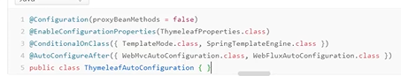

### springboot

#### 主程序

```java
package xf;

import org.springframework.boot.SpringApplication;
import org.springframework.boot.autoconfigure.SpringBootApplication;

@SpringBootApplication
public class MainApplication {
    public static void main(String[] args) {
        SpringApplication.run(MainApplication.class,args);
    }
}
```

##### pom.xml

```xml
<?xml version="1.0" encoding="UTF-8"?>
<project xmlns="http://maven.apache.org/POM/4.0.0"
         xmlns:xsi="http://www.w3.org/2001/XMLSchema-instance"
         xsi:schemaLocation="http://maven.apache.org/POM/4.0.0 http://maven.apache.org/xsd/maven-4.0.0.xsd">
    <modelVersion>4.0.0</modelVersion>

    <groupId>org.xf</groupId>
    <artifactId>springboottest1</artifactId>
    <parent>
        <artifactId>spring-boot-parent</artifactId>
        <groupId>org.springframework.boot</groupId>
        <version>2.1.7.RELEASE</version>
        <relativePath/>
    </parent>
    <!-- https://mvnrepository.com/artifact/org.springframework.boot/spring-boot-starter-parent -->

   <dependencies>
       <dependency>
           <groupId>org.springframework.boot</groupId>
           <artifactId>spring-boot-starter-parent</artifactId>
           <version>2.5.6</version>
           <type>pom</type>
       </dependency>
       <dependency>
           <groupId>org.springframework.boot</groupId>
           <artifactId>spring-boot-starter-web</artifactId>

       </dependency>
   </dependencies>

    <properties>
        <maven.compiler.source>8</maven.compiler.source>
        <maven.compiler.target>8</maven.compiler.target>
    </properties>

</project>
```

#### 1、依赖管理

```xml
<parent>
    <artifactId>spring-boot-parent</artifactId>
    <groupId>org.springframework.boot</groupId>
    <version>2.1.7.RELEASE</version>
    <relativePath/>
</parent>
```

他的父项目：几乎声明了所有的常用的版本号，springboot会自动控制版本号，不需要我们使用版本号

```xm
<parent>
  <groupId>org.springframework.boot</groupId>
  <artifactId>spring-boot-dependencies</artifactId>
  <version>2.1.7.RELEASE</version>
  <relativePath>../spring-boot-dependencies</relativePath>
</parent>

```

如果对当前版本号不满意

starter

#### 2、自动配置

- 自动配置号Tomcat

  - 引入tomcat依赖
  - 配置的

- 自动配置springmvc

  - 引入springmvc全套组件
  - 自动配好springmvc常用组件

- 默认的包结构

  - 主程序所在包及其下面的所有子包里面的组件都会默认扫描出来

  - 无需以前的包扫描

  - @ComponentScan(“”)修改包扫描

    ```java
    @SpringBootApplication()
    相当于
        @SpringBootConfiguration
    @EnableAutoConfiguration
    @ComponentScan
    
    ```

    

- 各种配置拥有默认值

  - 各种配置都有默认值，所有值都是映射到某个类的属性里面，会在容器中创建对象

- 按需加载所有自动配置

  - 很多的starter
  - 引入的那些场景，这些场景的配置才会自动执行
  - springboot所有的自动配置功能都在spring-boot-autoconfigure包里

#### 3、注解

```java
@Configuration//告诉springboot这是一个配置类，相当于spring的配置类
@Import({User.class, LinkedHashMap.class})//给容器中自动创建出这两个组件，默认组件的名为全限定名
@Bean//给容器中添加组件。 以方法作为组件名位组件的id，返回类型就是组件类型，注册是组件是单实例的
@Conditional／／条件注解
    @ConditionalOnMissingBean
@ImportSource("classpath:beans.xml")//导入xml配置文件   
@    

```


#### 4、@SpringBootApplication讲解

核心注解

##### @SpringBootConfiguration

@Configuration代表当前是一个配置类

##### @ComponentScan

指定扫描那些包，spring注解

##### @EnableAutoConfiguration

###### 	@AutoConfigurationPackage

​		自动配置包一个@Import  导入包的 autoconfigurationpackage.register.class可以批量注册组件。就是一个将指定包下的所有组件导入进来？就是main所在的包下

###### 	@Import


springboot自动加载原理：127个会加载，即项目在启动的时候，所有的类会全部加载，再通过条件装配规则/注解然后按需装配

##### 关于文件解析器的 规范 MultipartResolver

此方法，是为了从容器中找到该类，然后重新命名正确的名字，然后返回

**springboot中如果给@Bean注解的方法传入了对象参数，这参数的 值会从容器中找**


springboot默认会在底层配好所有的组件，如果用户配置类，以用户优先


啊啊啊springboot好神仙啊，麻蛋

##### 总结：

- springboot先加载所有的自动配置类
- 每个自动：配置类按照条件进行生效；默认都会绑定配置文件指定的值
- 生效的配置的类会给容器中装配很多组件
- 只要容器中有这个类，然后就会有响应的功能
- 只要用户有自己配置的，就以用户配置的优先
- 定制化配置
  - 用户自己@Bean替换底层的组件
  - 用户去看这个组件

###### 条件注解回顾：

1、@ConditionalOnbean

```java
@Bean
@ConditionalOnBean(RedisConnectionFactory.class)
   public RedisTemplate<Object, Object> redisTemplate(RedisConnectionFactory connectionFactory) {
       RedisTemplate<Object, Object> template = new RedisTemplate<Object, Object>();
       template.setConnectionFactory(connectionFactory);
       template.setKeySerializer(new StringRedisSerializer());
       template.afterPropertiesSet();
       return template;
   }
```

如果方法添加了@ConditionalOnBean注解，注解里的属性是RedisConnectionFactory。他的意思是如果你配置了redis的相关信息，就执行方法中的操作

2、@ConditionalOnMissingBean（name=“connectionFactory”）比1多了一个missing，就是不存在括号中的实例的时候。执行方法体中的内容

3、@ConditionalOnMissingBean（annotion=EnableS。class）根据

#### 简化小技巧

lomb0k

### 二、简单功能分析

#### 1、静态资源访问

##### 目录

static/public or /resources or META-INF/resuorce 访问当前项目跟路径/* 静态资源名

原理：静态映射/**

请求来之后，先去controller看能不能处理，不能处理所有请求，又都交给静态资源处理器

- 改变静态资源目录：

##### 静态资源访问前缀

默认没用前缀


#### 2、欢迎页面

将页面放到静态资源目录下静态资源目录下的index.xml

favicon.ico  图片可以设置图标

#### 3、静态资源配置原理

1. springboot启动默认加载 xxxAutoConfiguration
2. springmvc功能的自动配置类， webmvcAutoconfiguration生效
3. 一个配置类只有一个有参构造器，有参构造器所有参数都会默认从容器中找

handlerMapping：处理器映射，仅保存了handler能处理的请求

### 三、请求参数处理

#### 1、请求映射

rest原理（表单提交）：

- 表单提交要带上_method=put

#### 2、rest映射

利用了装饰者模式，将

#### 3、请求映射

所有的请求映射都在HandlerMapping中。

- springboot自动配置欢迎页的HandlerMapping，范文到index.xml
- 请求进来，挨个尝试所有的HandlerMapping是否有请求信息
  - 如果有就找到这个请求对应的handler
  - 如果没有就找下一个handlermapping
- 我们需要自定义的映射处理，我们也可以自己给容器中放HandlerMapping


#### 4、源码分析


- requestmappingHanlerAdapter支持方法上标注@RequestMapping
- HandlerFunctionAdapter支持函数时编程的

##### 1）、参数解析器:（HandlerMethodArgumentResolver）参数解析原理

各个解析器对应着不同注解注解的参数，springmvc目标方法能解析多少参数


为什么springmvc第一次访问的时候会毕竟慢，后面很快

##### 2）、自定义参数类型

ServletModelAttributeMethodProcessor参数解析器解析

##### 3）、返回值解析器原理

- 返回值处理判断是否支持这种类型返回值supportsReturnType
- 返回值处理器调用handlerReturnValue进行处理
- RequestResponseBodyMethodProccessor可以处理返回值表了ResponseBody注解
  - 利用MessageConverters进行处理，将数据写为json
    - 内容协商（浏览器默认会请求的方式告诉服务器他能够接收什么样的内容类型）
    - 服务器根据自己的能力，决定生产什么样的类型的消息
    - springmvc会遍历所有的容器底层的httpmessageconverter，看谁能处理
      - 
      - 0-只支持byte类型的
      - 1-String
      - 2-String
      - 3-Resource
      - 4-ResourceRegion
      - 5-DOMSource.class\SAXSource.class\StreamSource.class\Source.class
      - 6-MultiValueMap
      - 7-true
      - 8-true
      - 9-支持注解方式xml处理的
      - 最终是messconverter把对象写为json数据，利用了底层的jackson包

##### 4）、内容协商

1. 判断当前响应头中是否已经有确定的类体类型。MediaType
2. 获取客户端支持接收的内容类型（获取客户端Accept请求头）
   - contentNegotiationManager内容协商管理器，默认使用基于请求头的策略
   - HeaderContentNegotiationStrategy确定客户端可以接收的内容类型
   - 
3. 获取可产生的媒体类型，遍历循环当前系统所有的MessageConverter，看谁支持操作此对象
4. 找到支持操作Person的converter支持的媒体类型统计出来
5. 客户端要【application/xml】。服务端能力10种【json、xml】
6. 进行内容协商的最佳匹配
7. 用支持将对象转为最佳匹配的converter。调用它进行转换

###### 浏览器的内容协商功能

为了方便内容协商，开启基于请求参数的内容协商功能


开启参数请求的内容协商，默认为true

contentManager

参数为format=xml/json


确定客户端能接收请求的类型 parameter是优先的

##### 5）、自定义MessageConverter

实现多协议数据兼容。json、xml

- @ResponseBody响应数据出去调用RequestResponseBodyMethodProcessor处理
- Processor处理方法返回值。通过MessageConverter处理
- 所有MessageConvertor合起来可以支持各种媒体类型数据的操作（读，写）
- 内容协商找到最终的messageConverter

配置步骤：

1. 给入口容器添加一个webMvcConfigurer

6）、浏览器参数类型的自定义MediaType

有可能添加的自定义的功能会覆盖很多功能，导致一些默认功能失效

#### 四、视图解析与模板引擎


##### 1、thtmeleaf使用

1. 引入依赖
2. 自动配置自动配好的策略
   - 所有thymeleaf的配置都在ThymeleafProperties
   - 配置好了springTemplatesEngine
   - 配置好了ThymeleafViewResolver
   - 我们只需要开发页面页面要放在类路径下 的templates
   - list遍历
   - 

##### 源码分析

1. 目标方法处理的过程中，所有数据都会被放在ModelAndView里面，包括数据和视图地址

2. 方法的参数是一个自定义类型对象（从请求参数中确定的），把他重新放在ModelAndViewContainer

3. 任何目标方法执行完成以后都会返回ModelAndView（数据和视图地址）

4. processDispatchResult处理派发结果（页面该如何响应）

   1. render（mv，request，response）;进行页面渲染逻辑

      1. 根据方法的Stirng返回值得到view对象【定义了页面的渲染逻辑】

         - 所有的视图解析器是否跟库当前返回值得到view对象

         - 得到了redirect:/main.html-->Thymeleaf new  RedirectView()

         - ContentNegotiationViewResolver里面包含了下面所有的视图解析器，内部还是利用下面所有视图解析器得到对象

         - view.render（mv.getModelInternal(),request,response）;视图对象调用自定义的render进行页面渲染工作

           - redirectView如何渲染

             获取目标地址url

             response.sendRedirect(encodoURL);

      2. 视图解析：

         - 返回值以forward：开始；new InternalResourceView(forwardUrl);--》request.getRequestDispatcher(path).forward(request,response);
         - 返回值以redirct开始：new Redirectrectview()-->render就是重定向
         - 返回值是普通字符串：new ThymeleafView()

      3. 自定义视图解析器，自定义视图

#### 五、拦截器


"/**"默认拦截所有请求，静态资源也会被拦截

##### 步骤：

1. 编写一个拦截器，实现HandlerInterceptor接口
2. 拦截器注册到容器中实现WebMvcConfigurer中
3. 指定拦截规则

##### 源码分析：

1. 根据当前请求，找到HandlerExecutionChain【可以处理请求的handler以及handler的所有拦截器】
2. 先来顺序执行所有拦截器的preHandler方法
   - 如果返回为true。则执行下一个拦截器的preHandle
   - 如果拦截器返回为false。直接倒序执行时所有以及执行了的拦截器的afterComplition
3. 如果任何一个拦截器执行失败，返回false。则直接return，不执行目标方法
4. 所有拦截器返回true，执行目标方法
5. 倒叙执行所有拦截器的postHandler
6. 前面的步骤有任何异常都会直接触发afterCompletion
7. 页面渲染完成以后，也会倒叙触发afterCompletion  

#### 六、文件上传功能

##### 1、文件上传实例

```java
 @PostMapping("/up")
    public String up(String email,
                     String username,
                     MultipartFile headerImg,
                     MultipartFile[] photos){
        log.info("上传的信息：emai={},username={},headImgsize={},photos.length",
                email,username,headerImg.getSize(),photos.length);

        if (!headerImg.isEmpty()){
            try {
                headerImg.transferTo(new File("C:\\Users\\xfff\\Desktop\\AdminEx - 响应式设计后台管理模版@www.java1234.com\\"+headerImg.getOriginalFilename()));
            } catch (IOException e) {
                e.printStackTrace();
            }
            System.out.println("上传成功");
        }

        return "test";
    }
```

##### 2、源码分析

文件上传自动配置类-MultipartAutoConfiguration-MultipartProperties

- 自动配置好了StandardServletMultipartResolver【文件上传解析器】

- 原理步骤

  1. 请求进来使用文件上传解析器判断【isMultipart】并封装【resolveMultipart，返回MultipartHttpServletRequest】文件上传请求

  2. 参数解析器解析请求中的文件内容封装称MultipartFile

  3. 将request文件中信息封装为一个Map;MultipartFileMap<String,MultipartFile>

  4. 关于MultipartFile.transferTo(new File());方法使用了InputStream和OutputStream

     - ```java
       public static int copy(InputStream in, OutputStream out) throws IOException {
           Assert.notNull(in, "No InputStream specified");
           Assert.notNull(out, "No OutputStream specified");
           int byteCount = 0;
       
           int bytesRead;
           for(byte[] buffer = new byte[4096]; (bytesRead = in.read(buffer)) != -1; byteCount += bytesRead) {
               out.write(buffer, 0, bytesRead);
           }
       
           out.flush();
           return byteCount;
       }
       ```

#### 七、SpringBoot错误处理


也可以命名5xx，4xx

##### 1、源码分析

###### ErrorMvcAutoConfiguration自动配置异常处理规则

- 容器中的组件类型：
  - DefaultErrorAttributes->error Altributes
  - ErrorController
    - 处理默认路径请求：/error
    - 容器中还会有View-》id是error，那么如果调用errorcontroller就会返回error视图
    - 容器中放组件BeanNameViewResolver(视图解析器)：按照返回视图名作为组件的id去容器中找view对象
  - 容器中组件
  - 如果想要返回页面，就会找error视图【StaticView】。默认是一个白页 

###### 异常处理流程

1. 执行目标方法，目标方法运行期间有任何异常都会被catch，而且标志当前请求结束；并且用dipatchException
2. 进入视图解析流程（页面渲染）
3. mv=processHandlerException；处理handler发生的异常；处理完成返回Modlerandview
   1. 遍历所有的handlerExceptionResolvers，看谁能处理当前异常【HandlerExceptionResolver】
   2. 系统默的异常解析器
      1. DefaultErrorAttributes先来处理异常，并把异常信息保存到request域，并返回null
      2. 默认没有任何能处理异常，所以异常会被抛出
      3. 如果没有任何解析器处理，最终底层会发送/error请求。会被底层的BasicErrorController处理
      4. 解析错误视图；遍历所有的ErrorViewResolver看谁能解析DefaltErrorViewResolver
      5. 状态码
         1. informational
         2. successful
         3. redirection
         4. client_error
         5. server_ err0r

##### 2、错误定制

######  方法一

使用@ControllerAdvice和@ExceptionHandler

底层支持：ExceptionHandlerExceptionResolver支持

###### 方法二


底层支持：ResponseStatusExceptionResolver，把@ResponseStatuse注解的信息拿来放到直接调用sendError(statusCode,resolvedReason);tomcat发送的/error

###### 方法三


#### 八、web原生组件注入（servlet、filter、Listener）

##### 1、使用servlet API

@ServletComponentScan(basePackages="")指定原生servlet所在包

@webServlet(urlPattern="/")

扩展：DispatchServlet如何注册进来

- 容器中自动配置了DispatcherServlet属性绑定包WebMvcProperties；对应的配置文件时spring.mvc
- 通过ServletRegistrationBean<DisPatcherServlet>把DispatcherServlet配置进来
- 默认映射的时/路径

tomcat-Servlet

多个servlet都能处理同一层路径，按照精确优先原则


#### 九、嵌入式Servlet容器

- 默认支持webServlet
  - Tomcat，Jetty or Undertow
  - ServletWebServletApplicationContext容器启动寻找ServletWebServerfactory并引导创建服务器
- 切换服务器
- 原理
  - springBoot应用启动发现是web应用。web场景包-导入tomcat
  - web应用会创建一个web版的ioc容器ServletWebServerApplicationContext
  - ServletWebServerApplicationContext启动的时候寻找ServletWebServerFactory（Servlet的web服务器工厂-》servlet的web服务器）
  - SpringBoot底层默认有很多webservlet工厂；TomcatServletWebServerFactory,JettyServletWebFactory,or UnderTowServletWebServerFactory
  - 底层直接有一个自动配置类
  - ServletWebServerFactoryAutoConfiguration导入了ServletFactoryConfiguration配置类，根据动态判断系统中到底导入了那个web服务器的包（默认是web-starter导入tomcat包）容器中九有了Tomcat
  - TomcatServletWebServerFactory创建出tomcat服务器并启动，TomcatWebServer的构造器拥有初始化方法initialize->this.tomcat.start();
  - 内嵌服务器，就是手动把启动服务器的代码调用（tomcat）


#### 十、定制化原理

##### 1、定制化的常见方式

- 修改配置文件
- xxxxxCustomizer
- 编写自定义的配置类xxConfiguration;+@Bean替换、添加容器中默认组件;视图解析器
- web应用实现WebMvcConfiguration即可定制化web功能
- @EnableWebMvc+WebMvcConfigurer--@Bean可以全面接管SpringMVC，所有配置规则自己重新配置，实现定制和扩展功能

##### 2、原理分析套路

1,场景starter-xxxAutoConfiguration-导入xx组件-保定xxxProperties--绑定配置文件项

2,@EnableWebMvc注释webmvcconfigurer表示全面接管springmvc

3,一旦使用@EnableWebMvc会导入@Import(DelegatingWebMvcConfiguration.calss)

4,**DelegatingWebMvcConfiguration的作用**纸包装springmvc最基本的使用

- 把所有系统中的webMvcConflguration拿来。所有的功能定制都是这些webmvcconigurer合起来生效。
- 配置了一些非常底层的组件。RequestMappingHandlerMapping、这些组件依赖的组件都是从容器中获取
- @Configuration（proxyBeanMethods=false）

public class DelegatingWebMvcConfiguration extends WebMvcConfigurationSupport

- webMvcAutoConfiguration里面的配置要能生效
- @ConditionalOnMissingBean(WebMvcConfigurationSupport)
- @EnableWebMvc导致了SpringMvcAutoConfiguration没有生效

#### 十一、数据访问

```xml
<dependency>
    <groupId>org.springframework.boot</groupId>
    <artifactId>spring-boot-starter-data-jdbc</artifactId>
</dependency>
```

数据库驱动？

为什么导入jdbc场景，不自动导入驱动

##### 1、自动配置分析

- 自动配置的类
  - DataSourceAutoConfiguration:数据库的自动配置
    - 底层配置好 的连接池是Hikar
  - DataSourceTransactionManagerAutoConfiguration：事务管理的自动配置
  - jdbcTemplateAutoConfiguration：JdbcTemplate的自动配置，可以对是菊科星系crud
    - 可以
  - IndiDataSourceAutoConfiguration jindi的自动配置
  - XADataSourceAutoConfiguration 分布式数据配置

#### 十二、整合mybatis

##### 1、配置

- 全局配置文件
- sqlsessionFactory
- sqlSession
- mapper


#### 十三、引入mybatis-plus

##### 自动配置

- mybatis-plus
- sqsessionfacory自动配置好
- mapperlocation自动配置好
  - classpath*；/mapper/**/*.xml;任意包的路径下所有mapper稳健性的任意路径下的所有xml都是sql映射文件。建议以后sql映射文件放在类路径下的mapper下
- 容器中自动配置好了SqlSessionTemplates
- @Mapper标注的接口也会自动扫描
- 只需要我们的Mapper继承baseMapper就可以crud能力

##### 关于框架使用的小问题

- 数据库字段为最好是小写的，因为mybatis-plus默认数据库的字段是全小写，就算是类中的属性是大写，mybatis-plus也会将其适配成小写
- 解决方案：在属性上添加@TabledField("数据库字段")
- 

#### 十四、NoSql

##### 1、整合Redis


