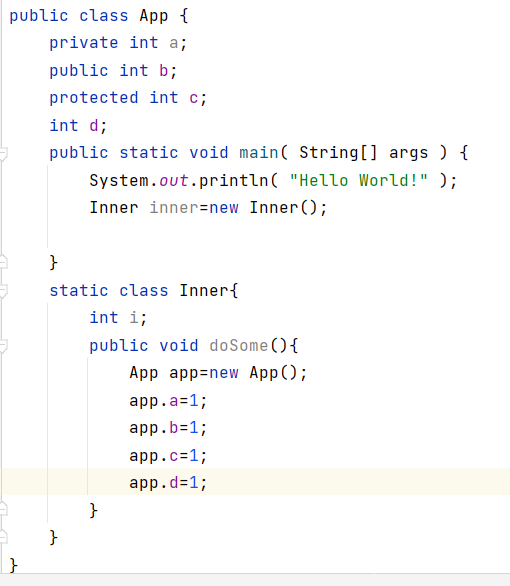

### 关于静态方法调用非静态内部类

​	有时你希望定义一个类成员，使他的使用完全独立于该类的任何对象。通常清空下，类成员必须通过他的类的对象访问，但是可以创建这样一个成员，它能够被它自己使用，而不必引用特定的实例。在成员的声明前面加上关键字static就能创建这样的成员。如果一个成员被声明为static，它就能够在它的类的任何对象创建之前被访问，而不必引用任何对象。你可以将方法和变量都声明为static。static成员最创建的例子是main。因为在程序开始执行时必须调用main，所以它被声明为static。

声明为static的变量称为静态变量称为静态变量或类变量。何以直接通过类名引用静态变量，也可以通过实例名来引用静态变量，但最好采用前者，因为后者容易混淆静态变量和一般变量。静态变量是根类相关联的，类的所有实例共同拥有一个静态变量。

声明为static的方法称为静态方法或类方法。静态方法可以直接调用静态方法，访问静态变量，但是不能直接访问实例变量和实例方法。静态方法中不能使用this关键字，因为静态方法不属于任何一个实例。静态方法不能被子类的静态方法覆盖。

### 内部类和静态内部类的区别

定义在一个类内部叫做类的内部类，包含内部类的类称为外部类。内部类可以声明public protected private等访问闲置，可以声明为abstract的公其他内部类或外部类继承与扩展，声明为static final的，也可以实现特定的接口。外部类按常规的类访问访问使用内部类，唯一差别是，外部类可以访问内部类的所有方法和属性，包括私有属性

#### 为什么静态static方法中不可以new 内部类的对象？？

#### 关于内部类和外部类的成员变量之间的调用

**总结**：外部类可以调用内部类的所有成员，包括私有成员，内部类也可以调用外部类的所有成员，包括私有成员