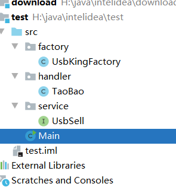
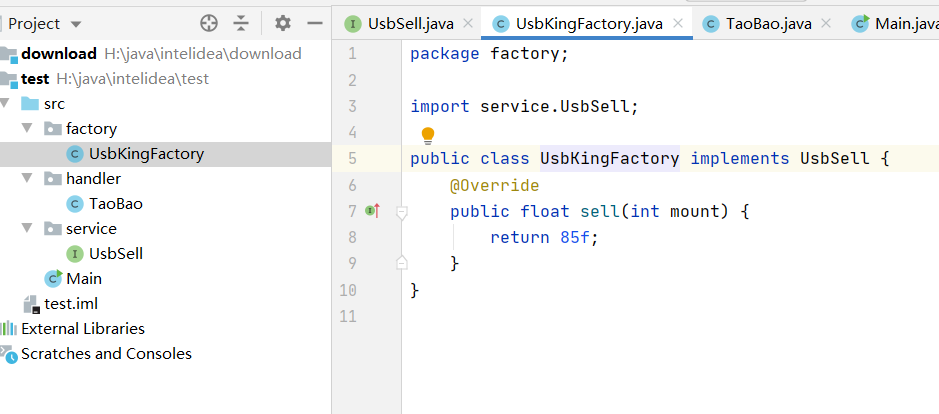
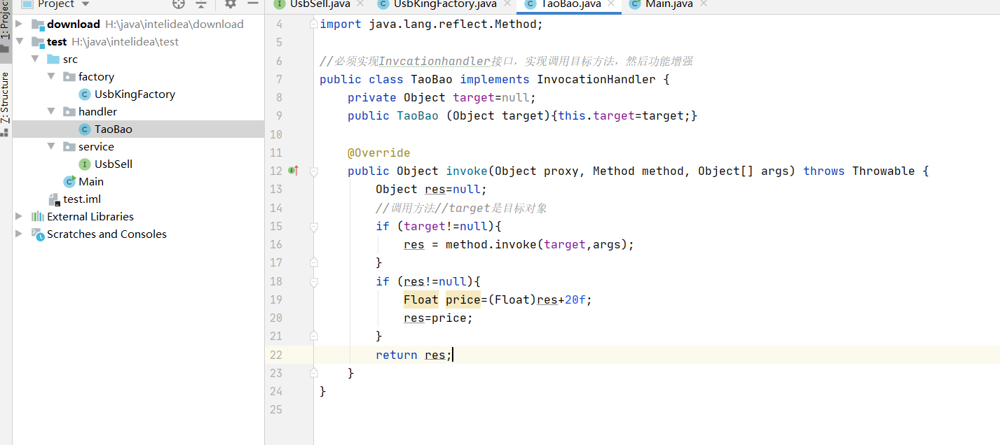
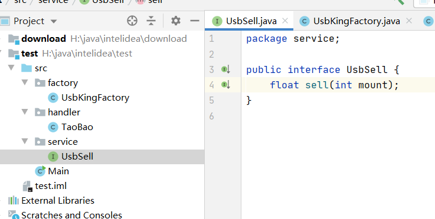
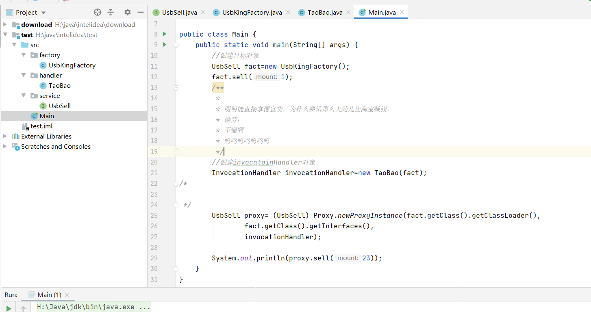

### 动态代理

#### 代理：

代购，中介，换ip，商家等

#### 静态代理：

1. 代理类是自己手工实现的，自己创建一个java类，标识代理类。
2. 同时你索要代理的目标是确定的

特点：

1. 实现简单
2. 容易理解

模拟一个用户购买u盘的行为

​	用户是客户端类

​	商家：代理，代理某个品牌的u盘

​	厂家：目标类。

​	三者的关系：用户客户端---商家代理---厂家（目标）

​	商家和厂家都是卖U盘的，他们完成的功能是一致的，都是卖u盘

##### 实现步骤：

1. 创建一个接口吗，定义卖u盘的方法，标识你的厂家和商家要做的事情。
2. 创建商家类，实现1步骤中的接口
3. 创建商家，就是代理，也需要实现1步骤中的接口
4. 创建客户端类，调用商家的方法买一个u盘

##### 代理完成的功能：

1. 目标中方法的调用
2. 功能增强

优点：容易理解，简单实现

缺点：

1. 目标增加，代理会成倍增加
2. 当接口中功能增加了，或者修改了，会影响众多的实现类，厂家类需要修改


#### 动态代理：

在静态代理中目标很多时，可以使用动态代理，避免静态代理的缺点

动态代理中，即使很多，代理类数量很少，当你修改了接口的时候，不会影响代理类

##### 概念：

在程序执行的过程中，使用jdk反射机制，创建代理类对象，并动态的指定要代理目标类

​	换句话说，动态代理时一种创建java对象的能力，使得不用创建taobao类，就能创建代理对象

#### jdk动态代理的实现：

##### 1、反射：

method类，标识方法，类中的方法。通过Method可以执行某个方法

##### 2、jdk动态代理的实现

反射包：java.lang.reflect。里面有三个类：InvocationHandler，,Method,Proxy,invoke();:

###### InvocationHandler接口

要实现InvocationHandler接口中的invoke()方法

1. InvocationHandler接口：就一个方法invoke()

   invoke（）：标识代理对象要执行的功能代码，你的代理类要完成的功能就卸载invoke方法中。

2. 代理类完成的功能

   1. 调用目标方法，执行目标方法的功能
   2. 功能增强，在目标方法调用时，增加功能

3. 方法原型

   1. 参数：
      - object proxy：jdk创建的代理对象，无需赋值
      - Method method：目标类中的方法，jdk提供method对象的
      - object[] args ：目标类中方法的参数，jdk提供的

4. public Object invoke(Object proxy,Method method,Object[] args)

5. InvocationHandler接口 :表示你的代理要干什么

###### Method 类

表示方法的，确切的说就是目标类中的方法

作用：通过Method可以执行某个目标的方法，Method.invoke()；

method.invoke(目标对象，方法参数)

​	object ret=method.invoke（UsbKingFactory,1）;

​	上面的那句话代替了：float price=factory.sell(mount);

###### Proxy类：

​	核心的对象，创建代理对象，之前创建对象都是new类的构造方法

现在我们使用Proxy类的方法，替代new的使用

- 方法：静态方法：newProxyInstance()此用来替代Main方法中的new Taobao

- 参数：

  - ClassLoader loader: 类加载器，负责向内存中加载对象的。使用反射获取对象的ClassLoader

    ```java
    a.getClass().getClassLoader();
    ```

    目标类代理

  - Class<?> interfaces :接口与，目标对象实现的接口，也是反射获取的

  - InvocationHandler h：我们自己写的代理类

- ```java
  //newProxyInstance()原码
  public static Object newProxyInstance(ClassLoader loader,Class<?> interfaces,InvocationHandler h)
  
  ```

  


#### 	源码展示：








​	 

