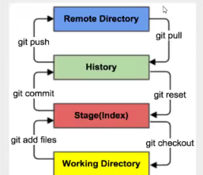

### Git

#### 版本控制

版本迭代，是一个版本控制工具

主流版本控制工具

- git
- svn
- cvs
- vss
- tfs

#### git和svn的区别

svn是集中式版本控制系统，版本库是集中放在中央服务器的，而工作的时候，用的都是自己的电脑，所以首先要从中央服务器得到最新的版本，然后工作，完成工作后，需要把自己昨晚的活推送到中央服务器。集中式版本控制系统是必须联网才能工作，堆网络宽要求较高

git是分布式版本控制系统，没有中央服务器，每个人的电脑就是一个完整的版本库，工作的时候不需要联网，因为版本都在自己电脑上，协同的方法是这样的。git可以直接看到更新了那些代码和文件

1. git bash ：unix与linux风格的命令行，使用最多，推荐最多
2. git cmd：windows风格的命令行
3. git gui ：图形界面的git，不建议初学者使用，尽量熟悉常用命令

touch 文件

mkdir 创建文件夹

mv 文件 目标文件夹

#### git工作原理

##### 工作区域

git本地有三个工作区域：工作目录，暂存区，资源区。如果再加上远程的git仓库就可以分为四个工作区域。

- Workspace：工作区，就是平时放代码的地方
- index/Stage：暂存区，用于临时存放你的改动，事实上它只是一个文件，保存即将提交到文件列表信息
- Repository：仓库区（本地仓库区）：就是安全存放数据的位置，这里面有你提交到所有版本的数据。其中head指向最新放入仓库的版本
- Remote：远程仓库，托管代码 的服务器，可以简单的认为你项目组中 的一台电脑用于远程数据交换

