### Maven

1. maven约定的目录结构，约定是大家都准           

2. pom.xml文件

   ```xml
   <?xml version="1.0" encoding="UTF-8">
   
   <project xmlns-"http://maven.apache.org/POM/4.0.0" xmlns:xsi-"http://www.w3.org/2011/XMLSchema-instance" xsi:schemaLocation-"http://maven.apache.org/POM/4.0.0 http://maven.apache.org/xsd/maven-4.0.0xsd">
    	<modelVersion>4.0.0</modelVersion>
    	<groupId>com.maven</groupId>
    	<artifactId>ch01-maven</artifactId>
    	<version>1.0-SHAPSHOT</version>
   </project>
   ```

3. mvn complie 编译src/main目录下的所有java文件

https://repo.maven.apache.org:中央仓库地址

#### 1、maven下载默认地址是：c:\Users\Administrator\.m2\repository

#### 2、maven修改默认仓库

找到maven安装目录的conf文件夹下的pom.xml文件，ctrl+f搜索标签<localRepostory>标签，将标签脱出注释，修改标签内容为自定义仓库内容即可

**注意：maven中路径是/，复制粘贴的路径是\需要修改

#### 3、仓库

仓库是存放东西的，存放maven使用的jar和我们项目使用的jar

- maven使用的插件
- 项目使用的第三方jar

##### 分类：

- 本地仓库：本机存放个人计算机的文件
- 远程仓库，在互联网上的，使用网络才能使用的仓库
  - 中央仓库：最权威的，所有的开发人员都共享使用的一个集中仓库https://repo.maven.apache.org:中央仓库地址
  - 中央仓库的镜像：中央仓库的备份，在各大洲，重要的城市都有镜像
  - 私服：在公司内部，在局域网中使用，不对外使用

##### 放库的使用

- maven仓库的使用不需要认为参与。
- 开发人员需要mysql驱动----》maven查本地仓库---》私服----》镜像---》中央仓库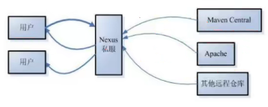

##### pom

| pom文件解释  |                                                      |      |
| :----------: | ---------------------------------------------------- | ---- |
| modelVersion | maven模型的版本，对于Maven2和maven3来说，它只是4.0.0 |      |
|   groupId    | 组织id，一般是公司域名的缩写eg：com.baidu.appolo     |      |
|  artifactId  | 项目名称，也是模块名称，对应groupid中项目的子项目    |      |
|   version    | 项目的版本号。如果不问带你，在版本后代-SNAPSHOT      |      |
|              |                                                      |      |

www.mvnreposity.com 搜索使用的中央仓库

#### 4、单元测试junit

1. 加依赖www.mvnreposity.com 

2. 在maven项目中的src/test/java目录下，创建测试程序

   1. 测试类的名称 是Test+你要测试的名称
   2. 测试的方法名称 Test+方法名称

   其中testAdd叫做测试方法，他的定义规则

   1. 方法是public
   2. 方法必须有返回值
   3. 方法是自定义的
   4. 方法上面加入@Test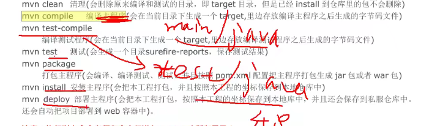

###### mvn complie

编译main/java/目录下的java为class文件，同时把class拷贝到 target/classes目录的下面

把main/resources目录下面

###### mvn test-complie

编译test中的java代码

###### mvn test

执行测试代码

###### mvn package

打包src/main下面的所有文件

#### 5、maven声明周期

Assert.assertEquals(期望值，实际值)

清理，编译，测试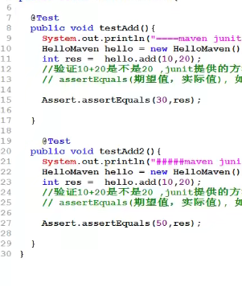

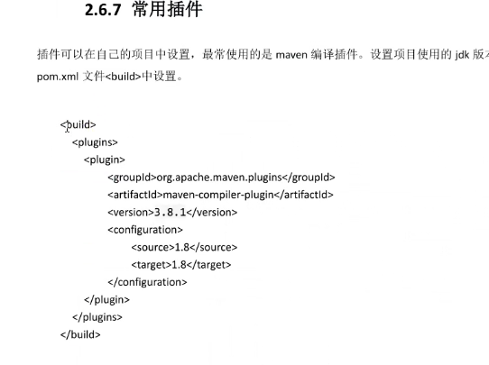

### idea使用maven

##### maven创建web工程


-DarchetypeCatalog=internal，maven项目创建时，会联网下载模板文件，比较大，用这个默认不下载


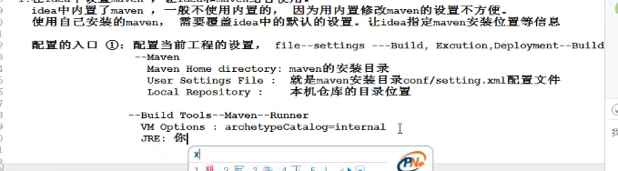

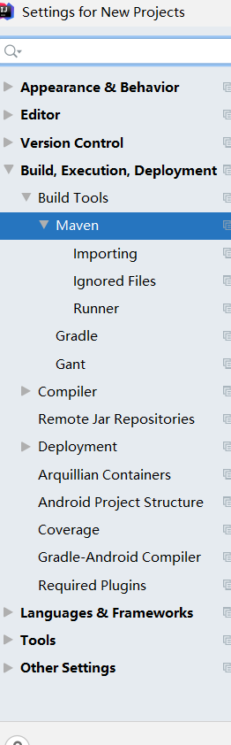

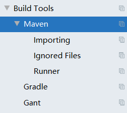

1.在idea中有内置maven，但一般不用内置

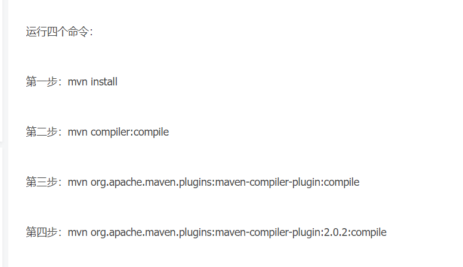

###### jsp依赖：

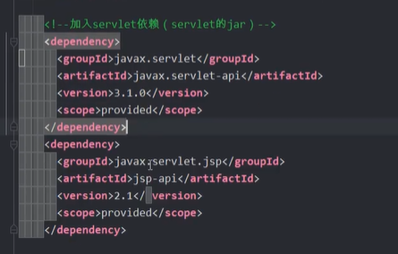

#### 6、依赖范围

使用scope表示的

scope的值有compile（表示所有声明周期都需要用的依赖，默认依赖），test(测试) ，provid（提供者，在编译测试的时候需要用到，但是打包安装的时候，用不到）

scope：表示依赖使用的范围，也就是在maven构建项目的哪些阶段起作用

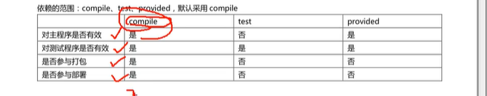

#### 7、maven常用功能

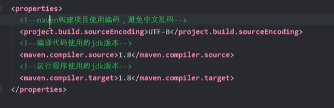

<properties  设置常用属性

1. maven全局变量
   1. 自定义变量：
   2. 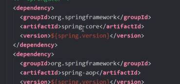
   3. 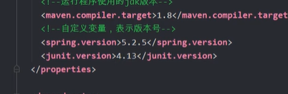
2. 资源插件
   1. 作用：
      - 默认没有resources的时候，maven执行编译代码的时候，会把
      - 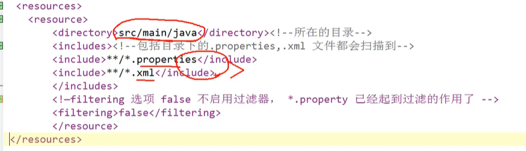

