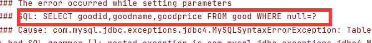
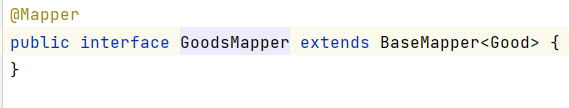
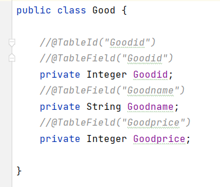
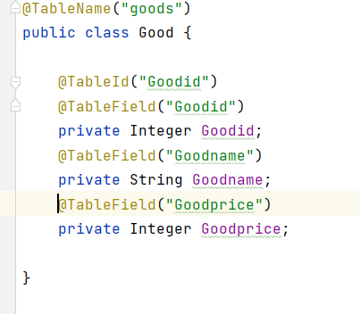
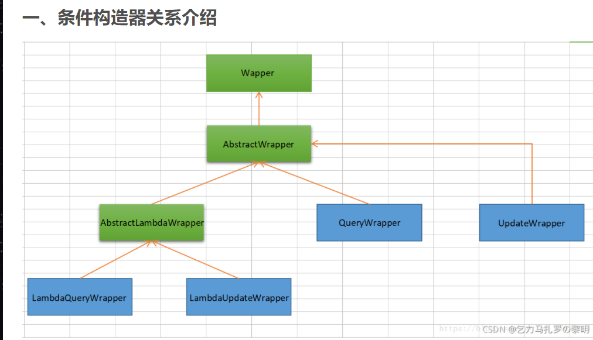
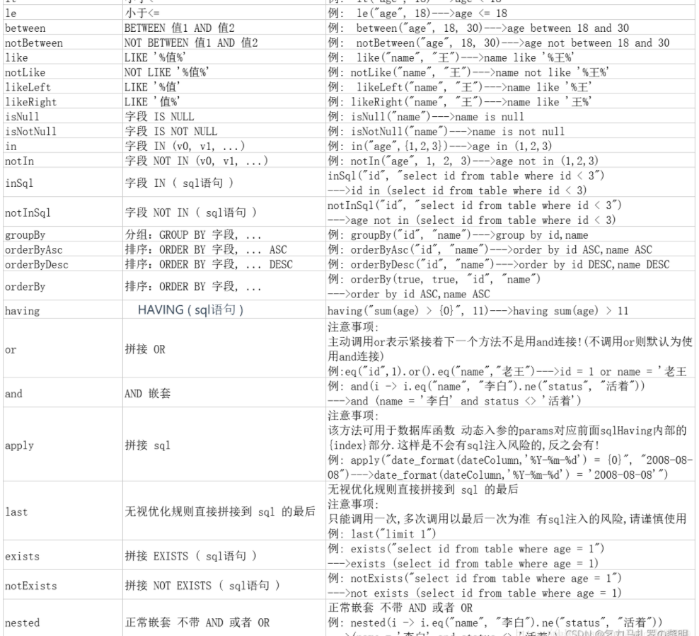

### MyBatis-plus使用出现空指针异常或者表不纯在

 Table '****' doesn't exist

使用框架一定遵循：**约定大于配置**。使用不规范，debug两行泪，呜呜呜

mybatis-plus组成sql语句时：

select 字段（实例类中是属性名，必须为小写）from 表名（你类的实例名）where id=？

下面说一下如果使用不规范出现的问题以及解决方案

#### 

MyBatis-plus组成sql语句的时候，重点参照BaseMapper中的泛型类。

字段拼接为全小写，像我这样的类属性名，会被全部适配成小写，如上图一的sql语句。

而且表名匹配默认为泛型类名，头字母为小写如Good类那么默认适配表名为good。

mybatis-plus默认表的主键名为id，如果在泛型类中找不到id属性，那么查找到的值会报空。NullException。

#### 以上问题的解决方法：

- @TableName("你的表名")
- @TableId("你的表的主键名")
- @TableField("表中各个字段名")

### wrapper的使用

- 上图绿色框为抽象类abstract
- 蓝色框为正常class类，可new对象
- 黄色箭头指向为父子类关系，箭头指向为父类

#### wapper介绍

1. wrapper：条件构造器抽象类，最顶端父类
2. AbstractWrapper：用于查询条件封装，生成sql的where条件
3. QueryWrapper：Entity对象封装操作类，不是用lambda语法
4. UpdateWrapper：Update条件封装，用于Entity对象更新操作
5. AbstractLambdaWrapper：Lambda语法使用Wrapper统一处理解析lambda获取column
6. LambdaQueryWrapper：用于Lambda语法使用查询Wrapper
7. LambdaUpdateWrapper：Lambda更新封装Wrapper

#### 函数介绍：

