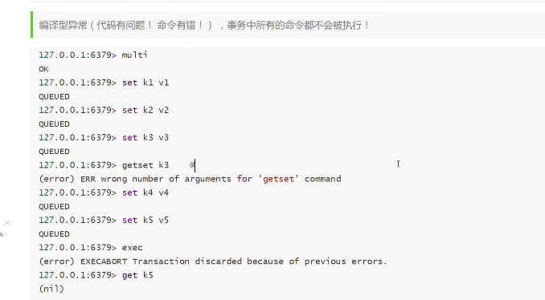

#### redis

启动

src 下 redis-server

后台启动：再任何目录下  redis-server &

启动redis服务时，指定配置文件：默认端口6379

启动服务时：  redis-server redis.conf &

关闭服务：

1. 通过kill命令关闭：ps -ef/grep redis插卡

   ​									kill -9 pid

   redis-cli shutdown

##### redis-benchmark性能测试

##### 					

##### 基础知识

默认有16个数据库


数据库切换


```ABAP
27.0.0.1:6379> select 1
OK
127.0.0.1:6379[1]> DBSIZE
(integer) 0
127.0.0.1:6379[1]> select 0
OK
127.0.0.1:6379> DBSIZE
(integer) 6
127.0.0.1:6379> select 16
(error) ERR DB index is out of range
127.0.0.1:6379> 
```

为什么redis默认端口号是6379

redis是单线程的，是非常快，基于内存操作，cpu不少内存瓶颈，redis的瓶颈是根据机器的内存和网络带宽，既然可以使用单线程来实现，就使用单线程了！所有就使用了单线程

Redis是c语言写的，官方提供数据未 10000+ 的qps，完全不必同样是使用key-value的Memecache差

##### 为什么redis单线程快

多线程：多线程一定比单线程效率高

核心：redis是将所有的数据全部放在内存中的，所以说使用单线程去操作效率是最高的，多线程（cpu上下文会切换，消耗时间）对于内存系统来说，如果没有上下文切换，多次读写都是再一个cpu上的，再内存情况这个就是最佳方案

#### redis五种数据类型 

##### String（字符串）

大部分人只会用String类型

```bash
127.0.0.1:6379> APPEND key1 sdasdad #string后面追加
(integer) 8
127.0.0.1:6379> get key1
"2sdasdad"
127.0.0.1:6379> STRLEN key1#获取长度
(integer) 8
127.0.0.1:6379> 
```

```bash
127.0.0.1:6379> set view 0
OK
127.0.0.1:6379> get view
"0"
127.0.0.1:6379> 
127.0.0.1:6379> incr view
(integer) 1
127.0.0.1:6379> incr view
(integer) 2
127.0.0.1:6379> get view
"2"
127.0.0.1:6379> decr view
(integer) 1
127.0.0.1:6379> get view
"1"
127.0.0.1:6379> TYPE view
string
127.0.0.1:6379> INCRBY view 10
(integer) 11#设置不上自增
127.0.0.1:6379> get view
"11"
127.0.0.1:6379> INCR view
(integer) 12
127.0.0.1:6379> 

```


getrange 字符串 0 111

###### string常用命令

setex key 30 da 

setnx key value   如果存在创建失败

mset k1 v1 k2 v2 k3 v3


getset db redis

String场景：value字符串可以是数字，统计多单位数量，对象缓存存储

##### List

redis中，list可以是栈，队列，阻塞队列所有的list命令都是l开头的

###### List的命令

Lpush

Lrange

lindex list 1

lrem 移除

trim list start end 截取start到end的list

rpoplpush 移除列表最后一个元素，并将他移动到新的列表

lset 

linsert list before “world” “other”将某个具体的value插入到列表中


##### Set（集合）

里面的值不能重复，无序

命令：

1. sadd
2. srem
3. scard 获取元素个数
4. smembers 获取set中的所有值
5. srandmember 随机抽取set中的值
6. spop 随机弹出一个元素
7. smove  将一个元素移到另一个集合中
8. sdiff key1 key2 得到差集
9. sinter key1 key2 得到交集

##### Hash

map集合 key-map 值是一个map


1. hgetall
2. hdel 删除
3. hlen
4. hexists
5. hkeys
6. hvals
7. 

#### zset

在set的基础上，增加了一个值，set k1

zrangebyscore salary -inf +inf


1. zcount 获取指定集合区间的集合数量

#### 三种特殊的类型

##### geospatial地理位置

rdis的geo在redis3.2就推出了，可以推算地理位置的信息，两地之间的举例，方圆几里的人


1. geoadd  两极无法直接导入
2. geopos 获取经纬度
3. geodist 返回两个位置之间的举例


1. ​	georadius

##### Hyperloglog

基数（不重复的 元素）

做基数统计的算法  网页的uv（一个人访问一个网站多次，但是还是算作一个人！）

传统方式，set保存用户的id，然后就可以统计set中的元素数量作为判断

优点：占用内存是固定的 2的64次方不同元素的 技术，只需要12kb内存。

有0.81%的错误率

1. pfadd
2. pfcount
3. pfmerge

##### Bitmaps

位存储

统计疫情感染人数

统计用户信息、活跃不活跃。登录，未登录。

Bitmaps位图，数据结构，都是操作二进制位来记录，只有0和1两个状态。

#### 事务

redis事务本质：一组命令的集合。一个事务中所有命令都会序列化，在事务执行过程中，会按照顺序执行。一次性，顺序性。排他性。

所有命令在事务中，并没有直接执行。只有发起执行命令的时候才会执行

redis单挑命令保存原子性，但是事务不保证原子性


muti 开启事务

/*编写命令队列*/

exec 执行/discard放弃事务 事务队列中不会执行

如果代码问题，事务中所有的命令都不会被执行

运行时异常。如果事务队列中存在语法性，那么执行命令的时候，其他命令


虽然第一条命令不对，但是其他的命令成功了，所以不保证原子性

##### 悲观锁：

很悲观，无论什么时候都会加锁

##### 乐观锁（watch ）

很乐观，认为什么时候都不会出现问题，所以不会上锁。如果事务执行期间值被改变，会导致事务执行失败

##### Jedis

使用java来操作redis

```
Jedis jedis=new Jedis("192.168.78.5",6379);
System.out.println(jedis.ping());
```

##### 常用api

