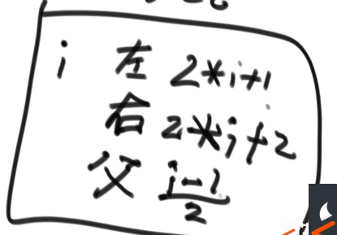
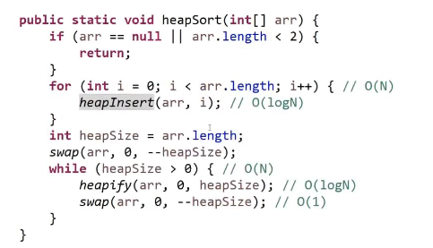
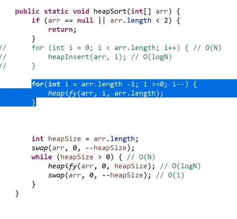

### 数据结构算法

堆：就是一个数组结构的完全二叉树



#### 大根堆的上浮heapInsert

```java
public static heapInsert(int [] arr,int index){
	while(arr[index]>arr[(index-1)>>1]){
		swap(arr,index,(index-1)>>1);
        index=(index-1)>>1;
	}
}
```

大根堆下沉

```java
public static heapify(int arr,int index,int heapSize){
    int left=index<<1+1;
    while(left<headpSize){
        int largest=left+1<heapSize&&arr[left]>arr[left+1]?left:left+1;
        largest=arr[largest]>arr[index]?largest:index;
        if(largest==index){
            break;
        }
        swap(arr,largest,index);
        index=largest;
        left=index<<1+1;
    }
}
```

堆排：

每次将堆顶放到堆尾，堆大小--



这个更快




### 1.联系客服

### 2.说明需求

### 3.完成程序

### 4.订单完成


