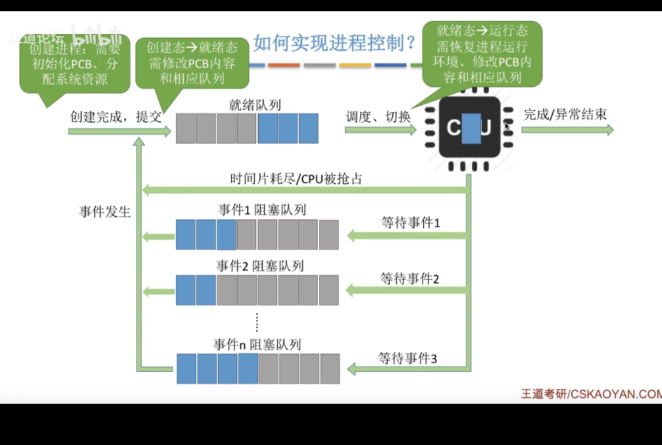
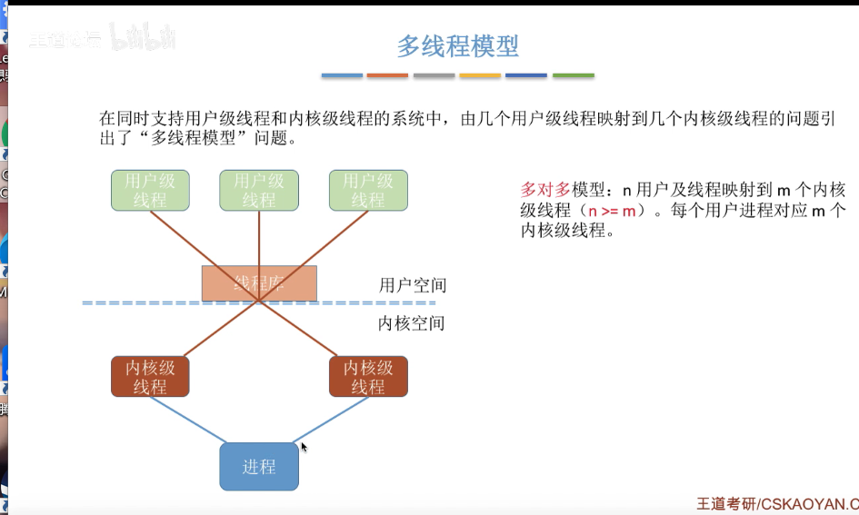

### 操作系统

#### 一、中断和异常

本质：发生中断就意味着需要操作系统介入，开展管理工作

##### 内中断：

也称异常

##### 外中断：

人为干涉、i/o中断

##### 系统调用

#### 二、进程

程序：就是指一个指令序列

状态：创建、就绪、运行、阻塞、销毁

##### 1）进程通信

为了保证安全，一个进程不能直接访问另一个进程的地址空间。但是进程之间的信息交换又是必须实现的

1. 共享存储
   - 共享空间：是互斥的，用的时候要加锁
2. 消息传递
   - 发送和接收原语
   - 直接通信
   - 间接通信：又称信箱通信方式
3. 管道通信
   - 是指用于连接读写进程的一个共享文件，又名pipe文件。其实就是在内存中开辟一个大小固定的缓冲区
   - 管道只能采用半双工，要想全双工，需要两个管道
   - 也是需要互斥访问

##### 2）线程

引入线程之后，线程成为了程序执行流的最小单位

#### 三、死锁

在并发环境下，各个进程因竞争资源而造成的一种互相等待对方手里的资源，导致各个进程都阻塞，都无法向前推进

##### 死锁产生的必要条件：

1. 互斥条件：只有必须互斥使用的资源争抢才会导致死锁。在设计进程的时候，尽量避免资源的互斥。
2. 不可剥夺：进程所获得的资源在未使用之前，不能由其他进程强行夺走，只能主动释放
3. 请求和保持条件：
4. 循环等待：循环等待。

对不可剥夺资源分配的不合理

